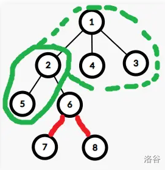
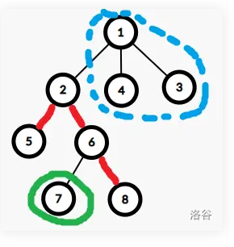
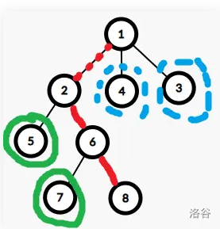
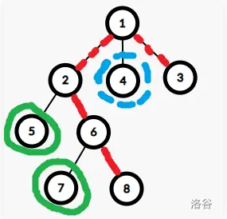

[press](https://www.cnblogs.com/Sundar-2022/p/18591492)

关键在于分类 ： 

```ccp
dp[i][0] 表示 i 节点的子树中选一条链，i 不在链上的最大联通块数
dp[i][1] 表示 i 节点的子树中选一天链，i 在链端点的最大联通块数
dp[i][2] 表示 i 节点的子树中选一条链，i 在链中间的最大连通块数
```

1. 节点 i 不在链上 ， 分为直接儿子在或不在



<font size = 3>2  号节点不在红色链上，当前 2 子树中有一个绿色连通块加 1 节点发现个数不变</font>



<font size = 3>2 号节点在链上，此时有一个绿色和一个蓝色连通块</font>

2. 节点 i 在链上 分为是端点或者在链中间



<font size =3>若仅一个端点，即是路径退化为点，此时答案等于子树数，若两个端点，如上图，此时答案为 绿色个数 加 子树数 - 1</font>



<font size =3>若点 i 在链中间 此时答案为 绿色 加子树数 - 2 ， 选择连通块个数最大的两个子块，指的是当前父节点中的子树中连通块数最大的，因为只能删一条路径</font>


同时对于上述绿色个数使用递归求解即可

```cpp
void dfs(int u, int fa)
{
    int son = 0, mx0 = 0, mx1 = 0, mx2 = 0, tp = 0;
    // mx1 表示子树中该直接子节点在链中的连通块最大的，tp为第二大的个数
    // mx0 表示子树中该直接子节点不在路径上的最大连通块
    // mx2 表示在端点
    for (auto L : g[u])
    {
        if (L == fa)
            continue;
        dfs(L, u);
        son++;
        mx0 = max(mx0, dp[L][0]);
        // 在链上分为单点路径和在链中间
        mx2 = max(mx2, dp[L][2]);
        if (dp[L][1] > mx1)
        {
            tp = mx1;
            mx1 = dp[L][1];
        }
        else if (dp[L][1] > tp)
            tp = dp[L][1];
    }
    dp[u][0] = max(mx0, max(mx1, mx2) + 1);
    dp[u][1] = max(son, mx1 + son - 1);
    dp[u][2] = mx1 + tp + son - 2;
}
```

