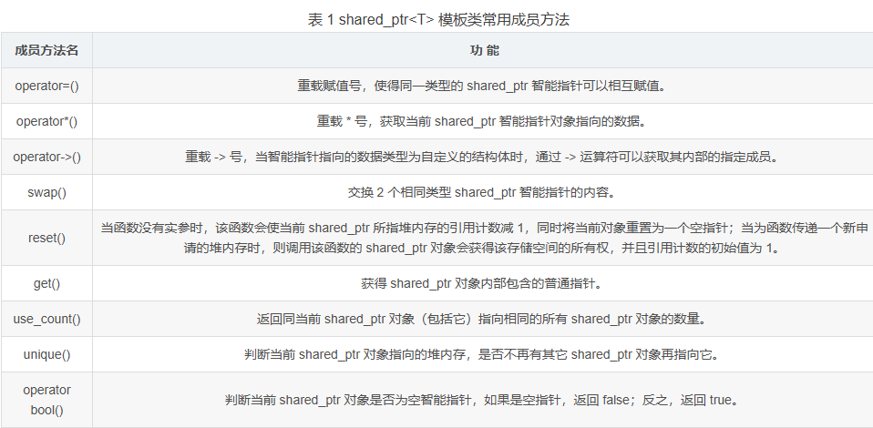
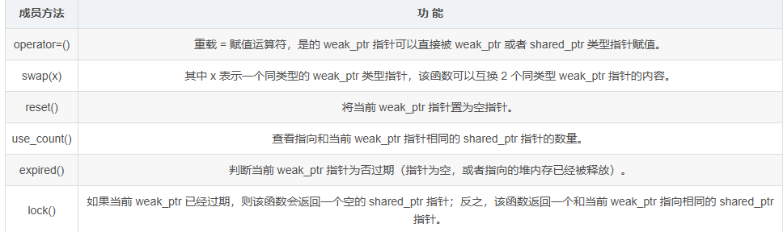
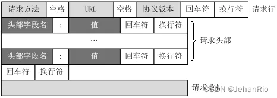

<div align="center">
  <h1>
    WebServer
  </h1>
</div>

## moduo-buffer

`moduo-buffer`采用的是非阻塞`I/O`模型，每次`send()`不需要一次发完，将没发完的数据存在`stackbuff` 中，对`buffer`实现动态增长，防止`buffer`数组最初过大，从而占据较多的内存

## 智能指针

智能指针可以在适当的时机自动释放分配的内存，使用智能指针可以很好的避免忘记释放内存而导致的内存泄露问题

> C++ 智能指针底层是采用引用计数的方式实现的。简单的理解，智能指针在申请堆内存空间的同时，会为其配备一个整形值（初始值为 1），每当有新对象使用此堆内存时，该整形值 +1；反之，每当使用此堆内存的对象被释放时，该整形值减 1。当堆空间对应的整形值为 0 时，即表明不再有对象使用它，该堆空间就会被释放掉。

### 独占式`unique_ptr`

使用`move()`给`unique_ptr`传入函数,这样你就知道原先的`unique_ptr`已经失效了，但是对于`move`之后使用原来的内容是未定义行为,

1. 为动态申请的内存提供异常安全
2. 将动态申请的内存所有权传递 move() 给某函数
3. 从某个函数返回 move() 动态申请内存的所有权
4. 在容器内保存指针
5. **无法进行复制构造**，**无法进行复制赋值操作**，但是可以进行**移动构造**和移动赋值操作
6. auto_ptr 拥有的功能

move(xxx) 之后 xxx会被释放成 null，unique_ptr 是通过指针**占有**并**管理**另一个对象，并在 unique_ptr 离开作用域时释放该对象的智能指针，某个时刻，**只能有一个** unique_ptr 指向一个给定的对象

```cpp
vector<unique_ptr<int>> arr;
unique_ptr<int> p(new int(3));
arr.push_back(move(p));//不能直接 push_back
```

### 共享式`shared_ptr`

多个 shared_ptr 可以共同使用同一块堆内存 ，底层也是采用的引用计数机制，只有当引用技术为 0，堆内存才会被释放

```cpp
//shared_ptr 类型的空智能指针，注意，空的shared_ptr 指针，其初始引用计数为0，而不是1
shared_ptr<int> p1;
shared_ptr<int> p2(nullptr);
//直接明确指向
shared_ptr<int> p3(new int(10));
shared_ptr<int> p4 = make_shared<int>(10);
```

`shared_ptr` 提供有相应的拷贝构造和移动构造函数

```cpp
//拷贝构造函数
shared_ptr<int> p5(p4);// shared_ptr<int> p5 = p4;
//移动构造
shared_ptr<int> p6(move(p5));//shared_ptr<int> p6 = move(p5);
```

> 对于 move(p4) 来说，该函数会强制将 p4 转换成对应的右值，因此初始化 p5 调用的是移动构造函数。另外和调用拷贝构造函数不同，用 move(p4) 初始化 p5，会使得 p5 拥有了 p4 的堆内存，而 p4 则变成了空智能指针。

**注意** ： 同一普通指针不能同时为多个 shared_ptr  对象赋值，否则会导致程序异常

shared_ptr 在初始化时可以自定义所指堆内存的释放规则

```cpp
shared_ptr<int> p1(new int[10],default_delete<int[]>()); //指定default——delete作为释放规则
void deleteIne(int *p) {//自定义释放规则
  delete []p;
}
shared_ptr<int> p2(new int[10],deleteInt);
shared_ptr<int> p3(new int[10],[](int *p){delete []p;});
```



### 弱式`weak_ptr`

> 当 weak_ptr 类型指针的指向和某一 shared_ptr 指针相同时，weak_ptr 指针并不会使所指堆内存的引用计数加 1；同样，当 weak_ptr 指针被释放时，之前所指堆内存的引用计数也不会因此而减 1。也就是说，weak_ptr 类型指针并不会影响所指堆内存空间的引用计数。
>
> 除此之外，weak_ptr 模板类中没有重载 * 和 -> 运算符，这也就意味着，weak_ptr 类型指针只能访问所指的堆内存，而无法修改它。



## function 函数

### 实例

和直接调用函数的本质区别  -- 是否需要在运行时动态 “持有”并 ”调度“ 不同的可调用体

可以存储任何可调用对象，包括函数指针、函数对象、成员函数指针和lambda表达式。

```cpp
function<return_type(parameter_types)> var_name;
function<void(int)> func;//表示 func 可以接收任意 void() 类型的函数返回，例如 void foo()
```

其中，`return_type` 是函数返回值类型，`parameter_types` 是函数参数类型

```cpp
int func(int x,int y) {return x + y;}
function<int(int,int)> f = func;
class A {
  public:
  int mem_func(int x){return x * x};
};
function<int(A*,int)> f2 = &A::mem_func;
```

function 对象可以向普通函数一样调用，并且可以使用 bool 类型的运算符来检查调用对象是否为空

```cpp
function<int(int,int)> f;
if(f)
  	cout << f(1,2) << endl;
else cout << "f is empty" << endl;
```

具体使用例子

```cpp
void test1() {
    cout << "function" << endl;
}
int test2(int i) {
    return i;
}
int test3(int i, int j) {
    return i + j;
}
struct A {
    void foo(int i) {
        cout << i << endl;
    }
};

int main() {
    // 1. 绑定无参函数 test1
    function<void()> fn1 = bind(test1);
    // 2. 绑定一参函数 test2，但声明为 function<int(int,int)>
    function<int(int,int)> fn2 = bind(test2, placeholders::_1);
    // 3. 绑定二参函数 test3，对应同样接受两个参数的 function
    function<int(int,int)> fn3 = bind(test3, placeholders::_1, placeholders::_2);
    // 4. “预置” test3 的第一个参数为常量 3，仅剩下一个占位符
    function<int(int)> fn4 = bind(test3, 3, placeholders::_1);
    // 5. test3 的两个参数都用常量“固化”了，此时生成可无参调用的可调用对象
    function<int()> fn5 = bind(test3, 3, 4);
    A a;
    // 6. 绑定成员函数 A::foo，将 this 指针设为 &a
    function<void(int)> fn6 = bind(&A::foo, &a, placeholders::_1);
  	fn1();
    cout<<fn2(1)<<endl;
    cout<<fn3(2, 3)<<endl;
    cout<<fn4(3)<<endl;
    cout<<fn5()<<endl;

}
```

> C++ 中 `bind` 返回的可调用对象有一个**通用的模板式 `operator()`**，它可以接受“匹配到所需占位符”之外的额外参数，并将它们“丢弃”。也即 fn2(x,y) = test2(x) , 	(y 会被丢弃)
>
> bind(&A::foo,&a,placeholder::_)  隐式地第一个参数是该方法所属对象的指针（俗称 `this` 指针），第二个参数是 `int i`。
>
> fn6(x) = a.foo(x)

### function 的好处

`function<R(Args...)>` 可以封装几乎所有“可调用”的实体，包括：

- 普通函数指针（`void foo(int)`）；
- 成员函数指针（`&MyClass::method`，配合对象指针或引用调用）；
- Lambda 表达式（捕获外部变量的匿名函数）；
- 仿函数（重载了 `operator()` 的类）；
- 另外一层 `bind` 或 `function` 本身生成的可调用对象。

`function` 内部采用类型擦除技术，把不同类型的可调用对象都包装成同一种“虚拟接口”，即 `operator()(Args...) → R`。这样调用方只需知道“它能被调用且返回 R”，无需关心它背后是哪个具体类型。

所以使用 function 函数作为参数时，用户自定义这类参数传入时就会有很大的方便性，比较使用于**回调机制**

**通过 `function` 先存储再调用**

- **绑定方式**：运行时绑定（类型擦除 + 小对象或堆内存存储 + 间接调用）。
- **性能**：比直接调用多一次间接跳转，还可能有堆分配开销。
- **优势**：
	1. 可以在运行时动态改变目标函数／Lambda／成员函数／函数对象；
	2. 同一接口先后接受多种可调用类型，使用者无需编写单独的重载或模板；
	3. 常用于回调、事件分发、策略注入、线程池任务提交等场景。

### 进阶

#### 与智能指针结合

`function` 可以存储指针指针，避免内存泄漏

```cpp
function<int(int,int)> add = make_shared<int(*)(int,int)> ([](int a,int b)) {return a + b};
```

#### 存储成员函数指针

```cpp
class A {
  int add(int a,int b) {return a + b;}
};
function<int(A&,int ,int)> add = &A::add;
A a;
cout << add(a,3,4) << endl;
```

#### 存储 bind

```cpp
function<int(int)> add = bind([](int a,int b) { return a + b;},3,palceholders::_1);
```

## Tempalte

### 函数模板声明

1. 一个**非模板函数**可以和一个同名的**函数模板**同时存在，而且该函数模板还可以被实例化为这个非模板函数
2. 对于非模板函数和同名函数模板，如果其他条件都相同，在调动时会优先调用非模板函数而不会从该模板产生一个实例。如果模板可以产生一个具有更好匹配的函数，那么将选择模板。

#### 函数定义

```cpp
template<typename T>
void swap(const T*a,const T*b) {
  T temp = *a;
  *a = *b;
  *b = temp;
}
```

传入不同的参数时其实调用的是不同的函数，**根据不同的类型通过模板定制出专属该类型的函数，然后在调用，不同的参数对应不同的地址**

#### 函数模板调用

隐式调用，自动匹配传入参数的类型

```cpp
int main() {
  int a = 10,b = 20;
  float c = 30,d = 40;
  swap(&a,&b);
  swap(&c,&d);
}
```

#### inline 函数模板

```cpp
template<typename T>inline T swap(const T*a,const T*b) // 注意 inline 在 template 后面
```

### 类模板

类模板实例化和函数模板实例化不同，类模板实例化需要在类模板名字后跟 `<>`，然后将实例化的类型放在 `<>` 中，**类模板名字不是真正的类，而实例化的结果才是真正的类** 。

#### 类模板声明

```cpp
template<class Type>class Queue{
public:
    Queue();
    Type &front();
    const Type &front()const;
    void push(const Type &);
    void pop();
    bool empty()const
private:
    ...
};
```

#### 类模板定义

**注意 ：** 和函数模板不同，类模板的定义需要加个括号(显式)告诉编译器是什么类型

```cpp
queue<int>qi;//什么是显式，在定义时加个括号告诉他老子是int就是显式
Queue<vector<double>>qc;
Queue<string>qs;
```

### 非类模板形参

### 模板特化


## Channel

对 `fd`事件的封装，包括注册它的事件以及回调。

- events_ ： Channel 在当前 EventLoop 中注册给 poller(epoll) 时所表明的**感兴趣事件掩码(mask)**，如EPOLLIN、EPOLLOUT。决定了下次调用 `epoll_ctl(EPOLL_CTL_MOD/ADD)`时要想内核注册的监听事件
- revents_:   Poller 返回时告诉 Channel ，哪些事件已经就绪，通常在`HandleEvents()`被调用时被赋值为 epoll_wait 返回的就绪事件位。

当遇到 挂起(EPOLLHUP) 或者错误(EPOLLERR)时，前者是**对端已经关闭了连接**，此时 poller 不需要在监听这个 fd

### events_置为 0

既表明“我已经不再关心任何 I/O 事件”，下次如果上层逻辑仍打算对这个 Channel 再做处理（如重启、重连），就会显式调用 `Channel::EnableReading()`、`EnableWriting()` 等去重新将 `events_` 恢复成具体的 EPOLLIN/EPOLLOUT，再通过 `Update()` 向 epoll 注册。

如果上层准备彻底关闭这个 Channel，就会在 `events_ == 0` 的基础上调用 `RemoveChannel()`，彻底把文件描述符从 epoll 中移除并关闭。

当检测到 `EPOLLHUP`（没有可读挂起）或 `EPOLLERR`（出错）时，说明该 Channel 所对应的 fd 已经不可再进行正常 I/O，必须**立即停止向 epoll 注册任何事件**，以避免下一轮再次收到相同错误/挂起通知。

### read

**EPOLLIN：普通可读事件**

​	表示**有数据可读**（通常是对端发来了正常的应用数据）。

​	一旦出现，就需要调用 `HandleRead()` 去把缓冲区里的数据一次性读完并交给业务逻辑处理。

**EPOLLPRI：高优先级（OOB）数据**

​	对于 TCP 套接字，如果对端通过 `send(..., MSG_OOB)` 发送了“紧急数据”（Out‐Of‐Band data），内核会在相应的文件描述符上产生 `EPOLLPRI`。

​	这类数据往往是“特殊标记”或“单字节告警”，需要跟普通可读（`EPOLLIN`）分开处理。

​	把它跟 `EPOLLIN` 一起检查，意味着：无论是普通数据还是 OOB 数据到来，都由 `HandleRead()` 决定“究竟先读普通、先读 OOB”或“分别调用不同处理逻辑”。

**EPOLLRDHUP：对端关闭（半关闭）通知**

​	该标志专门用于表示“TCP 对端已经调用了 `close()` 或者只关闭了写端（shut down write）”。

​	当对端半关闭时，内核会给本端返回一个“可读”且带 `EPOLLRDHUP` 的事件。此时如果不读取，就会漏掉“对端已经发来的最后那一批数据＋一个 EOF”信号。

在收到 `EPOLLRDHUP` 时，即使没有新数据 `EPOLLIN`，也应当调用 `HandleRead()`，让它执行两件事：

1. **把剩余数据全部读干净**（因为对端在半关闭前可能还有缓冲数据）；
2. **检测到读取到 0 字节**，从而确认对端已真正关闭，便可以走“清理 Channel／关闭 socket”逻辑。

## Poller

`Poller` 类的作⽤就是负责监听⽂件描述符事件是否触发以及返回发⽣事件的⽂件描述符以及具体事件。所以⼀个Poller 对象对应⼀个 IO 多路复⽤模块。在 `muduo` 中，⼀个 `EventLoop` 对应⼀个 `Poller`。

`reinterpret_cast`⽤在任意指针(或引⽤)类型之间的转换

## 内存池

内存分配方式，`new、malloc`方式申请分配内存时由于所申请内存块的大小不定，当频繁使用时会造成大量的**内存碎片**并进而降低性能。

内存池这是在真正使用内存之前，先申请分配一定数量的、大小相等(一般情况下)的内存块留作备用。当有新的内存需求时，就从内存池中分出一部分内存块，若内存块不够在继续申请新的内存。

**主要管理工作**：对于内存块中空闲存储单位的管理

### 池化技术

特征降维方法；作用是在保留图像或特征图中最显著信息的同时减少数据量，从而提高计算效率并防止过拟合。

#### 最大池化

在每个区域内选择最大值作为输出值。这样可以保留局部区域内的最显著特征，丢弃次要信息。它具有平移不变性，在一定程度上提高了模型对位置变化的鲁棒性。

#### 平均池化

在每个区域内计算平均值作为输出值。这种方式可以对整个区域进行平均，从而得到更加全局的统计信息，适用于一些需要考虑整体趋势而不仅仅关注局部细节的任务。

### 内存碎片

内存碎片是指已分配的内存空间中存在的一些零散、不连续的小块未被使用的内存

1. **外部碎片**：即由于已分配内存块的释放而造成的未被充分利用的空闲内存块。这些空闲块虽然总大小足够，但由于彼此之间存在占用的块，无法组合成足够大的连续空闲区域。
2. **内部碎片**：即已分配给进程或应用程序的内存中，实际使用但没有被完全填满的部分。例如，某个进程申请了100个字节的内存，但只实际使用了80个字节，那么剩下的20个字节就构成了一个内部碎片。

#### 如何解决内存碎皮

1. 碎片整理（Defragmentation）：通过将已分配和未分配的内存重新组织排列来减少外部碎片。这通常需要暂停程序运行并进行较大规模数据搬移操作。
2. 分区策略优化：根据程序的内存使用特点，合理划分内存分区，减少外部碎片产生的可能性。例如采用动态分区或伙伴系统等算法。
3. 内存池管理：提前申请一块较大的内存空间，并自行管理内部碎片和对象的分配与释放，减少频繁的内存申请和释放操作。
4. 垃圾回收机制：对于某些编程语言如Java、Python等，利用垃圾回收器自动清理不再使用的对象，可以有效减少内部碎片。

## webbench

先在主进程中 fork 出多个⼦进程，每个⼦进程都循环做 web 访问测试。⼦进程把访问的结果通过pipe(管道)告诉⽗进程，⽗进程做最终的统计结果。webbench 最多可以模拟3万个并发连接去测试⽹站的负载能⼒。

## 日志

### 单例模式

保证一个类只有一个实例，并提供一个他的全局访问点，该实例被所有程序模块共享，此时需要把该类的构造和析构函数放入 private中。

#### 懒汉模式

只有当调用 `getinstance`时，才回去初始化这个单例，其中在C++11之后，不需要要加锁，直接使用函数内部静态对象即可

#### 饿汉模式

在程序运行时立即初始化。**不需要加锁**，就可以实现线程安全。在程序运行时就定义了对象并初始化，线程调用成员函数`getinstance`只会返回一个对象的指针

### 异步日志

**阻塞队列** 

## 零拷贝技术

拷贝是指计算机中的 I/O 操作，也就是数据的读写操作。

> 1. 应用程序先发起读操作，准备读取数据了；
> 2. 内核将数据从硬盘或外部存储读取到内核缓冲区；
> 3. 内核将数据从内核缓冲区拷贝到用户缓冲区；
> 4. 应用程序读取用户缓冲区的数据进行处理加工；


#### 内核态

1. 内核态是操作系统内核运行的模式，当操作系统内核执行特权指令时，处于内核态
2. 在内核态下，操作系统内核拥有最高权限，可以访问计算机的所有硬件资源和敏感数据，执行特权指令，控制操作系统的整体运行
3. 内核态提供了操作系统管理和控制计算机硬件的能力，它负责处理系统调用、中断、硬件异常等核心任务。

#### 用户态

这里的用户可以理解为应用程序，这个用户是对于计算机的内核而言的，对于内核来说，系统上的各种应用程序会发出指令来调用内核的资源，这时，应用程序就是内核的用户。

1. 用户态是应用程序运行的模式，当应用程序执行普通的指令时，处于用户态
2. 在用户态下，应用程序只能访问自己的内存空间和受限的硬件资源，无法直接访问操作系统的敏感数据或控制计算机的硬件设备
3. 用户态提供了一种安全的运行环境，确保应用程序之间相互隔离，防止恶意程序对系统造成影响。

### 内核缓冲区

内存中专门用来给内核直接使用的内存空间，应用程序和外部存储进行数据交互的一个中间介质。

### 用户缓冲区

应用程序可以直接读写的内存空间。应用程序无法直接到内核读写数据，所以应用程序想要处理数据，必须先通过用户缓冲区。

### PageCache

1. PageCache Linux内核对文件系统进行缓存的一种机制，使用空闲内存才能来缓存从文件系统读取的数据块，加速文件的读取和写入操作
2. 当应用程序或进程读取文件时，数据会首先从文件系统读取到 PageCache 中，如果后续继续读取相同的数据，就可以直接从 PageCache 中获取，避免再次访问文件系统
3. 同样，当应用程序或进程将数据写入文件时，数据会暂存到 PageCache 中，然后由 Linux 内核异步的将数据写入磁盘，从而提高写入操作的效率。

### 磁盘缓冲区

计算机内存中用于暂存从磁盘读取的数据或将数据写入磁盘之前的临时存储区域，他是一种优化磁盘 I/O 操作的机制，通过利用内存的快速访问速度，减少对慢速磁盘的频繁访问，提高数据读取和写入的性能和效率。


### 问题

数据的传输通常设计多次**数据拷贝**，数据需要从应用程序的用户缓冲区复制到内核缓冲区，然后在从内核缓冲区复制到设备或网络缓冲区，导致多次内存访问和数据复制，消耗大量的 CPU 时间和内存带宽。

由于数据要经过内核缓冲区，导致数据在**用户态和内核态之间来回切换**，切换过程中有上下文的切换，增加了复杂性和时间开销

### 零拷贝

思路：减少拷贝次数，尽量将数据存储在离应用程序(用户缓冲区)近的地方

理想状态：操作数据不用拷贝，实际是尽量减少拷贝操作的次数

1. 尽量减少数据在各个存储区域的复制操作，例如从磁盘缓冲区到内核缓冲区
2. 尽量减少用户态和内核态的切换次数和上下文切换
3. 使用一些优化手段，例如 PageCache

### 实现

#### 直接内存访问 (DMA)


DMA 是一种硬件特性，允许外设直接访问系统内存，而**无需 CPU 的介入**，在数据传输时，DMA可以直接将数据从内存传输到外设，或从外设传输数据到内存，避免数据在用户态和内核态之间的多次拷贝

#### sendfile

系统调用，在网络传输文件时实现零拷贝，应用程序可直接将文件数据从文件系统传输到网络套接字或者目标文件，而无需经过用户缓冲区和内核缓冲区

#### 共享技术


通过共享一块内存区域，实现数据的共享，类似于引用对象，实际就是一个指针，一个地址

#### 内存映射文件

**直接将磁盘文件映射到应用程序的地址空间**，应用程序可以直接在内存中读取和写入数据。**映射文件内容**

当数据文件需要传输时，内核可以直接从内存映射区域读取数据进行传输，避免了数据在用户态和内核态之间的额外拷贝

## RAII

资源获取即初始化，常见的**编程范式**，主要用于**管理资源**(如**动态内存**，**文件句柄**，**网络连接** etc)，

核心思想 ： **将资源的生命周期绑定到对象的生命周期**，通过对象的构造函数来获取资源，析构函数来释放资源。

RAII 是管理资源的重要原则， 通过**将资源的获取与对象的生命周期绑定在一起**，RAII 可以有效防止资源泄露，并提高代码的可维护性和异常安全性。

### 核心概念

资源获取即初始化：**资源的分配与对象的初始化绑定在一起，资源的释放和对象的销毁绑定在一起**

自动释放资源：当对象超出作用域时，系统会自动调用析构函数，释放资源。

### 典型应用

- 内存管理：通过智能指针自动管理堆内存
- 文件管理：通过 `std::fstream` 自动管理文件的打开和关闭
- 互斥锁管理：通过 `lock_guard` 和 `unique_lock`自动管理锁的获取和释放

### 优点

1. 资源安全释放：通过将资源放在对象析构函数中，RAII 保证了资源的释放，即使发生异常，也不会造成资源泄露
2. 简化代码：不需要手动管理资源的分配和释放
3. 异常安全：析构函数在对象销毁时自动调用，RAII 机制可以确保在异常发生时资源得到正确释放

## 连接池

服务器要频繁的访问数据库，在初始化时，集中创建并管理多个数据库连接。使用**信号量**来管理资源的数量，**锁**：在访问公共资源的时候使用

尽量用make_shared代替new去配合shared_ptr使用，因为如果通过new再传递给shared_ptr，内存是不连续的，会造成内存碎片化
	function<void()>是一个可调用对象。他可以取代函数指针的作用，因为它可以延迟函数的执行，特别适合作为回调函数使用。它比普通函数指针更加的灵活和便利。

## epoll

`epoll` 是一种 I/O 多路复用机制，用于**监视多个文件描述符的状态**并进行事件驱动的 I/O 操作，是**基于事件驱动的模型**，通过将文件描述符注册到`epoll`**内核事件表**中，然后等待**内核**通知有事件发生。

### 优势

1. 高效：`epoll`使用了更加高效的数据结构和算法， 能够在大规模并发连接下提供更好的性能。
2. 扩展性：`epoll`支持水平触发和边缘触发两种模式
3. 节省资源：`epoll`使用一个文件描述符来管理多个连接，而不是每个连接都需要一个文件描述符
4. 没有连接数限制：`epoll`没有连接数的限制，可以处理成千上万个并发数据
5. 高效的时间复杂度：采用**红黑树**数据结构，对于大量的文件描述符，查找和插入时间复杂度为`O(n)`，是直接在内核中操作，减少不必要的拷贝
6. poll 和 select 都是基于**轮询**，每次调用内核都需要遍历所有的文件描述符，epoll 是基于事件回调的机制，状态变化，内核会调用回调函数将其加入就绪链表中。

### ET + LT

LT ： 内核检测到文件描述符(fd)的读缓冲区有数据时，会通知用户。只要缓冲区的数据没有被完全读取，就会一直通知。支持**阻塞**和**非阻塞**，**缺省**的工作模式，内核会持续告知用户文件描述符是否就绪。

ET：告诉工作模式，仅支持**非阻塞socket**，内核仅在文件描述符从未就绪变为就绪时通过 epoll 通知用户一次，除非用户执行了某些操作导致文件描述符不在处于就绪状态才会通知。如果用户未操作导致重新进入未就绪状态不会通知。

### 工作原理

#### 1. 创建 epoll 实例

```cpp
#include<sys/epoll.h>
int epoll_create(int size);//size旧为分配的事件监视表的大小，目前无意义，传>0的数即可
int epoll_create1(int flags);//两个函数都用于创建一个epoll实例(epoll文件描述符)，用于I/O多路复用，返回值-fd
//flags用于指定创建 epoll 实例的标志，EPOLL_CLOEXEC：标志在执行 exec 系列函数时将自动关闭，子进程避免资源泄露
```

注意：`epoll_create1`是`epoll`系统调用的较新版本，允许设置`EPOLL_CLOEXEC`标志，以实现更好的资源管理。

#### 2. 注册文件描述符

```cpp
int epoll_ctl(int epfd,int op,int fd,struct epoll_event *event)//用于向epoll实例注册或修改文件描述符的事件
//成功返回0，失败返回-1 ， epfd 是epoll实例的文件描述符，即是epoll_create返回的文件描述符  
//op表示要执行的操作类型  1. EPOLL_CTL_ADD :向epoll实例中添加一个文件描述符，并监视指定的事件  2.EPOLL_CTL_MOD：修改 epoll 实例中已注册的文件描述符的事件。  3.EPOLL_CTL_DEL：从 epoll 实例中删除一个文件描述符，不在监视其事件
fd ：要操作的文件描述符，即需要注册，修改或者函数的文件描述符
event：用于指定感兴趣的事件类型和相关数据。
struct epoll_event 结构体包含两个成员：events、data
struct epoll_event {
uint32_t events; /* Epoll events /
epoll_data_t data; / User data variable */
};
events：表示监视的事件类型，可以是以下事件之一或它们的位或运算结果：
EPOLLIN：表示文件描述符可读。
EPOLLOUT：表示文件描述符可写。
EPOLLRDHUP：表示对端关闭连接或者关闭了写入一半的连接。
EPOLLPRI：表示有紧急数据可读。
EPOLLERR：表示发生错误，如连接错误、重置等。
EPOLLHUP：表示发生挂起事件，如连接挂起、对端关闭连接等。
EPOLLET：启用边缘触发模式，即只通知状态改变的事件。
EPOLLONESHOT：一次性触发模式，即事件触发后只能被触发一次。
data：用于存放用户定义的数据，可以是任意类型的指针，通常用于记录与文件描述符相关的数据。
使用 epoll_ctl() 函数将需要监视的文件描述符注册到 epoll 实例中。可以指定感兴趣的事件类型，例如可读事件、可写事件等。
struct epoll_event ev;
ev.events = EPOLLIN;//监视可读事件
ev.data.fa = sockfd;
if(epoll_ctl(epoll_fd,EPOLL_CTL_ADD,sockfd,&ev) == -1) {prror...}
```

#### 3. 等待事件

```cpp
int epoll_wait(int epfd,struct epoll_event *events,int maxevents,int timeout)
```

> epoll_wait ：用于等待 epoll 实例中的文件描述符上的事件发生，并将触发的事件填充到用户提供的数组中。
>
> 返回值：成功时，返回触发事件的文件描述符数量，即填充到 events 数组中的事件数量，失败时，返回 -1 + errno
>
> epfd：epoll 实例的文件描述符，即通过 epoll_createx 创建的 epoll 文件描述符。
>
> events：用于存放触发的事件的数组结构体地址，函数将把触发的事件填充到该数组中。
>
> maxevents：表示 events 数组的最大容量，即可以存放的最大事件数量
>
> timeout：指定等待的超时时间(ms)，-1 表示阻塞，0表示立即返回，非阻塞等待；大于0表示等待的时间

使用 `epoll_wait`等待事件的发生，当有文件描述符上的事件发生时，`epoll_wait`会触发事件的文件描述符信息。

### 多进程 epoll 

多进程 epoll 时，当`listen_fd`有 `accept()`时，操作系统会唤醒部分子进程，但只有一个子进程可以真正`bind`会浪费资源。“群惊
"

## timerfd

定时器接口，基于文件描述符，通过文件描述符的刻度时间进行超时通知，所以能够被用于 `select/poll`的应用场景。

> timefd、eventfd、signalfd 配合 epoll 使用，可以构造出一个零轮询的程序，但程序没有处理的事件时，程序时被阻塞的。

## 唤醒机制

### 使用管道 fd

创建一个管道，将管道的一端绑定到`epollfd`上，需要唤醒时，向管道的另一端写入一字节，工作线程被立即唤醒

### eventfd

将调用`eventfd`函数返回的`eventfd`绑定到`epollfd`上，需要唤醒时，向这个`eventfd`上写入一字节，IO复用函数立即被唤醒

可以避免低效的轮询或忙等待，应用程序可以在`epoll_wait`上阻塞，直到事件发生。

```cpp
#include<sys/eventfd.h>
int eventfd(unsigned int initval,int flags);//flags目前无用，传入 0
```

eventfd 函数可以创建一个被用户空间应用程序作为”等待/通知“机制使用的 eventfd 对象，或被内核用于通知用户空间应用程序事件消息。eventfd 对象包含一个 uint64_t 类型**事件计数器**，由内核进行维护，通过参数 initval 进行初始化，可以通过写操作向该描述符谢图值来增加计数器，通过读操作从该描述符读取当前值并重置计数器。

返回一个文件描述符，用于对eventfd 对象的引用

如果仅仅时用于发出信号事件，应用程序可以使用一个 eventfd 文件描述符来替换管道。而且内核使用 eventfd 文件描述符的开销比管道低得多，且可以满足要求。同时 eventfd 可以被 epoll 等监听，将 `eventfd`文件描述符添加到`epoll`监控的文件描述符中。这样，应用程序就可以通过一次`epoll_wait`调用等待多个文件描述符上的事件，包括`eventfd`

**异步事件通知**：当需要唤醒 I/O事件循环时(有新连接到达或数据可读)，应用程序或另一个线程可以向 `eventfd`描述符写入一个值，触发内核通知`epoll`机制。

### socketpair

`socketpair`是一对相互连接的`socket`，相当于服务器和客户端的两个端点，每一端都可以读写数据，向其中一端写入数据后，就可以从另一端读取数据

```cpp
int socketpair(int domain,int type,int protocol,int sv[2]);
```

调用这个函数返回的两个文件描述符是`sv[0]`和`sv[1]`，即`socketpair`函数的第四个参数，向`sv[0]`、`sv[1]`中的任何一个`fd`写入字节后，就可以从另一个`fd`中读取字节。将读取方的`fd`绑定到`epollfd`上，在需要时向写入方的`fd`写入 1字节，工作线程就会立刻唤醒

## 正反代理

### 正向代理

正向代理服务器位于客户端和目标服务器之间，客户端将请求发送给正向代理服务器，由正向代理服务器代替客户端向目标服务器请求资源并返回给客户端。隐藏客户端的真实信息。

`epoll`模型可以高效地监听多个客户端连接和后端服务器连接的事件。当客户端发送请求时，`epoll`能够快速检测到客户端连接的可读事件，**代理服务器**读取请求并将其转发给目标服务器。当目标服务器返回响应时，`epoll`检测到后端连接的可读事件，代理服务器读取响应并将其返回给客户端。通过`epoll`的高效事件通知机制，**正向代理服务器能够同时处理大量客户端和后端服务器的连接**，实现高效的代理功能

### 反向代理

反向代理服务器位于服务器端，用于代理后端服务器。客户端向反向代理服务器发送请求，反向代理服务器将请求转发给后端的真实服务器，并将真实服务器返回的响应发给客户端，隐藏服务端

反向代理服务器使用`epoll`模型监听来自客户端的请求。当客户端请求到达时，`epoll`通知服务器，服务器根据请求的URL等信息，将请求转发给后端的合适服务器。同时，`epoll`也监听后端服务器的响应，当后端服务器返回响应时，反向代理服务器能够及时获取并将其发送回客户端。这种机制使得反向代理服务器能够快速地将请求分发到后端服务器，并将响应返回给客户端，提升了系统的整体性能。

### 优点

**统一维护**：由于`epoll`模型能够高效地管理大量的并发连接，正向代理和反向代理服务器可以集中处理所有的请求和响应，使得系统的维护更加集中和简便。管理员可以在代理服务器上进行统一的日志记录、安全监控、访问控制等操作，而不需要在每个后端服务器上分别进行配置和管理。

**负载均衡**：反向代理服务器可以根据预设的负载均衡算法（如轮询、IP哈希、加权负载等），将客户端的请求合理地分配到多个后端服务器上，避免单个服务器过载，提高整个系统的可用性和性能。正向代理服务器也可以根据后端目标服务器的负载情况，选择合适的目标服务器进行请求转发，从而实现负载均衡的效果。

## exec 函数

exec 函数提供了一个在**进程中**启动**另一个程序**执行的方法，用新程序替换当前进程的代码和数据

注：`execv`函数会取代执行它的进程，即一旦`execv`函数执行成功，他就不会返回，进程结束。(函数族用于接收不同的参数名字不同)

如果`execv`函数执行失败，会返回失败的信息，而且进程继续执行后面的代码

通常`execv`会放在`fork()`函数的子进程部分，来替代子进程执行，执行成功后子程序会消失，但是执行失败必须使用`exit`函数来让子进程退出。

### 使用场景

1. 当进程认为自己不能在为系统或用户做出任何贡献时，就可以调用`exec`函数族中的任意一个函数让自己重生
2. 如果一个进程想执行另一个程序，就可以调用`fork`函数新建一个进程，然后调用`exec`函数族中的任意一个函数，类似通过执行应用程序而产生一个新进程。(非常普遍)

### execl

`list` 表示 `execl`系列函数需要将每个命令行参数作为函数的参数进行传递

#### execv

`vector`表示 `execv`系列函数将所有函数包装到一个矢量数组中传递即可

```cpp
int execl(const char * path，const char * arg，…)；
int execle(const char * path，const char * arg，char * const envp[])；
int execlp(const char * file，const char * arg，…)；
int execv(const char * path，char * const argv[])；
int execve(const char * path，char * const argv[]，char * const envp[])；
int execvp(const char * file，char * const argv[])；
char *args[] = {"/bin/ls", "-l", "/home", NULL};
// 调用 execv
if (execv(args[0], args) == -1) {
  perror("execv failed");
  return 1;
}
/*
e 结尾, 参数必须带环境变量部分, 环境变零部分参数会成为执行exec函数期间的环境变量, 比较少用
l 结尾, 命令参数部分必须以"," 相隔, 最后1个命令参数必须是NULL
例如： execl("/bin/ls", “ls”, “-l”, NULL);
v 结尾, 命令参数部分必须是1个以NULL结尾的字符串指针数组的头部指针.
例如char * pstr就是1个字符串的指针, char * pstr[] 就是数组了, 分别指向各个字符串.
execv(szcmd, ps_argv);
p 结尾, 执行文件部分可以不带路径, exec函数会在$PATH中找 */
```


## HTTP

HTTP请求报文包括请求行、请求头部、空行和请求数据四个部分。



### 响应报文

```html
HTTP/1.1 200 OK
Date: Fri, 22 May 2009 06:07:21 GMT
Content-Type: text/html; charset=UTF-8
\r\n
<html>
      <head></head>
      <body>
            <!--body goes here-->
      </body>
</html>

```

- 状态行，由HTTP协议版本号， 状态码， 状态消息 三部分组成。 第一行为状态行，（HTTP/1.1）表明HTTP版本为1.1版本，状态码为200，状态消息为OK。

- 消息报头，用来说明客户端要使用的一些附加信息。 第二行和第三行为消息报头，Date:生成响应的日期和时间；Content-Type:指定了MIME类型的HTML(text/html),编码类型是UTF-8。

- 空行，消息报头后面的空行是必须的。它的作用是通过一个空行，告诉服务器头部到此为止。

	响应正文，服务器返回给客户端的文本信息。空行后面的html部分为响应正文。

### I/O处理的具体流程

```cpp
threadpool_->AddTask(std::bind(&WebServer::OnRead_, this, client));     //读
threadpool_->AddTask(std::bind(&WebServer::OnWrite_, this, client));    //写
```

函数来取出线程池中的线程继续读写，而主进程可以继续监听新来的就绪事件

> 此处采用 `bind` 将参数绑定，可以将可调用对象将参数绑定为一个仿函数，绑定后的结果可以使用 `function` 保存，而且 `bind` 绑定类成员函数时，第一个参数表示对象的成员函数指针，故第一个参数是 `WebServer::OnRead_`，第二个参数表示对象的地址

`OnRead_`函数首先把数据从缓冲区中读出来(调用 `HttpConn`的`read`,`read` 调用`ReadFd`读取到读缓冲区 `BUFFER`，然后交由逻辑函数`OnProcess()`处理)

`OnRead_`是**分散读** `OnWrite_`是**集中写**

> 分散读和集中写具体是来自操作的输入数据被分散到多个应用缓冲区中，而来自应用缓冲区的输出数据则被集中提供给单个写操作。----> 只需要一次系统调用就可以实现在文件和进程的多个缓冲区之间的传送数据，免除了多次系统调用或复制数据的开销

如果没有数据到来，`epoll` 是不会被触发的。当浏览器向服务器发出`request`的时候，`epoll`会接收到`EPOLL_IN`读事件，此时调用`OnRead`去解析，将 浏览器`fd`的`request`内容放到读缓冲区，并且把响应报文写到写缓冲区，这个时候调用`OnProcess()`是为了把该事件变为`EPOLL_OUT`，让下一次检测到写事件，把写缓冲区的内容写到`fd`，当`EPOLL_OUT`写完后，整个流程就结束了，此时需要再次把他只会原来的`EPOLL_IN`去检测新来的读事件。

## problem

### IO 多路复用是同步还是异步？

1. **IO 多路复用（I/O Multiplexing）本质上属于“同步 IO”的一类**

	所谓 **同步 IO**（Synchronous I/O），指的是 **发起一次 IO 操作后，该线程会阻塞在系统调用里，直到某个条件满足才返回。**

	对于 select/poll/epoll 这类“IO 多路复用”机制，应用通常这么做：

	```cpp
	int nready = epoll_wait(epoll_fd, ready_list, max_events, timeout);
	```

	这行调用本身就是“同步”的：当内核中没有任何感兴趣的 FD 就绪时，调用会一直阻塞（或直到 timeout 到达）才会返回。

	当有若干描述符满足可读、可写或异常时，`epoll_wait` 才会“同步地”把就绪列表返回给用户态，并让后续代码逐个对这些就绪 FD 做读/写。

2. **为什么说它是同步？**

	**调用时刻：** 发起 `epoll_wait()` 时，线程进入内核态并挂起，等到内核检测到某个 socket 状态改变（可读/可写/异常），才让线程恢复；期间调用者一直在“等”。

	**处理方式：** 当 `epoll_wait` 返回后，应用才能对具体的文件描述符执行 `read()`/`write()`。这时，同步地读取或写入数据，整个流程从“检查就绪”到“真正读写”都在同一个线程上下文里按顺序完成。

3. **与真正的“异步 IO”区分**

	“异步 IO”（Asynchronous I/O）则是指：应用向内核提交一次读或写请求后，**立刻就能得到返回（不会阻塞）**，后续内核在完成底层操作后会以某种方式（信号、回调、轮询、事件通知等）告知应用“数据已经就绪，可以取走”或者“写入已经完成”。

	POSIX AIO（`aio_read`/`aio_write`）或 Linux 的 io_uring 就允许内核在后台真正独立地完成磁盘读写、网络收发等，应用可以在完全不阻塞的情况下同时发出多个 IO 请求，然后再去“查询”或者“回调”获取结果。

总结：**select/poll/epoll 这一类 IO 多路复用，属于“同步 IO”范畴**——它让调用线程在 `epoll_wait` 阻塞，直到内核告知有 FD 就绪后，才切换到“逐个处理”那些就绪 FD 的同步读写操作。

#### I/O 多路复用属于同步 I/O

- **同步 I/O 的定义**：
	- 同步 I/O 指的是调用会阻塞直到操作完成。在同步 I/O 模型中，调用线程在发起一个 I/O 操作后，会一直等待操作完成或超时，才能继续执行后续操作。
- **I/O 多路复用的工作方式**：
	- I/O 多路复用技术（如 `epoll`、`select`、`poll`）允许一个线程同时监控多个文件描述符的 I/O 事件。线程通过调用 `epoll_wait()` 等函数等待事件发生，当事件发生时，函数返回，线程开始处理事件。
	- 这种等待事件的过程是阻塞的，属于同步操作。线程在等待事件期间不会执行其他任务，直到事件发生或超时。

#### I/O 多路复用结合异步通知机制

- **异步通知机制**：
	- 异步通知机制允许在事件发生时，通过回调函数或其他方式通知应用程序，而无需应用程序主动轮询等待事件。例如，`signalfd`、`eventfd` 或 `timerfd` 等机制可以用于异步通知。
- **结合使用**：
	- 在 I/O 多路复用中，可以将异步通知机制与 `epoll` 结合使用。例如，当有数据到达时，内核会通过 `epoll` 通知应用程序，然后应用程序在事件循环中异步地处理这些事件。
	- 这种结合使得应用程序可以在事件发生时及时响应，而不必阻塞等待每个 I/O 操作的完成，从而实现类似异步 I/O 的效果。

------

#### 同步 IO 与异步 IO 的主要区别

| 维度           | 同步 IO（Blocking/Synchronous）                              | 异步 IO（Non‐Blocking/Asynchronous）                         |
| -------------- | ------------------------------------------------------------ | ------------------------------------------------------------ |
| **调用行为**   | 发起一次系统调用后，线程会阻塞直到操作完成或就绪事件到达     | 发起请求后立即返回，应用无需等待；内核会在后台完成 IO，并通过信号/回调等通知应用 |
| **资源占用**   | 阻塞期间线程无法做其他事情                                   | 同一线程可同时发起多个请求，减少上下文切换；内核负责后续处理并通知 |
| **易用性**     | 编程模型直观：先“等”再“做”；逻辑流程简单                     | 编码复杂：需要管理申请队列、完成队列、回调/回显、状态检查等，业务逻辑会更分散 |
| **性能与场景** | 适合连接数不多或对延迟不敏感的场合；通过 poll/epoll 可以复用一个线程处理多连接1 | 适合对延迟要求极高、IO 操作本身开销大（如大量磁盘访问）的场景；可避免线程阻塞 |
| **典型实现**   | `read()`/`write()`、`select()`/`poll()`/`epoll_wait()` 等同步调用 | Linux AIO（`io_submit`/`io_getevents`）、io_uring、Windows 的 Overlapped IO 等 |

> 1. 通过 IO 多路复用，虽然本质仍是“同步读写”，但一个线程可同时“等多个 FD”并在它们就绪后分别调用同步 `read`/`write`，从而实现“伪并发”。
> 2. 真正的异步 IO（Kernel AIO、io_uring）会让“读写操作”也在内核态异步完成，用户态无需再同步调用 `read`/`write`，而只需等待“完成事件”。


#### 项目中为何更常使用 IO 多路复用而非异步 IO

1. **使用成本与跨平台兼容性**

	**API 复杂度**：

	以 Linux AIO 为例，申请和获取完成事件时需要填写 `iocb`、维护 `io_context`，还要处理“异步完成队列”（`io_getevents`／回调式）。io_uring 尽管简化了许多，但依然需要学习一套专门的接口，并处理提交队列、完成队列、Ring Buffer 的 mmap 等。

	相比之下，`epoll`/`poll`/`select` 等已在几乎所有类 UNIX 系统、主流 C++ 网络框架中成熟封装，使用门槛低。

	**可移植性**：

	- 异步 IO（POSIX AIO、io_uring）在不同 Linux 发行版、内核版本上的支持度不一；部分老内核对 io_uring 支持有限。
	- Windows 也有自己的 IOCP、Overlapped IO，但与 Linux AIO/epoll 差异较大。若需要跨平台（Linux、BSD、macOS、Windows），使用统一的“同步 IO + 多路复用”模型更易移植。

2. **网络 IO 场景下异步 IO 并不常用**

	**Linux AIO 主要针对磁盘文件 IO**：

	- 早期 Linux AIO（基于 POSIX AIO）对网络套接字并不友好，主要优化磁盘块读写、数据库场景下的大文件并发读写。网络 socket 的异步提交在很多发行版里并未得到良好支持。
	- `io_uring` 虽然已经能够支持 socket 异步收发，但它的学习曲线和集成成本都较高。

	- **网络延迟与系统调用开销**：
		- 一次 `send()` 或 `recv()` 的系统调用延迟相对较小，短时间就绪后返回；与磁盘 I/O 需要等待机械臂移动、磁盘寻道相比，网络读写的阻塞时长通常较低。
		- 因此，通过 `epoll` 监听大量并发连接，并在它们可读/可写时同步调用 `read/write`，在大多数网络服务器场景中已足够高效。

3. **编程模型与业务逻辑的清晰度**

	- **同步+回调的方式更直观**：
		- 业务代码只需在 `Channel` 里注册“可读回调”或“可写回调”，`epoll_wait` 一旦返回就绪，就按顺序调用对应回调，流程清晰。
		- 如果改为异步 IO，业务逻辑要分两步：先提交异步读取请求，再在某个完成事件里处理数据，整个流程会被拆分成“提交/完成”两个阶段，代码分散且难以维护。
	- **错误处理与资源回收更简单**：
		- 异步 IO 请求可能会在多次系统调用、不同时间点才完成，出错时需要在合适的回调里处理，也需要对应的超时检测。
		- 同步配合多路复用在 `HandleRead()`、`HandleWrite()` 里一步到位地“读/写 + 错误检查 + 关闭/重连”，业务逻辑更为集中。

4. **成熟度与社区生态**

	- 绝大多数开源网络库（如 muduo、libevent、libuv、Boost.Asio）都基于“同步 IO + 多路复用”或“同步 IO + 线程池”模型，且大量实战经验和优化都围绕着 epoll/IOCP 展开。
	- 如果使用异步 IO，需要自己完成大量底层封装、bug 验证以及边缘场景处理工作，而“同步+多路复用”已有丰富的最佳实践、文档和社区支持。

------

#### 何时可以考虑使用异步 IO？

虽然大多数网络服务器选型会偏向“同步 + 多路复用” ，异步 IO 也值得尝试：

1. **磁盘 I/O 密集型场景**
	- 像数据库引擎、日志系统、大文件并发读写等，需要同时发起成百上千个并行磁盘 I/O，这时异步 IO（如 io_uring）能有效减少线程阻塞、提升吞吐。
2. **超高并发、大连接且进一步降延迟**
	- 当并发连接数上千万、单个 `epoll_wait` 本身的系统调用开销就成为瓶颈时，可以考虑使用 io_uring、IOCP 等真正的内核异步 IO，减少用户态与内核态之间的来回切换。
3. **特殊平台约束**
	- Windows 下若需要极限性能，可能直接用 IOCP；Linux 下若要做零拷贝、零系统调用的超高性能网络库，也可能借助 io_uring 的 `IORING_OP_READV`、`IORING_OP_WRITEV` 等。

但综合成本、可维护性和主流部署环境，**绝大多数网络应用依旧选择“同步 IO + 多路复用”** 作为主干架构。


#### I/O 总结

- **IO 多路复用（select/poll/epoll）是同步 IO 的一种形式**：调用线程会阻塞在 `epoll_wait/ poll/ select`，直到内核检测到感兴趣的 FD 就绪，然后再同步地调用对应的读写操作。
- **同步 IO 与异步 IO 的区别**在于：
	- 同步 IO 里调用会一直“等”到本次操作可以进行（或超时／错误），读写在同一系统调用上下文中完成；
	- 异步 IO 里调用“异步提交”后立即返回，读写由内核后台执行，完成时会通知用户态，从而让线程不必一直阻塞等待。
- **项目中常用同步 + 多路复用而非异步 IO**，主要原因在于：
	1. 编程模型更直观、业务逻辑更集中；
	2. 兼容性和成熟度高，几乎所有主流系统/框架都已优化；
	3. 大多数网络 I/O 场景里，epoll + 同步读写即可满足高并发需求；
	4. 真正的异步 IO（io_uring、AIO、IOCP）在网络 I/O 下普及度不够，且集成成本和维护成本更高。

因此，除非对磁盘 I/O 或极限低延迟有特别需求，否则在网络服务器设计里仍以“同步 IO + 多路复用”作为主流方案。

### reactor、proactor模型的区别

1. Reactor 是**⾮阻塞同步**⽹络模式，感知的是**就绪可读写事件**。在每次感知到有事件发⽣（⽐如可读就绪事件）后，就需要应⽤进程主动调⽤ read ⽅法来完成数据的读取，也就是要应⽤进程主动将 socket 接收缓存中的数据读到应⽤进程内存中，这个过程是同步的，读取完数据后应⽤进程才能处理数据。
2.  Proactor 是**异步⽹络模式**， 感知的是**已完成的读写事件。**在发起异步读写请求时，需要传⼊数据缓冲区的地 址（⽤来存放结果数据）等信息，这样系统内核才可以⾃动帮我们把数据的读写⼯作完成，这⾥的读写⼯作全 程由操作系统来做，并不需要像 Reactor 那样还需要应⽤进程主动发起 read/write 来读写数据，操作系统完 成读写⼯作后，就会通知应⽤进程直接处理数据。

### reactor模式中，各个模式的区别？

Reactor模型是⼀个针对同步I/O的⽹络模型，主要是使⽤⼀个reactor负责监听和分配事件，将I/O事件分派给对应的Handler。新的事件包含连接建⽴就绪、读就绪、写就绪等。reactor模型中⼜可以细分为单reactor单线程、单reactor多线程、以及主从reactor模式。

1. **单reactor单线程模型**就是使⽤ I/O 多路复⽤技术，当其获取到活动的事件列表时，就在reactor中进⾏读取请 求、业务处理、返回响应，这样的好处是整个模型都使⽤⼀个线程，不存在资源的争夺问题。但是如果⼀个事 件的业务处理太过耗时，会导致后续所有的事件都得不到处理。
2. **单reactor多线程**就是⽤于解决这个问题，这个模型中reactor中只负责数据的接收和发送，reactor将业务处 理分给线程池中的线程进⾏处理，完成后将数据返回给reactor进⾏发送，避免了在reactor进⾏业务处理，但 是 IO 操作都在reactor中进⾏，容易存在性能问题。⽽且因为是多线程，线程池中每个线程完成业务后都需要 将结果传递给reactor进⾏发送，还会涉及到共享数据的互斥和保护机制。
3. **主从reactor**就是将reactor分为主reactor和从reactor，主reactor中只负责连接的建⽴和分配，读取请求、业务处理、返回响应等耗时的操作均在从reactor中处理，能够有效地应对⾼并发的场合。

### 正向代理和直接访问？

客户端直接访问服务器端和采用正向代理访问服务器端存在多方面区别，这些区别也导致了两者在性能上可能产生的差异，以下是具体介绍：

#### 一、客户端直接访问服务器端
- **网络架构**：客户端与服务器端直接建立连接，数据请求和响应在两者之间直接传输，没有中间代理设备或软件的介入。
- **服务器感知**：服务器能够直接获取客户端的真实IP地址等信息，清楚地知道请求来自哪个客户端。
- **客户端配置**：客户端直接配置服务器的IP地址和端口号等信息，请求直接发送到目标服务器。
- **性能特点**：
    - **低延迟**：没有中间代理环节，理论上通信延迟相对较低，因为数据包不需要经过额外的转发和处理，尤其在客户端与服务器网络条件良好时，能更快地完成传输。
    - **无代理开销**：没有代理服务器参与，不存在代理带来的额外资源消耗和数据处理延迟。
    - **受限于客户端与服务器网络**：性能受客户端和服务器之间的网络状况影响较大，如网络拥塞、服务器距离远等情况会导致性能下降。

#### 二、采用正向代理访问服务器端
- **网络架构**：客户端将请求发送给正向代理服务器，由正向代理服务器代替客户端向目标服务器请求资源，再将目标服务器的响应转发给客户端。
- **服务器感知**：服务器只能看到正向代理服务器的IP地址，认为请求来自代理服务器，无法获取客户端的真实IP地址。
- **客户端配置**：客户端需要配置正向代理服务器的地址和端口号，请求先发送到代理服务器，再由代理服务器转发到目标服务器。
- **性能特点**：
    - **可能的性能提升**：
        - **缓存优势**：正向代理服务器可以缓存频繁访问的网页或资源。当多个客户端请求相同资源时，代理服务器可直接返回缓存数据，无需每次都向目标服务器请求，减少了网络传输和服务器负载，提升响应速度。
        - **优化请求**：正向代理可以对客户端请求进行优化，如压缩数据、去除不必要的内容等，减少传输数据量，提高传输效率。
        - **连接复用**：代理服务器可以复用与目标服务器的连接，减少频繁建立和断开连接的开销，尤其在HTTP/1.1协议下，复用连接能显著提升性能。
    - **可能导致的性能下降**：
        - **代理服务器负载**：正向代理服务器需要处理所有客户端请求，若代理服务器性能不足或网络带宽有限，可能成为性能瓶颈，增加延迟。
        - **增加跳数**：数据需要经过客户端到代理服务器再到目标服务器的多次转发，相比直接访问，增加了网络跳数，可能引入额外延迟。
        - **代理配置复杂度**：客户端需正确配置代理服务器地址等信息，配置错误或代理服务器故障会导致访问失败，增加了维护复杂度。

#### 三、性能差异原因
- **缓存机制**：正向代理通过缓存常用资源，避免了多次访问目标服务器，减少了网络传输和服务器处理请求的次数，从而提高性能，尤其是在多个客户端请求相同资源时优势明显。
- **请求优化**：正向代理可以对客户端请求和服务器响应进行优化处理，如压缩数据、去除无效内容等，减少传输的数据量，提高传输效率，而直接访问无法进行此类优化。
- **连接管理**：正向代理能够复用与目标服务器的连接，减少了频繁建立和断开连接的资源消耗，尤其在处理大量短连接请求时，性能提升显著。直接访问则每次都需要建立新的连接。
- **网络位置优势**：正向代理服务器通常部署在客户端网络的出口处或靠近客户端的网络位置，能够利用地理位置优势减少客户端到代理服务器的网络延迟，尽管增加了跳数，但整体上可能仍优于客户端直接跨网络访问目标服务器的延迟。
- **资源限制**：如果正向代理服务器的硬件性能、网络带宽等资源有限，或者同时处理大量客户端请求，可能导致性能下降，成为网络瓶颈。此时其性能可能不如客户端直接访问服务器端。

### 多进程+execv ？

调度程序通过多进程与`execv()`结合实现定期调度的原因，涉及到进程管理、资源利用以及系统调用的机制。下面将详细解释为什么通常会结合多进程和`execv()`来实现定期调度，以及如何实现定期调度。

#### 一、多进程与`execv()`结合的原因

- **进程隔离与资源管理**：
    - **独立性**：每个子进程都是独立的，拥有自己的地址空间和资源。当执行目标程序时，如果目标程序出现异常或崩溃，不会影响父进程和其他子进程的运行。这种隔离机制增强了系统的稳定性和可靠性。
    - **资源限制**：父进程可以为每个子进程设置资源限制，如内存使用、CPU时间等，防止某个子进程占用过多资源影响整个系统。

- **执行效率**：
    - **避免频繁创建销毁进程**：创建和销毁进程是有一定开销的。如果目标程序需要定期执行，而每次执行时间较短，使用多进程结合`execv()`的方式，可以在调度时快速创建子进程并执行目标程序，执行完毕后子进程自然结束。相比让子进程自己实现定时功能并循环执行，这种方式避免了子进程长时间占用资源，更为高效。
    - **快速响应**：父进程可以根据调度策略快速创建子进程来响应定时任务，而子进程无需关心调度逻辑，只需专注于执行自身任务。

- **灵活性与可扩展性**：
    - **动态调度**：父进程可以根据不同的调度策略（如基于时间、事件、负载等）动态地创建子进程来执行不同的目标程序，灵活应对多种复杂的调度需求。
    - **易于维护**：父进程集中管理调度逻辑，便于对调度策略进行统一维护和修改。而子进程只负责执行具体任务，简化了代码结构，降低了维护成本。

#### 二、子进程直接执行的局限性

- **资源占用**：如果让子进程自己实现定期调度并一直运行，它将一直占用系统资源。对于执行频率较低或执行时间不确定的任务，这会导致资源浪费。
- **调度灵活性不足**：子进程自身实现定期调度，其调度策略相对固定，难以根据外部条件（如系统负载、其他任务状态等）动态调整调度计划。
- **管理复杂度高**：多个子进程各自实现调度，将增加整个系统的管理复杂度。父进程无法统一管理和监控各个子进程的调度执行情况，不利于资源调配和故障排查。

#### 三、如何实现定期调度

- **父进程的调度逻辑**：
    - **定时器或循环等待**：父进程可以通过设置定时器（如使用`alarm`、`timerfd`等）或在一个循环中通过`sleep`函数实现定期调度。例如，每隔一定时间间隔就创建一个子进程来执行目标程序。
    - **任务队列与优先级调度**：父进程可以维护一个任务队列，根据任务的优先级、执行时间要求等条件，合理安排子进程的创建和执行顺序。

- **子进程的执行流程**：
    - **执行任务**：子进程通过`execv()`调用目标程序，执行具体的任务逻辑。
    - **结束与反馈**：子进程执行完任务后结束，父进程通过`wait()`或`waitpid()`获取子进程的退出状态等信息，以便进行后续处理（如记录日志、统计任务执行情况等）。

#### 四、示例代码

```c
#include <stdio.h>
#include <stdlib.h>
#include <unistd.h>
#include <sys/types.h>
#define SCHEDULE_INTERVAL 10 // 调度间隔时间（秒）
#define TARGET_PROGRAM "/path/to/target_program" // 目标程序路径
int main() {
    while (1) {
        pid_t pid = fork();
        if (pid < 0) {
            perror("Fork failed");
            exit(EXIT_FAILURE);
        } else if (pid == 0) {
            // 子进程执行目标程序
            char *args[] = {TARGET_PROGRAM, NULL};
            execv(TARGET_PROGRAM, args);
            perror("Execv failed");
            exit(EXIT_FAILURE);
        } else {
            // 父进程记录子进程信息并继续调度
            printf("Launched target program with PID: %d\n", pid);
            sleep(SCHEDULE_INTERVAL);
        }
    }
    return 0;
}
```

#### 总结

调度程序通过多进程与`execv()`结合实现定期调度，主要是为了利用多进程的隔离性和独立性来提高系统的稳定性和资源管理效率，同时借助`execv()`的系统调用机制高效地执行目标程序。这种方式相比子进程自己实现调度，可以更好地集中管理调度逻辑、灵活调整调度策略，并有效利用系统资源。

### 调度程序是什么

调度程序是指用于**管理和协调多个任务或程**序执行的软件组件或模块，它负责决定何时以及如何启动、停止或暂停任务。调度程序的目的是**确保系统中的任务能够按照预定的计划或策略高效、有序地执行，合理分配系统资源，提高系统的整体性能和效率**。它广泛应用于操作系统、分布式系统、批处理系统、实时系统以及各种应用程序中。
#### 在不同场景下的作用和实现方式：

##### 操作系统中的调度程序：
**进程调度**：操作系统内核中的调度程序根据调度算法（如先来先服务、时间片轮转、优先级调度等）决定哪个进程获得CPU资源。它管理进程的创建、销毁、挂起和恢复，确保多任务环境下的高效运行。

##### 任务调度框架：
**分布式任务调度**：在分布式系统中，调度程序负责将任务分配到不同的节点上执行，考虑节点的负载、资源可用性和任务依赖关系等因素。

##### 应用程序中的调度功能：
**定时任务调度**：应用程序内部可能有需要定期执行的任务。调度程序可以使用定时器或轮询机制，按照设定的时间间隔或计划执行任务。例如，Linux中的`cron`守护进程允许用户配置定期执行的任务。

##### 工作流调度系统：
**复杂工作流管理**：工作流调度程序负责管理多个相关任务的执行顺序，确保任务按照规定的依赖关系和流程正确执行。

##### 实时系统中的调度：
**实时任务调度**：在实时系统中，调度程序必须保证任务在严格的时限内完成，以满足系统的实时性要求。调度算法通常会考虑任务的截止时间和优先级。

#### 为什么调度程序重要：

- **资源管理**：合理分配CPU、内存、I/O等资源，防止资源竞争和浪费。
- **性能优化**：确保高优先级或时间敏感的任务及时执行，提高系统响应速度和吞吐量。
- **自动化**：减少人工干预，自动执行重复性任务。
- **可靠性**：通过监控和恢复机制，确保任务的可靠执行。


### 共享内存和心跳机制

使用共享内存与心跳机制记录各子进程状态是一种常见的进程管理方式，常用于需要对多个子进程进行监控和管理的场景。以下是详细解释：

#### 一、共享内存机制

- **共享内存定义**：共享内存是操作系统中一种高效的进程间通信（IPC）方式，允许多个进程共享同一块内存区域，从而实现数据的快速交换和共享。

- **记录子进程状态**：在调度程序中，父进程可以在共享内存中开辟一块专门的区域，用于存储各子进程的状态信息。这些状态信息可以包括子进程的PID、运行状态（如运行中、已停止、异常退出等）、CPU使用率、内存占用、上次心跳时间等。

- **高效读写**：由于共享内存的读写速度远高于其他IPC方式（如管道、消息队列等），父进程可以高效地更新和读取子进程的状态信息，从而实时掌握各子进程的运行情况。

#### 二、心跳机制

- **心跳包定义**：心跳机制是一种用于检测进程是否存活和正常的手段。子进程定期向父进程发送心跳信号（如一个简单的数据包），告知父进程自己当前处于正常运行状态。

- **检测间隔**：心跳信号的发送频率通常根据具体需求设定。例如，可以每秒或每几秒发送一次心跳包。父进程在接收到心跳包后，更新共享内存中对应子进程的最后心跳时间。

- **超时判断**：父进程根据预设的超时时间（例如，如果子进程超过一定时间未发送心跳包，则认为其可能出现了问题），来判断子进程是否仍然存活。一旦检测到子进程超时未发送心跳包，父进程可以采取相应的措施，如重启子进程、记录故障日志等。

#### 三、二者结合的实现原理

- **初始化共享内存**：父进程在启动时，创建共享内存区域，并在其中为每个子进程分配状态记录空间。每个子进程在启动时，也会连接到这块共享内存。

- **子进程状态更新**：子进程在运行过程中，定期更新共享内存中的自身状态信息，包括发送心跳信号。每次发送心跳时，更新共享内存中记录的最后心跳时间。

- **父进程监控**：父进程定期扫描共享内存中的状态信息，检查每个子进程的心跳时间。如果发现某个子进程的心跳时间超过预设的超时时间，就认为该子进程可能出现了问题，需要进行相应的处理。

- **资源管理与同步**：为了保证共享内存操作的正确性和数据一致性，通常需要使用同步机制（如互斥锁、信号量等）来防止多个进程同时写入共享内存导致的数据混乱。

#### 四、优点

- **高效监控**：共享内存提供了一种快速的数据共享方式，父进程可以实时获取子进程的运行状态，及时发现问题并采取措施。
- **可靠性增强**：通过心跳机制和共享内存的结合，父进程能够准确判断子进程的存活状态，及时处理异常情况，提高系统的可靠性和稳定性。
- **资源利用优化**：父进程可以根据子进程的状态信息（如资源使用情况）进行资源调配和优化，提高系统整体的资源利用率。

#### 五、示例代码

以下是使用C语言在Linux环境下实现共享内存和心跳机制的简单示例：

#### 父进程代码

```c
#define SHM_KEY 1234
#define SHM_SIZE 1024
#define HEARTBEAT_INTERVAL 5 // 心跳超时时间（秒）
typedef struct {
    int pid;
    time_t last_heartbeat;
} ProcessStatus;
ProcessStatus *shm_ptr;
void handle_heartbeat_timeout(int sig) {
    time_t current_time = time(NULL);
    for (int i = 0; i <shm_ptr[0].pid; i++) {
        if (current_time - shm_ptr[i+1].last_heartbeat > HEARTBEAT_INTERVAL) {
            printf("进程 %d 超时，正在重启...\n", shm_ptr[i+1].pid);
            // 重启子进程的逻辑
            // ...
        }
    }
}
int main() {
    int shmid;
    shmid = shmget(SHM_KEY, SHM_SIZE, IPC_CREAT | 0666);
    shm_ptr = (ProcessStatus *)shmat(shmid, NULL, 0);
    shm_ptr[0].pid =0; // 第一个元素的pid用于记录子进程数量
    signal(SIGALRM, handle_heartbeat_timeout);
    alarm(HEARTBEAT_INTERVAL);
    while(1) {
        // 父进程业务逻辑
        pause(); // 等待信号
    }
    shmdt(shm_ptr);
    shmctl(shmid, IPC_RMID, NULL);
    return 0;
}
```

#### 子进程代码

```c
#define SHM_KEY 1234
#define HEARTBEAT_INTERVAL 3 // 心跳间隔（秒）
int main() {
    int shmid;
    shmid = shmget(SHM_KEY, 1024, 0666);
    ProcessStatus *shm_ptr = (ProcessStatus *)shmat(shmid, NULL, 0);
    int index = ++shm_ptr[0].pid; // 获取当前子进程的索引
    shm_ptr[index].pid = getpid();
    while (1) {
        shm_ptr[index].last_heartbeat = time(NULL);
        sleep(HEARTBEAT_INTERVAL);
    }
    shmdt(shm_ptr);
    return 0;
}
```

#### 六、总结

共享内存与心跳机制的结合是一种强大的进程管理方式，能够帮助调度程序有效地监控和管理多个子进程。通过实时更新和共享进程状态信息，调度程序可以快速响应进程运行中的各种情况，确保系统的稳定运行。

### 定时功能

#### 一、定时发送功能

- **使用定时器**：
	- 在Linux系统中，可以使用`alarm`函数设置定时器。当定时器到期时，系统会向进程发送`SIGALRM`信号。在信号处理函数中，可以执行定时发送的逻辑，例如发送心跳包或定期任务。
	- 也可以使用`timerfd_create`创建一个定时器文件描述符，通过`read`操作等待定时器事件。这种方式比传统的`alarm`更灵活，支持更精确的定时控制。
- **循环等待与睡眠**：
	- 在一个循环中，使用`sleep`或`usleep`函数让线程或进程睡眠一段时间。在睡眠结束后，执行定时发送的任务。这种方法简单易用，但对于需要高精度定时的场景可能不够准确。

#### 二、定时扫描功能

- **循环扫描**：
	- 父进程在一个无限循环中，每次循环都检查共享内存中的子进程状态。为了控制扫描间隔，可以在每次循环结束后使用`sleep`函数让父进程暂停一段时间。
- **基于事件的定时扫描**：
	- 使用`epoll`或`select`等I/O复用机制，结合定时器文件描述符（如`timerfd`），将定时扫描与事件驱动模型结合起来。父进程等待多个事件源（如子进程的心跳信号、定时扫描事件等），当定时扫描事件触发时，执行扫描逻辑


### 守护进程

守护进程是一种在后台运行的特殊进程，它通常用于执行系统任务或服务，独立于用户的登录会话，并且生命周期通常与系统相关。守护进程在系统启动时启动，在系统关闭时停止，用于执行各种系统任务，如日志记录、任务调度、网络服务等。

#### 守护进程的特性：

- **后台运行**：守护进程通常在后台运行，不与任何终端或用户界面交互，用户无法直接看到它们的执行。
- **生命周期长**：守护进程通常在系统启动时启动，并在系统运行期间持续运行，直到系统关闭。
- **脱离终端**：守护进程与控制终端脱离，这意味着它们不会因终端的关闭而终止。
- **独立性**：守护进程通常独立于其他进程运行，具有自己的进程ID（PID），并且通常忽略大多数终端信号，以确保其持续运行。

#### 守护进程的作用：

- **系统任务管理**：执行系统任务，如定期运行任务（如`cron`守护进程）、系统日志记录（如`syslogd`）、网络服务（如`httpd`、`sshd`）等。
- **服务提供**：为其他进程或用户提供了一种服务，如网络服务、打印机服务、数据库服务等。
- **系统监控**：监控系统资源和状态，如系统性能、磁盘空间、进程状态等，并在必要时采取措施。

#### 如何创建守护进程：
创建守护进程通常涉及以下步骤：

1. **创建子进程并退出父进程**：通过`fork()`创建一个子进程，然后父进程退出。这使得子进程被系统进程（如`init`进程）收养，从而脱离终端。
2. **脱离终端**：调用`setsid()`函数创建一个新的会话，使进程脱离控制终端。
3. **关闭文件描述符**：关闭标准输入、输出和错误文件描述符，以避免与终端的交互。
4. **当前工作目录更改**：更改工作目录为安全目录（如`/`或`/var/run`），以避免影响系统挂载操作。
5. **设置文件权限掩码**：设置文件权限掩码，确保进程创建的文件具有正确的权限。
6. **处理信号**：设置信号处理函数，以处理特定的信号，如`SIGTERM`（终止信号）、`SIGHUP`（挂起信号）等。

#### 守护进程与心跳机制的结合：

在系统中，守护进程可以用于监控其他进程的心跳信息。例如，一个守护进程可以定期检查其他服务进程的心跳信号，如果发现某个进程长时间未响应（即未发送心跳信号），它可以采取措施，如重启该进程、记录错误日志、发送警报等，以确保系统的稳定性和可靠性。

守护进程通常用于需要长期运行且不需要用户直接交互的任务，是系统和服务持续运行的重要组成部分。

### shared_ptr

#### 基于`std::shared_ptr`管理客户端连接，断连时自动释放资源的实现原理

使用`std::shared_ptr`管理客户端连接是一种高效且安全的资源管理方式，特别是在处理网络服务器中的多个客户端连接时。以下是详细解释：

#### 一、`std::shared_ptr`基本原理
- `std::shared_ptr`是一种智能指针，通过**引用计数机制**管理动态分配的对象生命周期。
- 每个`std::shared_ptr`实例关联一个计数器，记录有多少个`shared_ptr`指向同一个动态分配的对象。
- 当计数器变为零时（即没有`shared_ptr`指向该对象），会自动释放对象所占用的内存。

#### 二、管理客户端连接
- 在网络服务器中，每个**客户端连接**可以被封装成一个类对象（如`ClientConnection`），该对象包含套接字文件描述符、缓冲区、客户端地址等信息。
- 使用`std::shared_ptr<ClientConnection>`来管理这些对象。当创建一个新的客户端连接时，可以使用`std::make_shared<ClientConnection>()`创建一个`shared_ptr`实例。

#### 三、断连时自动释放资源
- 当客户端断开连接时，服务器需要检测到这一情况并释放与该客户端相关的资源。
- 在`ClientConnection`类的析构函数中，执行关闭套接字和其他清理工作的代码。
- 当最后一个`std::shared_ptr`释放对`ClientConnection`对象的拥有权时，引用计数变为零，触发`ClientConnection`对象的析构函数，从而自动释放所有相关资源。

#### 示例代码
```cpp
// 客户端连接类
class ClientConnection {
public:
    ClientConnection(int fd) : fd_(fd) {
        std::cout << "Client connected, fd: " << fd_ << std::endl;
    }
    ~ClientConnection() {
        close(fd_);
        std::cout << "Client disconnected, fd: " << fd_ << std::endl;
    }
    // 其他方法，如发送和接收数据
    void sendData(const std::string& message) {
        // 发送数据的实现
    }
    int getFd() const { return fd_; }
private:
    int fd_;
};
// 模拟服务器类
class Server {
public:
    void start() {
        // 模拟接受客户端连接
        for (int i = 0; i < 5; ++i) { // 假设有5个客户端连接
            int clientFd = 1000 + i; // 模拟客户端套接字文件描述符
            auto client = std::make_shared<ClientConnection>(clientFd);
            clients_.push_back(client);
        }
        // 模拟客户端断开连接
        for (auto it = clients_.begin(); it != clients_.end(); ++it) {
            // 当最后一个引用被释放时，shared_ptr会自动调用ClientConnection的析构函数
            std::cout << "Releasing client connection: " << (*it)->getFd() << std::endl;
        }
        clients_.clear(); // 释放所有客户端连接
    }
private:
    std::vector<std::shared_ptr<ClientConnection>> clients_;
};
int main() {
    Server server;
    server.start();
    return 0;
}
```

#### 五、总结

使用`std::shared_ptr`管理客户端连接是一种安全且高效的资源管理方式，它能有效防止资源泄漏，并简化代码中资源释放的逻辑。通过利用C++的智能指针机制，网络服务器可以更可靠地处理多个客户端连接，提升系统的健壮性和可维护性。