## 基础语法

```py
def plus(x1,x2) # 函数
	x = x1 + x2
  return x

# 库模块的引入
import random 
m = random.random()
print(m)
for i in [1,2,3,4,5,6,7,8,9,10]
	m_i = random.random()
  print(m_i)
  
pip install matplotlib -i xxxx   # 安装包
x = [1,2,3,4,5]
y = [2,3,4,5,6]
print(x,y) # [x...] [y...]

from matplotlib import pyplot as plt # 使用简称
#matplotlib inline
fig1 = plt.figure(figsize=(5,5))
plt.plot(x,y) # 表示是线  plt.scatter(x,y) 表示是散点图
plt.title('y vs x')
plt.xlabel('x')
plt.ylabel('y')
plt.show() #图形化，连线

import numpy as np
a = np.eye(5) # 对角线都是 1
print(type(a)) #numpy.ndarray
print(a) # 5 * 5 对角线是 1

b = np.ones(5) # 5列  ([5,5]) 5 * 5 ，初值是 1
print(b.shape) # 输出维度
c = a + b #5 * 5 ([5,5]) 时

import pandas as pd
data = pd.read_csv('xxxx')
print(type(data),data)
x = data.loc[:,'x'] # 所有行 x 列
pirnt(x)
c = data.loc[:.'x'][y>50] #筛选 y>50
data_array = np.array(data) #转换
print(data_array,type(data_array))
data_new = data + 10 # all + 10
data_new.head() # 默认树池前 5 行数据

#data to csv file 另存为 默认会将索引存储下来
data_new.to_csv('data_new_csv')
```

## 机器学习


> 12 区别在于是否给出明确的边界   13 在于样本数


### 线性回归

回归分析


#  机器学习+深度学习笔记(9.5更新~)


[小小的香辛料](https://amazingcoder.blog.csdn.net)于 2021-09-05 21:06:23 发布

阅读量2.7k 收藏 5

点赞数 1

分类专栏： [人工智能](https://blog.csdn.net/doubleguy/category_11270741.html) 文章标签： [python](https://so.csdn.net/so/search/s.do?q=python&t=all&o=vip&s=&l=&f=&viparticle=&from_tracking_code=tag_word&from_code=app_blog_art) [深度学习](https://so.csdn.net/so/search/s.do?q=深度学习&t=all&o=vip&s=&l=&f=&viparticle=&from_tracking_code=tag_word&from_code=app_blog_art) [人工智能](https://so.csdn.net/so/search/s.do?q=人工智能&t=all&o=vip&s=&l=&f=&viparticle=&from_tracking_code=tag_word&from_code=app_blog_art)

版权

[人工智能专栏收录该内容](https://blog.csdn.net/doubleguy/category_11270741.html)

30 篇文章

订阅专栏

**Note**

>  本笔记为笔者自学网课做的一些重要步骤和理解的记录，目的是在需要的时候可以快速回顾，并记录自己学习的一个过程。因此有些内容可能不完整，可以根据自己需求去补充相应的笔记。如果你恰好看到了我的笔记，可以配合慕课网的 《Python3入门人工智能 掌握机器学习+深度学习 提升实战能力》食用，效果更佳。

## 第一章 导学

### 1.人工智能实现方法

人工智能实现方法： **符号学习**（Symbolic learning）和**机器学习**（Machine learning）

  

### 2.开发环境

开发环境：Python、Anaconda、Jupyter Notebook

 

### 3.基础工具包

基础工具包：Panda、Numpy、Matplotlib

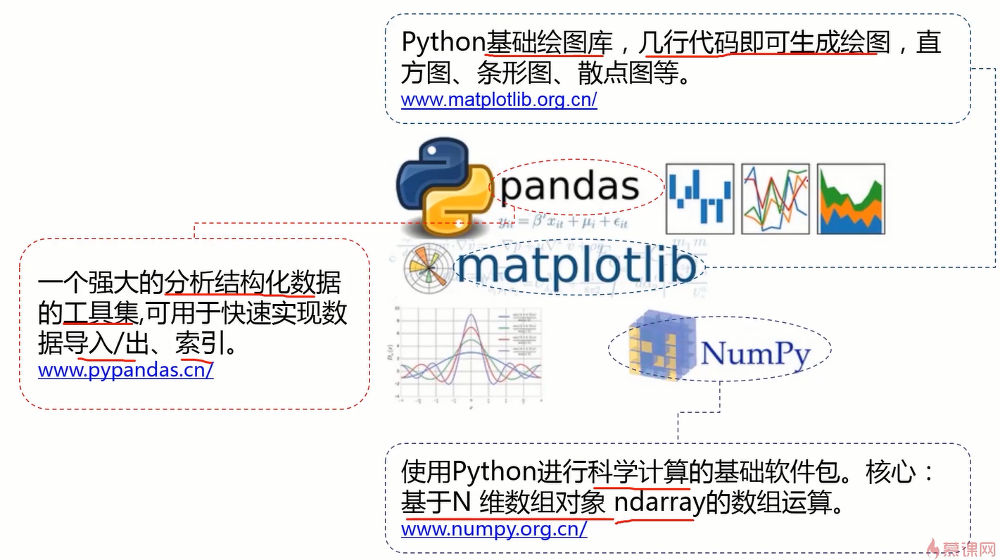

### 4.配置环境

配置环境：下载安装python、anaconda。

在anaconda中，建议每个项目新建一个开发环境，以免造成不必要的冲突。

其中，创建新环境的语句：conda create -n ***env_name*** ，激活环境语句：conda activate ***env_name*** 。（加粗斜体***env_name***为自定义环境名称）

在新建的环境中安装Jupyter Notebook即可完成环境配置。

### 5.Jupyter Notebook界面优化

Jupyter Notebook界面优化：由于默认的notebook的显示非常不舒服，所以导入新主题。

- 进入网址： https://github.com/dunovank/jupyter-themes ,找到安装命令**pip install jupyterthemes** / **conda install -c conda-forge jupyterthemes** ，在当前环境的命令行下使用**pip** / **conda**对应的语句安装该主题包。

	由于安装过程比较慢，可以使用一些国内的源。直接百度python源，找到一些国内镜像源：阿里/清华/豆瓣等。修改源的方法：原来的语句 + -i +源的地址，比如 **pip install jupyterthemes** 修改后变成 **pip install jupyterthemes** -i https://pypi.tuna.tsinghua.edu.cn/simple/ 。

	安装完成后，测试有没有安装好，语句为： **jt -h** 。如果成功显示了帮助的一些东西，就证明是安好了，当然我们也可以根据帮助来使用主题，如下图。

	

- 推荐的配置：jt -t grade3 -f fira -fs 13 -cellw 90% -ofs 11 -dfs 11 -T

	原先的主题：

	

	现在的主题：

	

### 6.开始编码

开始编码：在notebook右上角点new新建python文件，然后在file中重命名即可

- 使用markdown编辑除代码外的内容，换行要在该行结尾处多打两个或以上空格
- 使用markdown编辑完成后运行该cell即可显示运行结果
- ctrl+回车即可快速运行选中cell

### 7.Python的基础语法及Pandas、Numpy、Matplotlib实操

Python的基础语法及Pandas、Numpy、Matplotlib实操(见basic_coding.ipynb)，下载包依旧建议使用国内源

> 国内源地址
> 中国科技大学： https://pypi.mirrors.ustc.edu.cn/simple/
>
> 阿里云： http://mirrors.aliyun.com/pypi/simple/
>
> 豆瓣(douban)： http://pypi.douban.com/simple/
>
> 清华大学： https://pypi.tuna.tsinghua.edu.cn/simple/
>
> 中国科学技术大学 ：http://pypi.mirrors.ustc.edu.cn/simple/
>
> 科大放两个以显示其更好
>
> pip install numpy -i 源地址即可

**Matplotlib画图总结**

- 导入matplotlib,并导入需要的matplotlib下的对应子包。
- 创建并初始化图对象（包含指定图大小等初始化操作）
- 使用子包方法指定图像名称
- 使用给定坐标及子包相应方法绘图
- 使用子包方法展示图像

eg：使用Matplotlib画个折线图

```python
#使用Matplotlib
import matplotlib
from matplotlib import pyplot as plt
#生成图的实例
fig1 = plt.figure(figsize=(5,5))
#指定图名称
plt.title('My First Matplotlib Chart')
plt.xlabel('x-axis')
plt.ylabel('y-axis')
#给定各点坐标
x = [1,2,3,4,5]
y = [2,3,4,5,7]
plt.plot(x,y)
plt.show()
```


使用Matplotlib绘制散点图，就把plt.plot改成plt.scatter即可

```python
#使用Matplotlib绘制散点图
import matplotlib
from matplotlib import pyplot as plt
#让图在jupyter中直接展示出来
%matplotlib inline
#给定各点坐标
x = [1,2,3,4,5]
y = [2,3,4,5,7]
#生成图的实例
fig1 = plt.figure(figsize=(5,5))
#指定图名称
plt.title('My First Matplotlib Chart')
plt.xlabel('x-axis')
plt.ylabel('y-axis')
plt.scatter(x,y)
plt.show()
```


**Numpy总结**

Numpy的强大之处在于它可以很方便地对数组进行运算，首先要学会使用numpy构建数组，并做简单数组运算，更多运算参考官网文档。

eg：使用numpy生成俩数组，并求和。

```python
import numpy as np
arr1 = np.eye(5)
print(type(arr1))
print(arr1)
#打印该数组维度
print(arr1.shape)
```

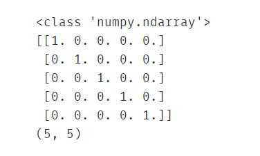

```python
arr2 = np.ones((5,5))
print(type(arr2))
print(arr2)
#打印该数组维度
print(arr1.shape)
```


```python
res = arr1+arr2
print(type(res))
print(res)
#打印该数组维度
print(res.shape)
```


**Pandas总结**

Pandas的强大之处在于它可以很方便地对数据进行加载、保存和索引。

eg1：读取csv文件，并分别索引出 **x列对应的所有行数据** 和 **y列对应的所有行数据**。

```python
import pandas as pd
#读取csv文件
data = pd.read_csv('data.csv')
print(type(data))
print(data)
```


```python
#分别索引x和y对应的所有行
x = data.loc[:,'x']
print(type(x))
print(x)
y=data.loc[:,'y']
```


eg2: 筛选出x<0 且 y>50的所有行

```python
#索引切片案例：筛选出x<0 且 y>50的所有行
data1 = data.loc[:,'x'][x<0][y>50]
print(data1)
```


关于loc函数的用法，第一次遇到，查了一下官方文档和博客，发现这个和数据库的思想差不多，就是从所有数据中查找我们需要的子集，无非是写法不同，参考 https://blog.csdn.net/u014712482/article/details/85080864 和 https://www.jianshu.com/p/521f6e302f38。此处涉及python切片知识，特地学了一下，链接：https://www.jianshu.com/p/15715d6f4dad ，可以说是讲的很详细了，看完感觉切片的功能太强大了，以后很多操作方便多了。

最后，在做数据处理的时候会使用Pandas导入csv文件，但是处理起来并不方便，通常会将DataFrame类型转成Numpy类型，方便进行数组间的科学计算。

```python
#常将DataFrame类型转成Numpy类型，方便处理
print(type(data))
np_data = np.array(data)
print(type(np_data))
print(np_data)
```


对比一下原来的csv文件，看看它的转换过程如何理解。


如图，csv转成numpy类型可以这样理解，由于数组下表具有顺序性，而csv文件的行标签也有顺序性，因此可以省略csv文件的行，直接把所有的行依次排成队列放入一维数组中，最终形成二维数组（python应该叫列表），完成转化过程。

最后关于Pandas，值得注意的是它的存储功能。

在使用Pandas加载文件数据，处理过之后，我们可能需要保存数据，这时使用 **to_csv(‘保存路径’)** 进行保存

eg: 对用Pandas加载进来data.csv文件的数据全部加15后得到的数据进行展示并保存

```python
#在对数据进行处理后，通过pandas进行数据保存
new_data = data +15
#展示前5行，因为数据特别大的时候没必要全部打开
new_data.head()
```


```python
new_data.to_csv('new_data.csv')
```

执行完该语句会发现当前ipynb文件所在目录下多了一个new_data.csv文件，打开得到保存后的数据内容。关于第一列的索引，可以参考官网文档选择性删除。

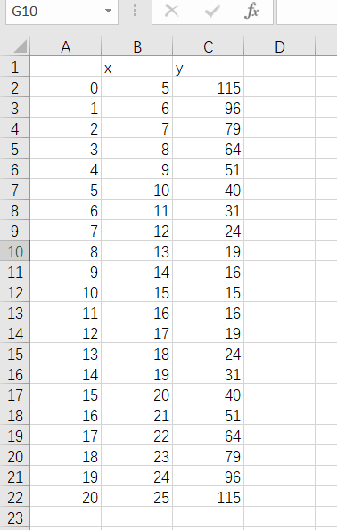

## 第二章 机器学习之线性回归

### 1.机器学习介绍

#### 1.1什么是机器学习？

举个例子：


如图的问题，对于传统算法而言，我们给出1月工资和计算的方程（关系表达式），通过计算机可以帮我们算出结果。而对于机器学习，不需要我们在给出方程（关系表达式）了，只需要给一堆数据，计算机会自己训练出表达式并根据表达式得到结果。这显然要比传统算法更智能。

定义如下：


#### 1.2应用场景


#### 1.3基本框架


#### 1.4机器学习的类别


- 监督学习：告诉计算机哪些是对的数据，哪些是错的数据，再让它训练。
- 无监督学习：不告诉计算机哪些是对的数据，直接让它训练。
- 半监督学习：也叫混合学习，只告诉计算机少量正确的数据，让它训练。
- 强化学习：根据每次的结果给计算机一个反馈（分数），让它根据反馈自动优化。

 

强化学习eg：机器人走路，只有一个通道，让它自己选择路径，当走到好的路径时给它+3分，走到坏的路径-3分。它就会自动寻找能获得高分的路径。

**各类学习的应用场景**


### 2.线性回归

#### 2.1什么是回归分析？

 对于初学者，直接讲线性回归可能会让初学者懵逼，我是谁？我在哪？我在干什么？这玩意有啥用？因此，有必要从从基本的概念入手，到底什么是回归分析？（Regression Analysis）

 如图，下面的三个案例给出了三个问题，这三个问题都是预测问题，那我们如何去做呢？当然是去找很多样本画图找规律喽。拿第一个问题举例，根据图上样本的分布规律，我们很容易发现它是一条斜率逐渐减小的递增曲线，从而根据曲线完成预测。但是如何让计算机看懂这个图？同样地，让它找到一条合适的曲线来拟合图上的样本点。这个拟合过程就叫回归，另外两个案例同理。


 举过例子了，下面抛出概念可能会比较容易理解了。


可以说，回归分析就是根据去拟合一条曲线，而拟合一条合适的曲线的方法就是确定该曲线对应的合适的参数。比如数据点趋于一条直线，我们就是要找到一条合适的直线y=ax+b，而确定合不合适关键就在于a和b这两个参数，因此不断调参找到合适的直线就是回归分析做的事。至于回归的种类，理解一种即可，其他原理类似。

#### 2.2线性回归

在了解什么是回归分析后，线性回归简直太好理解了。简单来说，它就是由数据拟合一条直线的回归分析。


最后，回归问题属于机器学习中的**监督学习**（你告诉计算机哪些是对的样本，哪些是错的，再让它训练）

#### 2.3回归问题求解

至此，我们已经了解了什么是线性回归，那回归问题如何求解呢？先来看一个问题


左边是问题，右边是解决方案。我们知道回归问题就是画图，根据样本点拟合一条曲线，这条曲线就是定量关系P=f(A)，在得到函数之后，这个问题就是小学初中的问题了，不再赘述。

 显然，回归问题的重点和难点是求定量关系，那如何去求？啥都别问先把图搞出来。


根据图，我们发现可以用很多曲线来拟合数据，但是这里为了简单，先从最基本的线性模型y=ax+b开始拟合，用其他曲线拟合的思想是一样的。找到合适的线性模型y=ax+b的关键是参数a和b，可以先直观地体会一下a和b对线性模型的影响。


为了找到合适的a和b，我们可以考虑从结果反推，什么样的模型是好的？当然是线离大多数点近啊！那更准确点呢？这个大牛已经研究好了，就是对于每一个样本点，算一下它与线当前纵坐标的差值的平方，再把所有的样本点所求的结果求和，取这个和的最小值，也就是右下角的公式。为了后续方便，可以在对这个结果除以2m，也就得到了我们常听的**损失函数**，把这个损失函数记为J。


其实除不除以2m对最后的结果都没有影响，只是为了方便后面求导计算约掉2m。

那原问题就转换成了找一个a和b，使得损失函数的值最小。

为了直观的看一下损失函数的意义和效果，可以做一个小图，放几个样本点，用两条不同的直线拟合它，观察损失函数的值以及对应的拟合效果。


表格中的x和y列为实际样本点的横纵坐标，y1’和y2’为预测的纵坐标的值，也即是拟合曲线上的预测点。计算y1’和y2’对应的损失函数得J1和J2，如下图。


显然J1<J2，而在图像上y1’显然比y2’的拟合效果好。从这个案例就可以体会出损失函数的价值。

回到原来的问题，如何确定合适的a和b从而找到最小的损失函数J？在损失函数公式中，可以把yi’=axi+b-yi带入公式，得到J与a和b的关系g，可以令J=g(a,b)。等等，这怎么有点像多元函数求极值的问题，那能用高数中的多元函数求极值的方法来求解这个问题吗？我也不清楚，先留个疑问吧，等知识丰富了再回来想这个问题。在人工智能领域提出了大名鼎鼎梯度下降法很好地解决了这个问题，它可以自动地寻找极小值。


介绍一下**梯度下降法**。打个比方，它的效果类似于把一个钢珠放在在一个开口向上的槽的半坡，让它自己滚动，它会晃来晃去，最终停到极小值点。而具体的实现办法就是上图的公式，当前点的横坐标为pi，那么搜索的下一个点的位置为p（i+1)，然后用上图公式就能得到下一个点的坐标了，然后把p(i+1)当做当前的点，再套用上面公式算出下一个点的坐标，直到它收敛即可得到极小值点的横坐标。公式怎么来的我也不知道，肯定是大牛搞出来的，目前我的水平也不需要理解，记住会用就行了。更多有关梯度下降的细节，可以参考网上的视频和博客。

α 即是步长，结合求偏导


J min 时就是 所求的 a 和 b

#### 2.4线性回归实战准备

首先认识一下sklearn，一个强有力的机器学习的开源框架。


其功能非常强大，常见的算法很快就能写出来。

**eg：调用sklearn求解线性回归问题？**

**分析：** 通过上一小节，我们已经知道求解线性回归最重要的就是确定得y=ax+b中的a和b两个参数。sklearn中有相应的包，使用包里面的函数可以快速求得参数a和b。


- 导入LinearRegression包
- 新建一个LinearRegression实例lr_model
- **调用fit方法拟合模型**，就可以找出参数a（coef）和b（intercept_）了
- 使用拟合的模型对新数据进行预测

**模型评估**

模型评估的指标有很多，后续章节会专门介绍，但这个小实战先简单介绍一下这三个指标


- MSE和损失函数非常像，就差一个分母的2，它越小越好。
- R^2=1-(MSE)/方差，这个原理暂时不太懂，姑且先放一放，知道它是小于1且越接近1越好。
- 画图对比y与y’，将模型可视化来评估模型好坏，比较直观。

具体的实现方法如下：


在作图时，可能需要将多个图放在一起展示，使用subplot方法即可实现，比如subplot(211)的意思就是两行1列选择第一个行。

subplot 表示画子图，subplot(211) 表示将图分为两行1列，同时选择第一行


#### 2.5单因子线性回归实战

##### 2.5.1准备工作

本次实战会用到如下两个csv文件


generated_data.csv文件是自己造的一个简单数据，主要用于学习起来简单方便，内容如下。

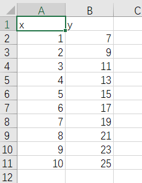

usa_housing_price.csv文件时美国一些房价及影响因素的数据，内容如下。


打开anaconda，切换到你创建学习本项目的环境，打开notebook，在对应文件夹下创建文件lr_generated_data.ipynb保存


##### 2.5.2回顾与步骤梳理

**任务：**
基于generated_data.csv数据，建立线性回归模型，预测x=3.5对应的y值，评估模型表现

在前面的线性回归章节已经介绍过如何建立线性回归模型了，再温习一下步骤。

1. 加载数据
2. 取出数据
3. 观察数据
4. 使用skleran建立线性回归模型
5. 使用建立的模型进行预测
6. 得出线性模型y=ax+b的两个重点参数a和b
7. 评价模型：MSE（均方差）、r2分数、画预测值与实际值的图看他是否逼近y=x

下面将围绕这几个步骤进行展开。

##### 2.5.3加载数据

```python
#加载数据
import pandas as pd
lr_data = pd.read_csv("generated_data.csv")#使用read_csv函数，非常常用，务必记住！！
lr_data.head()#显示前5行数据
```


pandas基本操作忘了的话，建议回第一章第7节看看，至于函数的使用，多记多百度，前期啥都不知道肯定是要记一些最常用的。

##### 2.5.4取出数据

```python
#取出x和y列数据
x = lr_data.loc[:,'x']
y = lr_data.loc[:,'y']
print(type(x))
print(x)
print(type(y))
print(y)
```


一样，loc用法也在第一章第7节，忘了回去看。一般取出数据之后，都查看一下，如果数据多的话就用head看前5行。

##### 2.5.5观察数据

```python
#画一下点看看数据长什么样子
from matplotlib import pyplot as plt
plt.figure() #(figsize(xx,xx)) 指定大小
#画直线或散点图均可
plt.scatter(x,y)
#plt.plot(x,y)
plt.show()
```


由于是自己造出来的完美数据，这些点正好是直线上的点。

##### 2.5.6使用skleran建立线性回归模型

```python
#使用sklearn建立线性回归模型
from sklearn import linear_model #from sklearn.linear_model import LinearRegression
lr_model = linear_model.LinearRegression()
#查看当前x、y及维度：1维
print(type(x),x.shape)
print(type(y),y.shape)
```


用到了sklearn下的linear_model，然后创建一个对象，后面会用对象调用函数。官方文档下都有用法，还是要过看官方文档，csdn，多百度，多记。

此处应注意x和y都是1维的，也就是向量形式。

```python
import numpy as np
#直接使用fit会失败，因为它要求传入的x参数为二维数组，因此要将一维的x转换成二维的
x = np.array(x) # 此时还是一维数组
x = x.reshape(-1,1) # 转换为 10 行 1 列 将一维转换为 二维
y = np.array(y)
y = y.reshape(-1,1)
#再次查看当前x、y及维度：2维
print(type(x),x.shape)
print(x)
print(type(y),y.shape)
print(y)
```


此处要将x转换成2维的，也就是转换成矩阵形式，其实y可以不用转换（这里目前还是有点小疑问，不过根据后面的实操得出的结论是这样）。另外关于reshape的用法参考 https://blog.csdn.net/u010916338/article/details/84066369 和 https://www.zhihu.com/question/52684594 。

```python
#使用fit构建线性回归模型
lr_model.fit(x,y)
```


构建模型很简单，就这一个fit函数，传入x和y的坐标集，它自己就能拟合得到一个线性模型。

##### 2.5.7使用建立的模型进行预测

```python
#使用构建的模型预测x对应的y（应该为完美预测）
y_predict = lr_model.predict(x)
print(y_predict)
```


传入原始数据中的x去进行预测，由于这个数据是完美数据，模型也是完美的，因此得到的预测值肯定也是完美的（即预测点就在直线上）。但在平时处理中，数据不是完美的，所以主要是看评价模型的指标，大多数情况直接看预测结果是没意义的。

```python
#使用构建的模型预测x=3.5时y的值
y_predict2 = lr_model.predict([[3.5]]) # 需要传入维度 [[x]]
print(y_predict2)
```


当然这个也是完美预测。。。

##### 2.5.8得出线性模型y=ax+b的两个重点参数a和b

```python
#根据模型得出参数a和b并显示出来
a = lr_model.coef_ #斜率
b = lr_model.intercept_ #截距
print(a,b)
```


使用这 coef_ 和 intercept_ 即可得到参数a和b，那这得到的对不对呢？看看原始数据。

选中所有的x和y(不包括这两个字母)点插入中的散点图。


右键其中一个散点，选择趋势线。


在下面勾选显示公式，可以看到公式为y=2x+5，而上面的参数a、b就是2和5，这就证明上面求得的参数是正确的。

 

##### 2.5.9评价模型

评价指标的3个常用方式MSE、r2分数、画y和y_predict的图，都记住吧。

```python
from sklearn.metrics import r2_score,mean_squared_error
#评价指标：均方差MSE和R2分数
MSE = mean_squared_error(y,y_predict)
R2 = r2_score(y,y_predict)
print(MSE,R2)
```


```python
#评价指标：画图
plt.figure()
plt.plot(y,y_predict)
plt.show()
```

 

#### 2.6多因子线性回归实战

**线性回归预测房价**

**任务:** 基于usa_housing_price.csv数据，建立线性回归模型，预测合理房价：
1、以面积为输入变量，建立单因子模型，评估模型表现，可视化线性回归预测结果
2、以income、house age、numbers of rooms、population、area为输入变量，建立多因子模型，评估模型表现
3、预测Income=65000, House Age=5, Number of Rooms=5, Population=30000,size=200的合理房价 X_test = [65000,5,5,30000,200]

与单因子线性回归类似，只是输入换成了多因子，步骤如下：

- 导入数据
- 展示数据
- 以面积为输入变量建立单因子模型
- 使用sklearn构建线性模型
- 使用模型预测房价
- 评估模型
- 画图评估
- 建立多因子模型
- 拟合线性模型
- 预测新数据
- 评估模型
- 画图评估
- 预测Income=65000, House Age=5, Number of Rooms=5, Population=30000,size=200的合理房价 X_test = [65000,5,5,30000,200]

##### 2.6.1导入数据

```python
#导入数据
import numpy as np
from matplotlib import pyplot as plt
import pandas as pd
data = pd.read_csv("usa_housing_price.csv")
data.head()
```


##### 2.6.2展示数据

```python
#展示一下数据
fig = plt.figure(figsize=(15,7))

fig1 = plt.subplot(231)
plt.scatter(data.loc[:,'Avg. Area Income'],data.loc[:,'Price'])
plt.title('Income VS Price')


fig2 = plt.subplot(232)
plt.scatter(data.loc[:,'Avg. Area House Age'],data.loc[:,'Price'])
plt.title('Age VS Price')


fig3 = plt.subplot(233)
plt.scatter(data.loc[:,'Avg. Area Number of Rooms'],data.loc[:,'Price'])
plt.title('Number VS Price')


fig4 = plt.subplot(234)
plt.scatter(data.loc[:,'Area Population'],data.loc[:,'Price'])
plt.title('Population VS Price')


fig5 = plt.subplot(235)
plt.scatter(data.loc[:,'size'],data.loc[:,'Price'])
plt.title('size VS Price')
plt.show()
```


##### 2.6.3以面积为输入变量建立单因子模型

```python
#以面积为输入变量建立单因子模型
#获取X和y
X = data.loc[:,'size']
y = data.loc[:,'Price']
X = np.array(X).reshape(-1,1)
print(X.shape)
```

##### 2.6.4使用sklearn构建线性模型

```python
#使用sklearn构建线性模型
from sklearn import linear_model as lm
lr1 = lm.LinearRegression()
lr1.fit(X,y)
```

##### 2.6.5使用模型预测房价

```python
#使用模型预测房价
y_predict1 = lr1.predict(X)
print(y_predict1)
```


##### 2.6.6评估模型

```python
#评估模型
from sklearn.metrics import mean_squared_error,r2_score
MSE1 = mean_squared_error(y,y_predict1)
R2_score1 = r2_score(y,y_predict1)
print(MSE1,R2_score1)
```


##### 2.6.7画图评估

```python
#画图评估
fig6 = plt.figure(figsize=(5,5))
plt.scatter(X,y)
plt.plot(X,y_predict1,'g') # 指定颜色
plt.show()
```


##### 2.6.8建立多因子模型

```python
#建立多因子模型
#定义X_muti和y
X_muti = data.drop('Price',axis=1) #取消 price 列
y = data.loc[:,'Price']
X_muti.head()
#y.head()
```


##### 2.6.9拟合线性模型

```python
#拟合线性模型
from sklearn import linear_model as lm
lr_muti = lm.LinearRegression()
lr_muti.fit(X_muti,y)
```

##### 2.6.10预测新数据

```python
#预测新数据
lr_muti_predict = lr_muti.predict(X_muti)
print(lr_muti_predict)
```


##### 2.6.11评估模型

```python
#评估模型
from sklearn.metrics import r2_score,mean_squared_error
lr_muti_r2_score = r2_score(y,lr_muti_predict)
lr_muti_mse = mean_squared_error(y,lr_muti_predict)
print(lr_muti_mse,lr_muti_r2_score)
```


```python
#与之前的单因子模型相比，r2分数好的多（比单子更接近1），mse小了10倍，显然该案例多因子模型更好一点
print(MSE1,R2_score1)
```


##### 2.6.12画图评估

```python
#画图评估模型   实际 y 值 和预计 y 值比较
from matplotlib import pyplot as plt
fig7 = plt.figure(figsize=(8,5))
plt.scatter(y,lr_muti_predict)
plt.title("Price VS Price_predict under multiple factors")
plt.show()#从图上看，预测值和实际值的重合部分比较多，效果不错
```


```python
#与单因子的对比一下
fig8 = plt.figure(figsize=(8,5))
plt.scatter(y,y_predict1)
plt.title("Price VS Price_predict under single factors")
plt.show()#oh my god 效果简直好太多了！
```


##### 2.6.13预测给定参数下的合理房价

```python
#预测Income=65000, House Age=5, Number of Rooms=5, Population=30000,size=200的合理房价 X_test = [65000,5,5,30000,200]
import numpy as np
X_muti2 = [65000,5,5,30000,200]
#将向量转为二维矩阵以便能作为参数传入predict函数 
X_muti2 = np.array(X_muti2).reshape(1,-1) 
print(X_muti2)
```


```python
lr_muti_predict2 = lr_muti.predict(X_muti2)
print(lr_muti_predict2)
```


## 第三章 机器学习之逻辑回归

### 1.分类问题介绍

线性回归主要是解决一个回归问题的，而逻辑回归则是解决分类问题的。至于为什么逻辑回归有“逻辑”二字但却是解决分类问题的，我的理解是分类也是一种特殊的回归。有兴趣自行百度。

来看下分类问题的实例：

   

#### **定义**


#### **分类的方法**


#### **分类任务与回归任务的明显区别**

- 分类问题的核心是 **非连续型标签** （输出方面）
- 回归模型的核心是 **连续醒数值** （输出方面）


### 2.逻辑回归讲解

#### 2.1分类任务

我们现在已经知道了逻辑回归是处理分类任务的，那什么是分类也很容易理解，有如下案例


如何让机器理解这个任务呢？这就要先看一下分类任务的框架是怎样的。

分为两步，第一步是先求解一个最终的结果，就是下图中的y=f(x1,x2,xn)，第二步就是根据该结果来判别类别。


 在这个看电影案例中，第一步就是y=f(x)∈{0,1} （0表示不看电影，1表示看电影），第二步就是根据f(x)的值判断类别。显然，关键在于找出f(x)。

 为了找出f(x)，可以先使用简单地线性模型看一下点的分布情况，如下图。


可以得出分布函数y=0.1364x+0.5，那基于这个分布函数很容易就能得出看电影的情况，当y>=0.5时，去看电影，否则不去。

来看一下在此情况下的预测准确率，貌似非常不错。


但其实它有很大的局限性，它不够灵活，当样本量变大以后，准确率可能会下降的很快。比如下面案例中由于一个样本点向右偏离了很多，导致线性回归函数整体偏移了很多，这显然很呆。这时逻辑回归就派上用场了。


#### 2.2逻辑回归的分布函数

相比线性回归，逻辑回归主要的不同在于分布函数，逻辑回归的分布函数为 y=1/(1+e^(-x)) ，也叫sigmoid函数，分布函数如下。


##### **定义**

> 二分类表示仅有两个结果


那将逻辑回归应用于看电影的案例就是如下答案


#### 2.3多维度下的分类任务

当有高维个影响因素时，只需将sigmoid函数进行适当的替换即可。比如当影响结果的因素为**二维（x1,x2）时**,可以把sigmoid函数中的x替换成下图右侧的g(x)，至于更高维度的，同样也是替换，只是g(x)也会更高维。（多个输入对应一个输出）


##### 决策边界

而这个g(x)就被称为**决策边界**，我们解决分类任务最重要的就是找到它。

同样地，找到下面这个决策边界也就是找到g(x)，当g(x)中包含二次项时，也意味着他是曲线，灵活度更高，可以看出它在下面的分类问题中作用非常好。 （有多个输入对应一个输出）


### 3.逻辑回归求解


这里sigmoid函数是固定的，关键是求解g(x)，也就是决策边界。而得到g(x)的关键又是**得到它的参数**，在后面的实战中会使用sklearn得到这几个参数。

对于逻辑回归，它的损失函数不同于线性回归的，因为它的点是离散型的，因此使用下面的损失函数。感兴趣的可以百度查查相关知识。

#### 最小损失函数

由于标签和预测结构是离散的，无法求导，故和线性回归的最小化损失函数有所不同。


逻辑回归的损失函数可以合并为一个式子，如下图。有了损失函数的式子，最后求解逻辑回归的问题就转化成了求最小的损失函数了，使用梯度下降法即可。


#### 梯度下降法求系数


### 4.实战准备

 使用matplotlib画分类点时，要使用mask进行标记，当mask为true时是一个类别，为false又是一个不同的类别，然后在画点的时候把不同类别的点后用mask标记一下即可。


使用逻辑回归实现二分类与线性回归那块类似


下面还要了解一下得到参数theta0、theta1、theta2（一阶线性）的过程，这就是决策边界的那三个参数。如果决策边界为曲线时，那应该引入平方项，并重新构建一个字典。


模型评估方面引入准确率，比较简单。


准确率实现方法及边界曲线可视化如下


### 5.考试实战

**任务: ** 逻辑回归预测考试通过。

基于examdata.csv数据，建立逻辑回归模型 预测Exam1 = 75, Exam2 = 60时，该同学是 passed or failed; 建立二阶边界，提高模型准确度

#### **导入csv文件**

```python
#read the data
import pandas as pd
import numpy as np
data = pd.read_csv('examdata.csv')
data.head()
```


#### **得到X和y，可视化数据**

此处X为2维，有两门考试嘛。y是一维，表示通过与否。

```python
#get X and y
X = data.drop('Pass',axis=1)
y = data.loc[:,'Pass']  # 用作 mask
X1 = data.loc[:,'Exam1']
X2 = data.loc[:,'Exam2']
X2.head()
```


#### **可视化数据**

```python
#visualize the data
%matpltlit inline
from matplotlib import pyplot as plt
fig1 = plt.figure(figsize=(8,5))
plt.title('Exam1 VS Exam2')
plt.xlabel('Exam1')
plt.ylabel('Exam2')
plt.scatter(X1,X2)
plt.show()
# add mask
mask = data.loc[:,'Pass'] == 1
print(mask)
```


#### **分类后的可视化**

```python
#visualize the data
from matplotlib import pyplot as plt
fig2 = plt.figure(figsize=(8,5))
mask=y==1    # y = data.loc[:,'Pass']  # 用作 mask
# plt.scatter(data.loc[:,"Exam1"][mask],data.loc[:,'Exam2'][mask]) 查看通过的人
plt.title('Exam1 VS Exam2')
plt.xlabel('Exam1')
plt.ylabel('Exam2')
passed = plt.scatter(X1[mask],X2[mask])    # X1 = data.loc[:,'Exam1']      X2 = data.loc[:,'Exam2'] (x1,x2) -> pass
failed = plt.scatter(X1[~mask],X2[~mask],marker='^') # (x1,x2) -> failed
plt.legend([passed,failed],['pass','fail'])  #('pass','failed') 也可
plt.show()
```


#### **模型构建与预测**

```python
#establish the model and fit    
"""
X = data.drop('Pass',axis=1) 去除 pass 列
y = data.loc[:,'Pass']  # 用作 mask
X1 = data.loc[:,'Exam1']
X2 = data.loc[:,'Exam2']
"""
from sklearn.linear_model import LogisticRegression
lr = LogisticRegression()
lr.fit(X,y)
predict1 = lr.predict(X)
print(predict1)
```


#### **用准确率评估模型**

accuracy_scroe

```python
#evaluate the model
from sklearn.metrics import accuracy_score
accuracy_score(y,predict1)
```


#### **预测特定数据下的通过情况**

```python
#预测Exam1 = 75, Exam2 = 60时，该同学是 passed or failed
predict2 = lr.predict([[75,60]]) # [[75,60]] 表示是一个表，2 列，此时传如 1 行数据进行预估
print('passed' if predict2==1 else 'failed')
```


#### **得到决策边界的参数**

```python
#得到决策边界函数
theta0 = lr.intercept_  #截距
theta1 = lr.coef_[0][0] #系数1
theta2 = lr.coef_[0][1] #系数2
X2_new = -(theta0+theta1*X1)/theta2 # 求解 x2
```

#### **可视化决策边界**

```python
#visualize the boundary
fig3 = plt.figure(figsize=(8,5))
mask=y==1
plt.title('Exam1 VS Exam2')
plt.xlabel('Exam1')
plt.ylabel('Exam2')
passed = plt.scatter(X1[mask],X2[mask])
failed = plt.scatter(X1[~mask],X2[~mask],marker='^')
boundary = plt.plot(X1,X2_new,c='r')
plt.legend([passed,failed],['pass','fail'])
plt.show()
```

 

#### **建立2阶边界，也就是曲线**

```python
#建立二阶边界，提高模型准确度
#get the new data
X1_2 = X1*X1
X2_2 = X2*X2
X1_X2 = X1*X2
X_new = {'X1':X1,'X2':X2,'X1_2':X1_2,'X2_2':X2_2,'X1_X2':X1_X2} #复制到字典中
X_new = pd.DataFrame(X_new)
print(X_new)
```


#### **构建模型并预测**

```python
# 创建新模型训练
lr2 = LogisticRegression() #逻辑回归
lr2.fit(X_new,y)
predict3 = lr2.predict(X_new)
print(predict3)
```


**用准确率评估模型**

```python
#get the accuary_score
accuracy_score(y,predict3)
```


#### **对x1进行排序，使得可视化地时候决策边界是一条平滑的线**

```python
X1_new = X1.sort_values()
print(X1,X1_new)
```


**得到二阶决策边界的参数，并通过决策边界=0的方程计算出X2的坐标**

```python
#get the new X2 inorder to draw the boundary easily
theta0 = lr2.intercept_
theta1,theta2,theta3,theta4,theta5 = lr2.coef_[0][0],lr2.coef_[0][1],lr2.coef_[0][2],lr2.coef_[0][3],lr2.coef_[0][4]
a = theta4
b = theta2+theta5*X1_new
c = theta0+theta1*X1_new+theta3*X1_new*X1_new
#print(theta0,theta1,theta2,theta3,theta4,theta5)
X2_new2 = (-b+np.sqrt(b*b-4*a*c))/(2*a)
print(X2_new2)
```

 

**可视化二阶决策边界**

```python
#draw the boundary
fig4 = plt.figure(figsize=(8,5))
mask=y==1
plt.title('Exam1 VS Exam2')
plt.xlabel('Exam1')
plt.ylabel('Exam2')
passed = plt.scatter(X1[mask],X2[mask])
failed = plt.scatter(X1[~mask],X2[~mask],marker='^')
boundary2 = plt.plot(X1_new,X2_new2,c='r')
plt.legend([passed,failed],['pass','fail'])
plt.show()
```


### 6.芯片监测实战

**任务:** 逻辑回归预测芯片质量通过

1、基于chip_test.csv数据，建立逻辑回归模型(二阶边界)，评估模型表现；
	2、以函数的方式求解边界曲线
	3、描绘出完整的决策边界曲线


步骤如下：
（1）加载数据
（2）可视化数据
（3）定义X和y，得到对应参数及相关数据
（4）建立模型、训练、预测
（5）评估模型
（6）找到决策边界（二阶）
（7）自定义边界函数

**加载数据**

```python
#read the data
import pandas as pd
import numpy as np
data = pd.read_csv('chip_test.csv')
data.head()
```


**获得X和y**

```python
#get X and y
X = data.drop('pass',axis=1)
y = data.loc[:,'pass']
X1 = data.loc[:,'test1']
X2 = data.loc[:,'test2']
X2.head()
```


**可视化分类后的数据**

```python
#visualize the data
from matplotlib import pyplot as plt
fig2 = plt.figure(figsize=(8,5))
mask=y==1
plt.title('test1 VS test2')
plt.xlabel('test1')
plt.ylabel('test2')
passed = plt.scatter(X1[mask],X2[mask])
failed = plt.scatter(X1[~mask],X2[~mask],marker='^')
plt.legend([passed,failed],['pass','fail'])
plt.show()
```


**直接建立二阶曲线边界**

```python
#建立二阶边界，提高模型准确度
#get the new data
X1_2 = X1*X1
X2_2 = X2*X2
X1_X2 = X1*X2
X_new = {
            'X1':X1,'X2':X2,'X1_2':X1_2,'X2_2':X2_2,'X1_X2':X1_X2}
X_new = pd.DataFrame(X_new)
print(X_new)
```


**建立模型并预测**

```python
lr2 = LogisticRegression()
lr2.fit(X_new,y)
predict3 = lr2.predict(X_new)
print(predict3)
```


**用准确率评估模型**

```python
#get the accuary_score
accuracy_score(y,predict3)
```


**对x1排序以便画好边界曲线**

```python
X1_new = X1.sort_values()
print(X1_new)
```


**获取决策边界的参数，并定义新增平方项和混合项的新字典**

```python
#get the new X2 inorder to draw the boundary easily
theta0 = lr2.intercept_
theta1,theta2,theta3,theta4,theta5 = lr2.coef_[0][0],lr2.coef_[0][1],lr2.coef_[0][2],lr2.coef_[0][3],lr2.coef_[0][4]
a = theta4
b = theta2+theta5*X1_new
c = theta0+theta1*X1_new+theta3*X1_new*X1_new
#print(theta0,theta1,theta2,theta3,theta4,theta5)
X2_new2 = (-b+np.sqrt(b*b-4*a*c))/(2*a)
print(X2_new2)
```


**画出决策边界**

```python
#draw the boundary
fig4 = plt.figure(figsize=(8,5))
mask=y==1
plt.title('test1 VS test2')
plt.xlabel('test1')
plt.ylabel('test2')
passed = plt.scatter(X1[mask],X2[mask])
failed = plt.scatter(X1[~mask],X2[~mask],marker='^')
boundary2 = plt.plot(X1_new,X2_new2,c='r')
plt.legend([passed,failed],['pass','fail'])
plt.show()
```


由于求解x2的时候，只用了一个求根公式 x=(-b+sqrt(b*b-4*a*c))/(2*a) ，因此决策边界只有一条，想画全就同时得到求根公式的两个x即可，于是就有下面的自定义边界函数f(x)。

#### **自定义边界函数**

```python
#自定义边界函数f(x)
def f(x):
    a = theta4
    b = theta2+theta5*x
    c = theta0+theta1*x+theta3*x*x
    boundary1 = (-b+np.sqrt(b*b-4*a*c))/(2*a)
    boundary2 = (-b-np.sqrt(b*b-4*a*c))/(2*a)
    return boundary1,boundary2
```

#### **获得两条边界曲线的纵坐标**

```python
#获得两条边界函数test1对应的test2
line1 = []
line2 = []
for x in X1_new:
    line1.append(f(x)[0])
    line2.append(f(x)[1])
print(line1,line2)
```


#### **画出决策边界**

```python
#draw the boundary
fig5 = plt.figure(figsize=(8,5))
mask=y==1
plt.title('test1 VS test2')
plt.xlabel('test1')
plt.ylabel('test2')
passed = plt.scatter(X1[mask],X2[mask])
failed = plt.scatter(X1[~mask],X2[~mask],marker='^')
boundary3 = plt.plot(X1_new,line1,c='r')
boundary4 = plt.plot(X1_new,line2,c='r')
plt.legend([passed,failed],['pass','fail'])
plt.show()
#线并不闭合，是因为test1的样本点太少了，可以自己制造密集一点的点来补全
```


此时我们发现决策曲线还是不闭合，原因是数据点不够多，那我们只需要多生成一些点再画图即可。

#### **生成密集的点以补全决策边界曲线**

```python
X1_customize = [-0.9 + i/20000 for i in range(0,38001)]#可以参考列表解析的用法
X1_customize = np.array(X1_customize)
#获得两条边界函数test1对应的test2
line3 = []
line4 = []
for x in X1_customize:
    line3.append(f(x)[0])
    line4.append(f(x)[1])
print(line3,line4)
```


#### **画出决策边界**

```python
#draw the boundary
fig6 = plt.figure(figsize=(8,5))
mask=y==1
plt.title('test1 VS test2')
plt.xlabel('test1')
plt.ylabel('test2')
passed = plt.scatter(X1[mask],X2[mask])
failed = plt.scatter(X1[~mask],X2[~mask],marker='^')
boundary5 = plt.plot(X1_customize,line3,c='r')
boundary6 = plt.plot(X1_customize,line4,c='r')
plt.legend([passed,failed],['pass','fail'])
plt.show()
#线已经闭合了
```


大工告成！终于结束了，这章学完收货颇丰~

有很多一开始没接触过的东西都自己去百度了，真的学会了很多。

## 第四章 机器学习之聚类

### 1.无监督学习

无监督学习(Unsupervised Learning)

举个例子，下列有些猫的图片，对这些图片进行分类。再无监督学习的情况下，他会自动寻找这些图片的共同点，将相似的归为一类，**并不需要你告诉他哪些图片是哪一类。**


其定义、优点及应用如下：


#### 区别

无监督和监督学习的区别就是是**否给数据打上label。**

比如下图是监督学习，他会使用y来代表label的情况，根据x值给该数据打上相应的y(label)值。比如给红色的类打上0的label，给蓝色的类打上1的label，分别代表0和1类。


而无监督学习则没有label项，在划分为两个类后，这两个类谁是0类谁是1类都无所谓。


#### **聚类分析**

**聚类分析**又称为**群分析**，根据对象某些属性的**相似度**，将其自动划分为不同的类别。


#### **常用的聚类算法**

##### KMeans聚类

必须预先告知需要分出几类

 

##### Meanshift

不需要人工干预

 

##### DBSCAN 算法

优点：可以过滤噪音


### 2.Kmeans-KNN-Meanshift

#### 2.1什么是Kmeans

KMeans Analysis也叫**K均值聚类**


其实这个算法很简单，就是**不断地更新聚类中心的位置**，直到**收敛**。其算法的具体步骤如下（初始点随便选取即可）：


##### KNN算法是监督学习

给定训练数据集，对新的输入实例，找到与该实例最邻近的 k 个实例


#### 2.2什么是KNN

KNN也叫K近邻分类模型


#### 2.3什么是Meanshift

Meanshift也叫均值漂移聚类

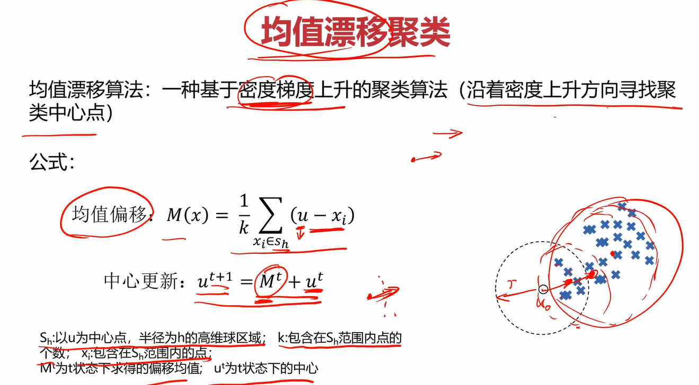

其算法流程为：


关于此处的每一个算法，我并没有过多的在笔记中记录。一方面是单纯使用文字很难讲解，看视频会比较好一点。另一方面是我的笔记是针对快速回忆以及重点知识的理解的，我觉得这些已经足够我回忆起来了，并且每个算法并不难理解。因此推荐第一次接触的兄弟们看看每个算法的讲解原理，再看上面几个图片就能通透很多。后面很多章节我也不会记得特别详细，毕竟这是笔记而不是讲课。

### 3.实战准备

#### 3.1KMeans预备知识

在之前学习的基础上，这里模型的训练流程应该都能理解。

需要注意的就是定义KMeans对象时往里面传的参数： **n_clusters=3** 和 **random_state=0**。

**n_clusters=3**就是你要聚成几个类，=3说明要聚3个类。

关于**random_state=0**，参考了一些博客，得出如下结论：

***如果你在需要设置random_state 的地方都设置好，那么当别人重新运行你的代码的时候就能得到完全一样的结果，复现和你一样的过程。如果你设置为None，则会随机选择一个种子。***

那么让它=0也是为了固定种子的值，以便后续我们可以保证当前随机性的复现。


获取聚类中心点的方法为KM.cluster_centers_

准确率都会，就不说了，emmm，kmeans好像也没啥了。

哦，这里还有个要注意，由于kmeans是无监督学习，因此他没有label，分类完成是没啥问题，但分出来的类标签可能有问题，这时就需要用到校正。方法也很简单，可以画个图看看是哪几个标签打反了，使用列表校正即可，再将矫正后的数据转为numpy的array就得到正确的带标签分类结果了。


#### 3.2Meanshift预备知识

这个挺简单地，带宽可以自动计算出来或者手动给定（一般都自动计算，因为你也不知道给多少合适）

estimate_bandwidth传入的参数X为数组，n_samples为使用的样本数，不指定，就使用所有的样本。

estimate_bandwidth(X,n_samples=500)的意思就是在X中以500个样本数据进行估算，得出合适的带宽。

最后构建模型需要传入带宽。

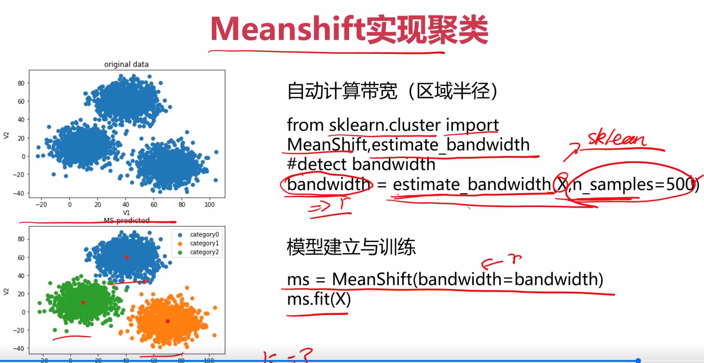

#### 3.3KNN预备知识

KNN贼简单，定义个KNN分类器创建实例就完事~

唯一需要注意的就是训练的时候要传入y，因为他是监督学习，你需要传入对应的label。而KMeans和Meanshift是无监督学习，训练的时候就不需要label。


### 4.Kmeans实战

无监督式，只需要 x  不需要 y

**任务: 2D数据类别划分**

1、采用Kmeans算法实现2D数据自动聚类，预测V1=80,V2=60数据类别；

2、计算预测准确率，完成结果矫正

3、采用KNN、Meanshift算法，重复步骤1-2

数据：data.csv

**开工~**

老样子，先new个新文件，名字如下(我已经弄好了)


**读取数据**

```python
#读取数据
import pandas as pd
import numpy as np
from matplotlib import pyplot as plt
data = pd.read_csv('data.csv')
data.head()
```


**定义X和y**

```python
# 定义X和y
X = data.drop('labels',axis=1)
y = data.loc[:,'labels'] # 所有行 labels列
y.head()
```


```python
#看一下标签的分布情况（看看有多少类，每类有多少个样本）
pd.value_counts(y)
```


#### **画出数据观察分布**

```python
#画出原始数据
%matplotlib inline
fig1 = plt.figure(figsize=(8,6))
plt.scatter(data.loc[:,'V1'],data.loc[:,'V2'])
plt.xlabel('V1')
plt.ylabel('V2')
plt.title('unlabeled data')
plt.show()
```


```python
#给原始数据打上标签
fig2 = plt.figure(figsize=(8,6))
label0 = plt.scatter(data.loc[:,'V1'][y==0],data.loc[:,'V2'][y==0])
label1 = plt.scatter(data.loc[:,'V1'][y==1],data.loc[:,'V2'][y==1])
label2 = plt.scatter(data.loc[:,'V1'][y==2],data.loc[:,'V2'][y==2])
plt.xlabel('V1')
plt.ylabel('V2')
plt.title('labeled data')
plt.legend([label0,label1,label2],['label0','label1','label2'])
plt.show()
```


#### **构建Kmeans模型**

```python
#创建Kmeans实例,使用kmeans训练模型
from sklearn.cluster import KMeans
kmeans = KMeans(n_clusters=3,random_state=0) # 分为三类，确保训练结果保持一致
kmeans.fit(X) # 无监督 不需要 kit(X,y)
```


#### **得到簇中心**

```python
#得到簇中心
cluster_center = kmeans.cluster_centers_
print(cluster_center)
```


```python
#可视化簇中心（红色点为簇中心）
fig3 = plt.figure(figsize=(8,6))
label0 = plt.scatter(data.loc[:,'V1'][y==0],data.loc[:,'V2'][y==0])
label1 = plt.scatter(data.loc[:,'V1'][y==1],data.loc[:,'V2'][y==1])
label2 = plt.scatter(data.loc[:,'V1'][y==2],data.loc[:,'V2'][y==2])
plt.xlabel('V1')
plt.ylabel('V2')
plt.title('labeled data')
plt.legend([label0,label1,label2],['label0','label1','label2'])
plt.scatter(cluster_center[:,0],cluster_center[:,1])#切片操作：[行切片操作,列切片操作]  第0列和第1列 即是簇中心的坐标(x,y)
plt.show()
```

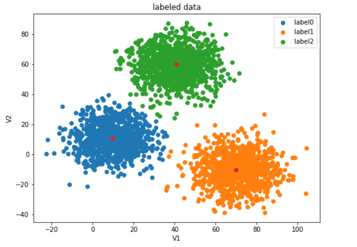

#### **进行预测**

```python
#对v1=80，v2=60的数据进行分类预测
y_predict1 = kmeans.predict([[80,60]])
print('label%d' % y_predict1)
#从图上看，它应该归为label2类，但预测结果竟然为label1类，显然是有问题的
```


```python
#看看对原训练数据的预测效果如何
y_predict2 = kmeans.predict(X)
#对比一下预测结果和原数据的标签
print(pd.value_counts(y_predict2),pd.value_counts(y))  #预测数据和原始数据
```


#### **计算准确率**

```python
#计算预测准确率
from sklearn.metrics import accuracy_score
print(accuracy_score(y,y_predict2))
```


这个准确率低的吓人，说明哪里出错了，画个图瞧瞧

```python
#画出当前预测结果与原数据图的对比
fig4 = plt.figure(figsize=(11,4))
plt.subplot(1,2,1) # 可直接(121)
label0 = plt.scatter(data.loc[:,'V1'][y==0],data.loc[:,'V2'][y==0])
label1 = plt.scatter(data.loc[:,'V1'][y==1],data.loc[:,'V2'][y==1])
label2 = plt.scatter(data.loc[:,'V1'][y==2],data.loc[:,'V2'][y==2])
plt.xlabel('V1')
plt.ylabel('V2')
plt.title('original data')
plt.legend([label0,label1,label2],['label0','label1','label2'])

fig5 = plt.subplot(1,2,2) # (122)
label0 = plt.scatter(data.loc[:,'V1'][y_predict2==0],data.loc[:,'V2'][y_predict2==0])
label1 = plt.scatter(data.loc[:,'V1'][y_predict2==1],data.loc[:,'V2'][y_predict2==1])
label2 = plt.scatter(data.loc[:,'V1'][y_predict2==2],data.loc[:,'V2'][y_predict2==2])
plt.xlabel('V1')
plt.ylabel('V2')
plt.title('predicted data')
plt.legend([label0,label1,label2],['label0','label1','label2'])
plt.show()
#发现虽然kmeans虽然帮我们分好类了，但是标签打错了，只需要重新调整一下标签即可
```


原来分类虽然基本正确了，但标签打错了，进行校正。   因为是无监督学习，只是划分类别，但是不确定标签一定匹配

#### **校正**

```python
#校正预测结果的标签
predict_correct = []
#自定义一个校正函数方便校正后预测某个指定数据的结果
def check(para,lis):
    for x in para:
        if x==0:
            lis.append(1)
        elif x==1:
            lis.append(2)
        else:
            lis.append(0)
    #校正完毕
check(y_predict2,predict_correct)
print(pd.value_counts(predict_correct),pd.value_counts(y))
```


```python
predict_correct = np.array(predict_correct)  # 需要转换为数组，否则无法进行后续列值比较 predict_correct==0
type(predict_correct)
```

#### **画出矫正后的图像**

```python
#画出校正后的预测分类图
#画出当前预测结果与原数据图的对比
fig6 = plt.figure(figsize=(11,4))
plt.subplot(1,2,1)
label0 = plt.scatter(data.loc[:,'V1'][y==0],data.loc[:,'V2'][y==0])
label1 = plt.scatter(data.loc[:,'V1'][y==1],data.loc[:,'V2'][y==1])
label2 = plt.scatter(data.loc[:,'V1'][y==2],data.loc[:,'V2'][y==2])
plt.xlabel('V1')
plt.ylabel('V2')
plt.title('original data')
plt.legend([label0,label1,label2],['label0','label1','label2'])

fig7 = plt.subplot(1,2,2)
label0 = plt.scatter(data.loc[:,'V1'][predict_correct==0],data.loc[:,'V2'][predict_correct==0])
label1 = plt.scatter(data.loc[:,'V1'][predict_correct==1],data.loc[:,'V2'][predict_correct==1])
label2 = plt.scatter(data.loc[:,'V1'][predict_correct==2],data.loc[:,'V2'][predict_correct==2])
plt.xlabel('V1')
plt.ylabel('V2')
plt.title('kmeans predicted data')
plt.legend([label0,label1,label2],['label0','label1','label2'])
plt.show()
```


**矫正后再计算准确率**

```python
#计算校正后的准确率
print(accuracy_score(y,predict_correct))
```


效果非常不错了~

此时再对v1=80，v2=60的数据进行分类预测

```python
#校正后，再对v1=80，v2=60的数据进行分类预测
res = []
y_predict3 = kmeans.predict([[80,60]])
#已分类完毕，对标签进行校正
check(y_predict3,res)
print('label%d' % res[0])
```


KMeans实战就到这了~

### 5.KNN 实战

KNN是**有监督学习**，在构建模型时，需要**传入相应的标签**。需要 x 和 y 

在以上代码的基础上，使用KNN算法构建模型。

**构建KNN模型**

```python
#使用knn算法(有监督学习，训练时需要给出标签)
from sklearn.neighbors import KNeighborsClassifier
knn = KNeighborsClassifier(n_neighbors=3)
knn.fit(X,y) # 有监督 必须传如 y
```


**使用KNN模型进行预测**

```python
#使用knn建立的模型预测V1=80,V2=60对应的类别
knn_predict1 = knn.predict([[80,60]])
print(knn_predict1)
```


**计算KNN模型预测准确率**

```python
#计算knn模型的准确率（准确率为1，表明模型效果很好）
from sklearn.metrics import accuracy_score
knn_predict2 = knn.predict(X) # 预测结果
print(accuracy_score(knn_predict2,y))
```


准确率竟高达100%！可见KNN模型的效果非常好。

**观察一下数据的分布情况**

```python
#看看knn预测结果与原始给定结果的数据分布情况（发现完全一致，表明模型效果很好）
print(pd.value_counts(knn_predict2),pd.value_counts(y))
```


使用KNN得到的预测结果分类与原始数据的分类结果完全一致，说明KNN的效果非常好。

**画出当前KNN模型**

```python
#画图看看knn模型的效果
#画出当前预测结果与原数据图的对比(完全一致，效果非常好)
fig8 = plt.figure(figsize=(11,4))
plt.subplot(1,2,1)
label0 = plt.scatter(data.loc[:,'V1'][y==0],data.loc[:,'V2'][y==0])
label1 = plt.scatter(data.loc[:,'V1'][y==1],data.loc[:,'V2'][y==1])
label2 = plt.scatter(data.loc[:,'V1'][y==2],data.loc[:,'V2'][y==2])
plt.xlabel('V1')
plt.ylabel('V2')
plt.title('original data')
plt.legend([label0,label1,label2],['label0','label1','label2'])

fig9 = plt.subplot(1,2,2)
label0 = plt.scatter(data.loc[:,'V1'][knn_predict2==0],data.loc[:,'V2'][knn_predict2==0])
label1 = plt.scatter(data.loc[:,'V1'][knn_predict2==1],data.loc[:,'V2'][knn_predict2==1])
label2 = plt.scatter(data.loc[:,'V1'][knn_predict2==2],data.loc[:,'V2'][knn_predict2==2])
plt.xlabel('V1')
plt.ylabel('V2')
plt.title('knn predicted data')
plt.legend([label0,label1,label2],['label0','label1','label2'])
plt.show()
```


如图，不仅图形的分布和原始数据一致，连标签也没有像Kmeans那样错乱，这样就不用再进行校正的步骤了。这是理所当然的，因为你的在创建KNN模型的时候就把对应的标签数据传进去了。

### 6.MeanShift实战

在前面的基础上，我们可以开始着手构建MeanShift模型了。

#### **计算MeanShift模型要用的带宽**

```python
#使用meanshift算法（优先计算出带宽，也即球的半径）
from sklearn.cluster import estimate_bandwidth
bw = estimate_bandwidth(X,n_samples=500)
print(bw)
```


这里构建注意，在构建MeanShift模型的时候，要先给出他的带宽。可以自己给定带宽，也可以使用sklearn里面的方法自动估算带宽。一般来说我们不知道给多少合适，所以都是使用自动估算的方法。这里就是先把带宽自动计算出来，关于estimate_bandwidth方法，自己查阅把，应该不需要细说了~

#### **构建MeanShift模型**

```python
#使用自动计算出的带宽构建模型
from sklearn.cluster import MeanShift
meanshift = MeanShift(bandwidth=bw) #带宽，其余使用默认数据即可
meanshift.fit(X)#无监督不用传入标签
```


#### **预测**

```python
#使用meanshift模型进行预测(结果不正确，说明构建模型有问题，可以看下结果标签与原始标签的分布对比情况)
meanshift_predict1 = meanshift.predict([[80,60]])
print(meanshift_predict1)
```


预测结果是0类，显然不对，V1=80,V2=60的数据点应该是2类。

#### **观察数据分布**

```python
meanshift_predict2 = meanshift.predict(X)
print(pd.value_counts(y),pd.value_counts(meanshift_predict2))
#经过对比发现，meanshift模型的0类和2类标签正好打反了，解决方法同上面的kmeans校正
```


#### **画图进一步观察错误**

```python
#可以画图看看错在哪了(由图得0类和2类标签反了)
#画出当前预测结果与原数据图的对比
fig8 = plt.figure(figsize=(11,4))
plt.subplot(1,2,1)
label0 = plt.scatter(data.loc[:,'V1'][y==0],data.loc[:,'V2'][y==0])
label1 = plt.scatter(data.loc[:,'V1'][y==1],data.loc[:,'V2'][y==1])
label2 = plt.scatter(data.loc[:,'V1'][y==2],data.loc[:,'V2'][y==2])
plt.xlabel('V1')
plt.ylabel('V2')
plt.title('original data')
plt.legend([label0,label1,label2],['label0','label1','label2'])

fig9 = plt.subplot(1,2,2)
label0 = plt.scatter(data.loc[:,'V1'][meanshift_predict2==0],data.loc[:,'V2'][meanshift_predict2==0])
label1 = plt.scatter(data.loc[:,'V1'][meanshift_predict2==1],data.loc[:,'V2'][meanshift_predict2==1])
label2 = plt.scatter(data.loc[:,'V1'][meanshift_predict2==2],data.loc[:,'V2'][meanshift_predict2==2])
plt.xlabel('V1')
plt.ylabel('V2')
plt.title('meanshift predicted data')
plt.legend([label0,label1,label2],['label0','label1','label2'])
plt.show()
```


由图可知，数据分类大致正确了，但是label打的不对，改正方法同KMeans，进行校正即可。

#### **对label进行校正**

```python
#对meanshift预测的结果进行校正
meanshift_correct = []
for i in meanshift_predict2:
    if i==0:
        meanshift_correct.append(2)
    elif i==1:
        meanshift_correct.append(1)
    else:
        meanshift_correct.append(0)
meanshift_correct = np.array(meanshift_correct)
print(meanshift_correct)
```


#### **查看校正后的数据分布**

```python
#校正后看下数据分布情况是否一致了（一致说明校正完成）
print(pd.value_counts(y),pd.value_counts(meanshift_correct))
```


由图发现，校正完数据分布已经恢复正常了。

#### **画出校正后的数据图**

```python
#不放心的话就画图看看（完全一致，没有任何问题）
#画出当前预测结果与原数据图的对比
fig8 = plt.figure(figsize=(11,4))
plt.subplot(1,2,1)
label0 = plt.scatter(data.loc[:,'V1'][y==0],data.loc[:,'V2'][y==0])
label1 = plt.scatter(data.loc[:,'V1'][y==1],data.loc[:,'V2'][y==1])
label2 = plt.scatter(data.loc[:,'V1'][y==2],data.loc[:,'V2'][y==2])
plt.xlabel('V1')
plt.ylabel('V2')
plt.title('original data')
plt.legend([label0,label1,label2],['label0','label1','label2'])

fig9 = plt.subplot(1,2,2)
label0 = plt.scatter(data.loc[:,'V1'][meanshift_correct==0],data.loc[:,'V2'][meanshift_correct==0])
label1 = plt.scatter(data.loc[:,'V1'][meanshift_correct==1],data.loc[:,'V2'][meanshift_correct==1])
label2 = plt.scatter(data.loc[:,'V1'][meanshift_correct==2],data.loc[:,'V2'][meanshift_correct==2])
plt.xlabel('V1')
plt.ylabel('V2')
plt.title('meanshift predicted data')
plt.legend([label0,label1,label2],['label0','label1','label2'])
plt.show()
```


如图，显然校正成功，效果也是非常不错的~

#### **准确率**

最后看一下MeanShift的准确率

```python
#看看meanshift的准确率（非常高了）
print(accuracy_score(meanshift_correct,y))
```

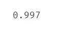 
```py
rrect.append(2) elif i==1: meanshift_correct.append(1) else: meanshift_correct.append(0) meanshift_correct = np.array(meanshift_correct) print(meanshift_correct) 
```


 

**查看校正后的数据分布**

```python
#校正后看下数据分布情况是否一致了（一致说明校正完成）
print(pd.value_counts(y),pd.value_counts(meanshift_correct))
```


由图发现，校正完数据分布已经恢复正常了。

#### **画出校正后的数据图**

```python
#不放心的话就画图看看（完全一致，没有任何问题）
#画出当前预测结果与原数据图的对比
fig8 = plt.figure(figsize=(11,4))
plt.subplot(1,2,1)
label0 = plt.scatter(data.loc[:,'V1'][y==0],data.loc[:,'V2'][y==0])
label1 = plt.scatter(data.loc[:,'V1'][y==1],data.loc[:,'V2'][y==1])
label2 = plt.scatter(data.loc[:,'V1'][y==2],data.loc[:,'V2'][y==2])
plt.xlabel('V1')
plt.ylabel('V2')
plt.title('original data')
plt.legend([label0,label1,label2],['label0','label1','label2'])

fig9 = plt.subplot(1,2,2)
label0 = plt.scatter(data.loc[:,'V1'][meanshift_correct==0],data.loc[:,'V2'][meanshift_correct==0])
label1 = plt.scatter(data.loc[:,'V1'][meanshift_correct==1],data.loc[:,'V2'][meanshift_correct==1])
label2 = plt.scatter(data.loc[:,'V1'][meanshift_correct==2],data.loc[:,'V2'][meanshift_correct==2])
plt.xlabel('V1')
plt.ylabel('V2')
plt.title('meanshift predicted data')
plt.legend([label0,label1,label2],['label0','label1','label2'])
plt.show()
```


如图，显然校正成功，效果也是非常不错的~

**准确率**

最后看一下MeanShift的准确率

```python
#看看meanshift的准确率（非常高了）
print(accuracy_score(meanshift_correct,y))
```

## 第五章 机器学习其他技术

在前面四章已经学习过最常用的机器学习模型了，本章还会介绍几个其他的模型，相对没有那么常用但也很重要的模型和技术。比如：**决策树、异常检测、主成分分析（PCA）**

### 1.决策树

在了解决策树之前，可以通过一个案例看一下决策树与之前的逻辑回归的区别。

**任务：**根据用户的学习动力、能力提升意愿、兴趣度、空余时间，判断其是否适合学习本门课程。


使用逻辑回归解决此问题的时候，我们会给定几个输入值：动力、能力、兴趣、时间（x1、x2、x3、x4），然后分别给他们一个权重，让他们相乘再相加，得到一个函数，记为Z。在通过sigmoid函数，可以算出一个人在x1、x2、x3、x4这4个属性下适合学习本课程的概率。这就是逻辑回归模型解决这个问题的基本框架。


而对于决策树，它在每一层会问一个问题，根据你回答的“yes” or “no”来判断是否进入下一层。例如，在这里的第一层问你“是否特别想了解或学习ai”，如果你回答yes，那就直接判定你适合学习本课程，结束整个决策树了；如果你回答no，则进入下一层，问下一个问题“是否想提升能力”，如果你回答no，······，如果你回答yes，······，进入下一层重复此过程，直至结束整个决策树。

#### 1.1**定义**

决策树（Decision Tree）：

> 运算量比较小，运算速度快，易于理解，可清晰查看各属性的重要性

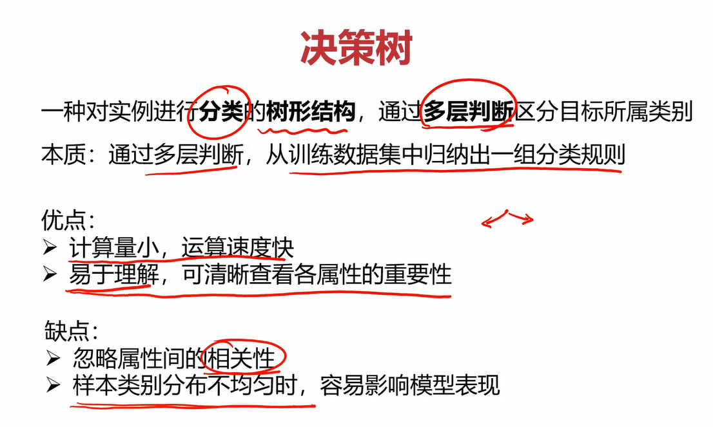

#### 1.2**求解**

观察决策树的过程，我们会发现最关键的点就是确定每一层的问题，也就是下图中的1、2、3这3个节点，也可以称他们为特征。特征选的好，就能得到比较好的决策树模型，从而能进行正确的分类。


具体流程可以参考以下案例。

目标：根据动力、想提升能力与否、有无兴趣、有无时间这4个指标判断某人是否适合本课程。

这4个指标与类别之间的关系有如下图表


不同特征（特征也就是上面说的每层的问题，那1、2、3个节点）会决定不同的决策树，那如何确定每层选择哪个特征呢？

##### **三种求解方法**：ID3、C4.5、CART

ID3：利用信息熵原理选择信息增益最大的属性作为分类属性，递归地拓展决策树的分支，完成决策树的构造。

三者主要的区别就是选择的目标函数不同，ID3使用的是信息增益，C4.5使用信息增益率，CART使用的是Gini系数。

信息熵：度量随机变量不确定性的指标，熵越大，变量的不确定性就越大。信息熵的定义及公式如下，特别地，当pk=1或pk=0时，信息熵Ent(D)=0。


根据信息熵，可以计算以属性a进行样本划分带来的信息增益：


我们的目标就是使划分之后得不确定性尽可能地小，也就是划分后的信息熵尽可能小，信息增益尽可能地大。

基于此原则进行计算得下图


可以看到，以兴趣进行划分时，获得的信息增益Gain与其他几个相比最大，为0.61。因此，因首先选择兴趣作为划分节点。剩下的几层重复此过程，直到把每一层的特征都确定下来，可以得到下图。


### 2.异常检测

异常检测是什么呢？举个例子，一堆人在操场排队，总有那么几个人喜欢掉队，你是班主任，你想找出这几个掉队的家伙，那这个过程就是一个异常检测的过程。很简单对吧，看看下面的两个案例，你就能更明白异常检测是干什么的了。

任务1：根据传感器X1和传感器X2的数据自动检测设备异常工作状态。


任务2：找出异常的小鱼。


#### 2.1**定义**

**异常检测**（Anomaly Detection）：根据输入数据，对不符合预期模式的数据进行识别。

对于m个给定的一维数据集，如何去检测异常的点？在数学上通常会使用概率密度进行检测，概率密度可以理解成随机给定一个点，这个点落在轴上位置的可能性。比如下图中，给定数据集的点落在中间比较多，落在边上比较少，那中间的概率密度就比较大，边上就比较小。概率密度越大的话，说明这片的点比较集中，数据点越“正常”。反之则比较疏远，数据点越“异常”。因此，可以设置一个合适的概率密度的值ε \varepsilonε，当某个点对应的概率密度的值小于ε \varepsilonε时，我们认为它是“异常”的。


#### 2.2**概率密度** ! ! 

区间（x1，x2）的概率为 $ \int ^{x_2}_{x_1} p(x) {\rm d}x$ ，其实也就是区间内概率密度函数与x轴构成的面积。显然，在整个定义区间上概率密度函数与 x轴构成的面积为1。当分布均匀时，概率分布函数应该是一条平行于 x 轴的线。


#### 2.3**高斯分布**  ! ! 

高斯分布的定义如下，你要问为什么，我也不知道，目前会用就行。先计算出数据集的均值和方差，再带入高斯分布的概率密度函数即可计算出某一点对应的概率。


高斯函数是一条对称的、越靠近中间函数值越大的有规律的函数。

#### 2.4**使用高斯函数进行异常检测**

前面已经分析过了，这里看看就好。


对于多维的数据集，只需要对均值、标准差、和概率密度函数做出一点改变即可。

假设有2维数据集

对于均值和方差，只需分别计算出每个维度的均值和方差，比如2个维度的均值和方差分别为 $μ_1，σ_1，μ_2，σ_2$。

对于概率密度函数，2维数据集的总概率密度函数p(x)就等于分别用 $μ_1，σ_1，μ_2，σ_2$ 带入高斯分布概率函数计算出的每个维度的概率的乘积。


#### 2.5**高斯分布概率函数的可视化**

在图形表现上，当数据集为1维时，对应的高斯分布概率函数应该是二维坐标系下的一条线；而当数据集为2维时，对应的高斯分布概率函数应该是三维空间下的一个曲面；


二维


三维

### 3.主成分分析

主成分分析（Principal Component Analysis）

#### 3.1数据降维

通过一下案例了解一下数据降维（Dimensionality Reduction）。


斯通通过将 17 个指标降低成 3 个指标，大大减少了计算量，提升了预测效率，降维的方法就是**主成分分析（PCA）**。


降维不仅能减少计算量，提升效率，还能使模型可视化。显然 17 项指标的模型是不可能可视化的，但是降维到 3 个指标的数据是可以可视化的。


在上图的案例中，数据点是二维的，有身高和体重两个影响因素，我们可以使用上图笔记画的一条线，让这些数据点投影到该线上，并用交点在一维直线中的位置来近似代替该点在二维平面中的位置，这样就将二维数据降到一维了。我们可以把这个交点称为综合因子。


上图案例也是将3维数据投影成一个二维平面。

#### 3.2数据降维的实现：PCA

主成分分析（PCA）的核心就是在信息损失尽可能少的情况下，降低数据维度。以二维数据降成一维数据为例，它的损失的部分可以认为是点到直线的距离，我们要让所有点到直线的距离之和最小，这样就可以保证在信息损失尽可能小的情况下降维数据的维度。


在将上面几个降维的案例抽象一下之后，可以得到降维的通用形式，即下图。(点到空间的距离就相当于损失的信息)


#### 3.3**保留主要信息的策略**

****

策略：使投影后数据的方差最大


### 4.实战准备

#### 4.1Iris数据集


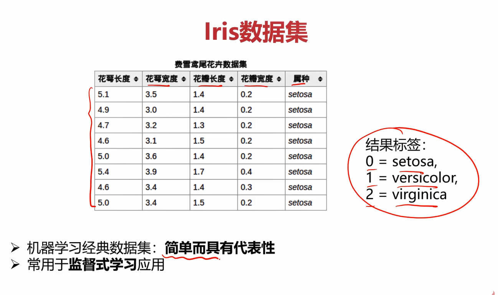


创建决策树分类器中的参数criterion值可以为gini或者entropy,前者是基尼系数，后者是信息熵，criterion='entropy’就是使用ID3方法（ID3就是使用信息增益）。min_samples_leaf这个值限制了叶子节点最少的样本数，如果某叶子节点数目小于样本数，则**会和兄弟节点一起被剪枝**。min_sample_leaf=5的意思是当划分出的样本量小于=5时就可以终止决策树了，这样可以防止决策树太高，过拟合。可视化决策树中的filled='True’是指填充同一类为同一种颜色。feature_names是不使用默认的名字，而是为了直观自定义名字。class_names也是一样，自定义名字。

#### 4.2异常数据监测的直方图

> 任务：自动查找数据中的异常点


#### 4.3异常数据检测对应的高斯分布概率函数图


第一次见scipy，关于它的介绍：

> Scipy是一个用于数学、科学、工程领域的常用软件包，可以处理插值、积分、优化、图像处理、常微分方程数值解的求解、信号处理等问题。它用于有效计算Numpy矩阵，使Numpy和Scipy协同工作，高效解决问题。

linspace(0,20,300)用于在0~20之间生成300个点，目的是使plot画出来的图更丝滑，如果点太少，图肯定会很尖锐。

norm.pdf就是高斯分布概率函数，pdf就是probability density function的缩写。

> scipy.stats.norm函数 可以实现正态分布（也就是高斯分布）。
>
> pdf : 概率密度函数
> 标准形式是：
> 
> `norm.pdf(x, loc, scale)`
> 等同于
> `norm.pdf(y) / scale ，其中 y = (x - loc) / scale`
>
> *loc: mean 均值， scale: standard deviation 标准差*

#### 4.4异常数据检测的可视化


sklearn有自带的异常数据检测模块EllipticEnvelope，用他得到的模型进行预测后得到的值只会包含-1和1。-1表示数据异常，1表示数据正常。

#### 4.5iris数据使用PCA降维


要先进行数据预处理，把数据标准化。


创建PCA实例时传入的 n_components=4 表示你想把数据**降到4维**，一开始就是4维，为什么第一次还降到4维？**它第一次降维是想看到当前4个维度下的方差情况，从而判断每个维度下的相关性。通过第一次从4维降到4维，我们可以得到4个维度下的方差情况，那下次降维就可以选方差比较大的维度了。**比如想降至2维，那就在第一次降维的基础上选择方差最大的2个维度。（方差越大，相关性越小）

训练时，注意这里不再用fit了，而是使用fit_transform，且参数应该传入标准化后的数据X_norm。

通过 pca.explained_variance_ratio_ 可以看到各个维度对应的方差比例。

注意区分bar和hist的使用。**bar是画几个出柱状图**，直接传入柱的标签和对应的值就行了；而**hist是做数据分布统计用的**。

关于他俩的区别，有网友评论：

> hist是制作一个频率分布图，比如说把一个数据分成10个部分，每个部分的频率是多少。就是大概看一下数据的分布。bar是用来把你已经总结好的数据画出来，可以用来对比各个组的数据。总之hist只是专门制作频率分布的，而bar的应用范围很广，你可以同时对比多个组，还可以更细的分组。你如果分好了数据，用bar也能做到hist的效果。用hist还能得到hist画图的数据，具体是a＝hist（x），可以看到分成10份的频率分布。或者你可以手工制定分成多少。之后你可以用bar把a画出来，或者对a进行处理。

#### 4.6可视化PCA


### 5.实战

#### 5.1决策树实现iris数据分类

**决策树实战task：**
1、基于iris_data.csv数据，建立决策树模型，评估模型表现
2、可视化决策树结构
3、修改min_samples_leaf参数，对比模型结果

具体实现流程如下：


**导入iris数据集**

```python
#导包
import pandas as pd
from matplotlib import pyplot as plt
from sklearn.metrics import accuracy_score
#导入iris数据
data = pd.read_csv('iris_data.csv')
data.head()
```


**定义X和y**

```python
#定义X和y
X = data.drop(['target','label'],axis=1) # axis=1 表示沿着列的方向删除，axis=0表示沿着行的方向删除
y = data.loc[:,'label']
print(X,y)
```

**构建决策树模型**

```python
#构建决策树模型
from sklearn import tree # criterion =(gini,entropy) 后者指ID3 信息增益   min... 限制了叶子节点最小的样本数
decision_tree = tree.DecisionTreeClassifier(criterion='entropy',min_samples_leaf=6)
decision_tree.fit(X,y)
```


**使用模型进行预测**

```python
#使用模型预测
y_predict = decision_tree.predict(X)
print(y_predict)
```


**计算模型预测的准确率**

```python
#评估模型
print(accuracy_score(y,y_predict))
```


**可视化决策树**

```python
#可视化决策树
fig1 = plt.figure(figsize=(11,11))
tree.plot_tree(decision_tree,
              feature_names=['SepalLength', 'SepalWidth', 'PetalLength', 'PetalWidth'],
              class_names=['setosa','versicolor','virginica'],
              filled=True) # 决策树，names，classname，填充色
plt.show()
```


**更改min_samples_leaf后观察决策树的变化**

```python
#更改min_samples_leaf观察效果
decision_tree = tree.DecisionTreeClassifier(criterion='entropy',min_samples_leaf=1)
decision_tree.fit(X,y)
fig1 = plt.figure(figsize=(11,11))
tree.plot_tree(decision_tree,
              feature_names=['SepalLength', 'SepalWidth', 'PetalLength', 'PetalWidth'],
              class_names=['setosa','versicolor','virginica'],
              filled=True)
plt.show()
```


#### 5.2异常检测

**异常检测实战task：**
1、基于 anomaly_data.csv数据，可视化数据分布情况、及其对应高斯分布的概率密度函数
2、建立模型，实现异常数据点预测
3、可视化异常检测处理结果
4、修改概率分布阈值EllipticEnvelope(contamination=0.1)中的contamination，查看阈值改变对结果的影响

具体实现流程如下：

**读取数据**

```python
#读取csv文件
import pandas as pd
data = pd.read_csv('anomaly_data.csv')
data.head()
```


**可视化初始的数据**

```python
#可视化初始数据
from matplotlib import pyplot as plt
fig1 = plt.figure(figsize=(5,5))
plt.title('data')
plt.xlabel('x1')
plt.ylabel('x2')
plt.scatter(data.loc[:,'x1'],data.loc[:,'x2'])
plt.show()
```


**定义x1和x2存储初始的数据**

```python
#定义x1和x2
x1 = data.loc[:,'x1']
x2 = data.loc[:,'x2']
```

**可视化x1和x2的分布情况**

```python
fig2 = plt.figure(figsize=(20,7))
sb1 = plt.subplot(121)
plt.hist(x1,bins=100) #bins=100 表示将数据分为 100 个区间（或称为“箱”）来统计数据点的分布情况。 len / bins
plt.title('x1 distribution')
plt.xlabel('x1')
plt.ylabel('counts')
sb2 = plt.subplot(122)
plt.hist(x2,bins=100)
plt.title('x2 distribution')
plt.xlabel('x2')
plt.ylabel('counts')
plt.show()
```


**分别计算两个维度下的均值和方差**

```python
#分别计算两个维度下的 均值 和 方差
import numpy as np
x1_mean = np.mean(x1)
x1_sigma = np.std(x1)
x2_mean = np.mean(x2)
x2_sigma = np.std(x2)
print(x1_mean,x1_sigma,x2_mean,x2_sigma)
```


**计算两个维度下的高斯分布密度函数**

```python
#计算高斯分布密度函数p(x)
from scipy.stats import norm
x1_range = np.linspace(0,20,300) #执行后，x1_range 是一个包含 300 个元素的一维数组，这些元素从 0 到 20 均匀分布。常用于生成数据点以供绘图或数学运算。
x1_normal = norm.pdf(x1_range,x1_mean,x1_sigma)
x2_range = np.linspace(0,20,300)
x2_normal = norm.pdf(x2_range,x2_mean,x2_sigma)
#normpdf函数：
#   y=normpdf(x,mu,sigma)：返回参数为μ和σ的正态分布密度函数在x处的值（其中参数mu是μ，参数sigma是σ）
#   这里传入的x是一个np列表，因此得到的应该是对应的一组高斯分布密度函数的值，也正是通过这一组数据使我们可以可视化高斯分布密度函数。
```

**可视化两个维度下的高斯分布密度函数**

```python
#可视化高斯分布密度函数
fig3 = plt.figure(figsize=(10,4))
plt.subplot(121)
plt.title('x1_probability_density_function')
plt.xlabel('x1')
plt.ylabel('p1(x)')
plt.plot(x1_range,x1_normal)
plt.subplot(122)
plt.title('x2_probability_density_function')
plt.xlabel('x2')
plt.ylabel('p2(x)')
plt.plot(x2_range,x2_normal)
plt.show()
```


**使用sklearn的异常检测模块构建模型**

```python
#构建模型
from sklearn.covariance import EllipticEnvelope
ano_detection = EllipticEnvelope() #默认阈值是 0.1
ano_detection.fit(data) # 无监督式学习。直接给参数，不需要给 label
```


**预测并统计预测结果分布情况**

```python
#预测并统计预测结果的分布
res_predict = ano_detection.predict(data)
print(pd.value_counts(res_predict)) # 1 是正常点 -1 是异常点
```


**画出异常检测的图像**

```python
#画出异常检测的图
fig4 = plt.figure(figsize=(10,10))
plt.title('anomaly detection')
plt.xlabel('x1')
plt.ylabel('x2')
normal_x = plt.scatter(data.loc[:,'x1'],data.loc[:,'x2'],marker='x') #改变原始数据为 x
anomaly_x = plt.scatter(data.loc[:,'x1'][res_predict==-1],
                        data.loc[:,'x2'][res_predict==-1],
                        marker='o',edgecolors='red',
                        facecolor='none',s=100) # 这里的异常数据使用 o 表示，facecolor内部不填充，边界颜色为红
plt.legend([normal_x,anomaly_x],['normal','anomaly']) # 添加题注
plt.show()
```


**根据图像调整检测异常点的阈值，使检测的异常点数量合适，再画出图像**

```python
#调整检测异常点的阈值，使异常检测结果更精确
ano_detection = EllipticEnvelope(contamination=0.02) # 修改阈值,表示假设数据中的异常点
ano_detection.fit(data)
res_predict = ano_detection.predict(data)
print(pd.value_counts(res_predict))
```


```python
#画出异常检测的图
fig5 = plt.figure(figsize=(15,10))
plt.title('anomaly detection')
plt.xlabel('x1')
plt.ylabel('x2')
normal_x = plt.scatter(data.loc[:,'x1'],data.loc[:,'x2'],marker='x')
anomaly_x = plt.scatter(data.loc[:,'x1'][res_predict==-1],
                        data.loc[:,'x2'][res_predict==-1],
                        marker='o',edgecolors='red',
                        facecolor='none',s=150)
plt.legend([normal_x,anomaly_x],['normal','anomaly'])
plt.show()
```


异常检测实战summary：
1、通过计算数据各维度对应的高斯分布概率密度函数，可用于寻找到数据中的异常点；
2、通过修改概率密度阈值contamination，可调整异常点检测的灵敏度;
3、核心算法参考链接：https://scikit-learn.org/stable/modules/generated/sklearn.covariance.EllipticEnvelope.html?highlight=ellipticenvelope

#### 5.3使用PCA对iris数据集降维

**PCA实战task：**
1、基于iris_data.csv数据，建立KNN模型实现数据分类（n_neighbors=3）
2、对数据进行标准化处理，选取一个维度可视化处理后的效果
3、进行与原数据等维度PCA，查看各主成分的方差比例
4、保留合适的主成分，可视化降维后的数据
5、基于降维后数据建立KNN模型，与原数据表现进行对比

具体实现流程如下：

##### **导入数据**

```python
import pandas as pd
data = pd.read_csv('iris_data.csv')
data.head()
```


##### **定义X和y**

```python
#定义X和y
X = data.drop(['target','label'],axis=1)
y = data.loc[:,'label']
print(X,y)
```


##### **建立KNN模型并预测**

```python
#建立KNN模型并预测  k 近邻算法
from sklearn.neighbors import KNeighborsClassifier
KNN = KNeighborsClassifier(n_neighbors=3)
KNN.fit(X,y)
y_predict = KNN.predict(X)
print(y_predict)
```


##### **计算预测准确率**

```python
#计算KNN对iris数据集预测的准确率
from sklearn.metrics import accuracy_score
print(accuracy_score(y,y_predict))
```


##### **将数据标准化** ！！

```python
#将数据标准化
import numpy as np
from sklearn.preprocessing import StandardScaler
scaler = StandardScaler() #StandardScaler 是机器学习库（如 scikit-learn）中用于数据标准化的工具。它的主要作用是将数据的每个特征（列）进行标准化处理，使得每个特征的均值为 0，标准差为 1。
X_stan = scaler.fit_transform(X)
print(X_stan)
```


##### **画出标准化前后的统计分布图**

```python
#为了直观地观察数据标准化前后的差异，画出标准化前后的统计分布图
from matplotlib import pyplot as plt
fig1 = plt.figure(figsize=(15,5))
plt.subplot(121)
plt.title('original sepal length')
#这里只看其中一个维度，维度太多线也会太多，不好看
plt.hist(X.loc[:,'sepal length'],bins=100)
plt.xlabel('x1')
plt.subplot(122)
plt.title('standard sepal length')
#这里fit_transform返回的是ndarray，已经不是DataFrame了，因此不能在用loc()了，得用切片索引。
plt.hist(X_stan[:,0],bins=100) #所有行第一列
plt.xlabel('x1')
plt.show()
```


##### **计算标准化前后的均值和标准差**

```python
#标准化主要是对均值和标准差进行“标准化”，因此计算标准化前后的均值和标准差，进行对比
#标准化前
x1_mean = np.mean(X.loc[:,'sepal length'])
x1_sigma = np.std(X.loc[:,'sepal length'])
#标准化后
x1_mean_stan = np.mean(X_stan[:,0])
x1_sigma_stan = np.std(X_stan[:,0])
print(x1_mean,x1_sigma,x1_mean_stan,x1_sigma_stan)
#可以观察到，标准化后的均值已经非常接近0了，标准差为1
```


```python
X.shape
```


##### **创建PCA实例，进行一次等维PCA，得到各个主成分的方差比例**

```python
#创建PCA实例，先进行一次等维PCA得到各主成分的方差比例
from sklearn.decomposition import PCA
pca = PCA(n_components=4)
#fit和fit_transform方法的区别就是fit只拟合模型，而fit_transform除了拟合模型，还会对传入的标准化数据降维
X_pca = pca.fit_transform(X_stan)
ratio = pca.explained_variance_ratio_
print(ratio)
```


##### **画出各主成分方差比例**

```python
fig2 = plt.figure(figsize=(10,5))
plt.bar([1,2,3,4],ratio) #维度坐标 输入数据
plt.xticks([1,2,3,4],['PC1','PC2','PC3','PC4']) # 数据越小相关性越高，可以舍去
plt.ylabel('explained variance ratio')
plt.show()
```


##### **进行第二次PCA降维**

```python
#进行第二次PCA降维
pca = PCA(n_components=2)
X_pca2 = pca.fit_transform(X_stan)
X_pca2.shape
```


##### **可视化降维后的数据**

```python
#由于降维后数据只有二维的，因此可以可视化降维后的数据
fig3 = plt.figure(figsize=(10,5))
plt.title('decompositioned data')
plt.xlabel('comprehensive factor1')
plt.ylabel('comprehensive factor2')
setosa = plt.scatter(X_pca2[:,0][y==0],X_pca2[:,1][y==0]) #选择的是 KNN 3 近邻算法，所以y为0、1、2
versicolor = plt.scatter(X_pca2[:,0][y==1],X_pca2[:,1][y==1])
virginica = plt.scatter(X_pca2[:,0][y==2],X_pca2[:,1][y==2])
plt.legend([setosa,versicolor,virginica],['setosa','versicolor','virginica'])
plt.show()
```


##### **降维后再次使用KNN预测**

```python
#降维后再次建立KNN模型并预测
from sklearn.neighbors import KNeighborsClassifier
KNN = KNeighborsClassifier(n_neighbors=3)
KNN.fit(X_pca2,y)
y_predict2 = KNN.predict(X_pca2)
print(accuracy_score(y,y_predict2))
```


准确率并没有下降多少，说明使用PCA降维效果还是很不错的。

PCA实战summary：
1、通过计算数据对应的主成分（principle components)，可在减少数据维度同时尽可能保留主要信息；
2、为确定合适的主成分维度，可先对数据进行与原数据相同维度的PCA处理，再根据根据各个成分的数据方差确认主成分维度;
3、核心算法参考链接：https://scikit-learn.org/stable/modules/generated/sklearn.decomposition.PCA.html?highlight=pca#sklearn.decomposition.PCA

## 第六章 模型评价与优化

### 1.过拟合与欠拟合

老样子，从一个任务说起：拟合反应速率与温度数据，预测85度时的反应速率

一个好的回归应该是下图这样的


而一个差的回归是下图的两种情形：欠拟合和过拟合


其中，欠拟合顾名思义，就是模型太过简单，导致模拟出的模型接近一条直线，但显然我们都知道温度和活性必然不会是简单的线性关系，因此大量的点都不能被很好地预测。过拟合则是模型过于复杂，能够很好地穿过几乎所有或所有的训练集，但它的泛化能力太差了，由于模型过于复杂，它会不断地波动，因此它对新的数据预测效果很差。

可以总结为一张图


#### **解决方案**

> 简化模型
>
> PCA降维
>
> 正则化


**相关搜索**

正则化： https://www.cnblogs.com/jianxinzhou/p/4083921.html

### 2.数据分离与混淆矩阵

#### 2.1数据分离

**建立模型的意义**，不在于对训练数据做出准确的预测，更在于**对新数据的准确预测**。因此，有必要得到更多独立于训练之外，用于测试的数据。


在之前的学习中，我们按部就班的按照此流程进行训练。假如现在你已经训练了模型，但又没有额外的新的数据用于测试怎么办？只用训练集的数据进行预测很容易造成过拟合。这里提出了数据分离的概念。


#### 2.2**混淆矩阵**

在之前的学习中，评估模型就用了MSE、r2分数、准确率这几个指标，用的最多的还是准确率，但它的局限性还是很大的。


什么叫“无法真实反应模型针对各个分类的预测准确度”？


在上图中，模型1和模型2虽然准确率都是90%，但模型2有1个空准确率（就是给你1000个数据，它全给你预测成1，那不是跟没预测一样吗？很蠢）。相比之下模型1对0和1的数据都能预测对一部分，那在准确率相同的情况下，肯定模型1更好一点。

从这个案例我们就知道只用准确率指标肯定是不够的，下面引出混淆矩阵。


毕设做的跟nlp相关的一个东西，毕设论文查资料也老看到这个，当时觉得挺难的，现在一看好简单啊，不知道当时脑子是不是玩4年玩坏掉了，渍渍。

这个可能容易记混，可以这样记：拿TP举例，第一个True表示预测情况（预测对了还是预测错了），第二个Positives表示实际情况（实际为正样本还是负样本）。那TP合起来就可以表达如下意思：预测对了（预测情况），实际为负样本（实际情况），大白话可以说成“你猜对了，他就是负样本！”。FP合起来可以表达为：“你猜错了，它实际应该是正样本，而你猜的是负样本！”。

不管是实际结果还是预测结果，对于2分类来说，他只有两个取值：0和1，表示负样本和正样本（也可以反过来，看你自己怎么定义）。我们在知道了TN、FP、FN、TP之后，就可以组合出更多很好用的指标了。


不同的应用场景我们已关注的指标也不一定相同。


### 3.模型优化


维度过高可以使用高斯分布概率密度计算，找到低密度的点


hist 判断数据范围，可以使用归一化

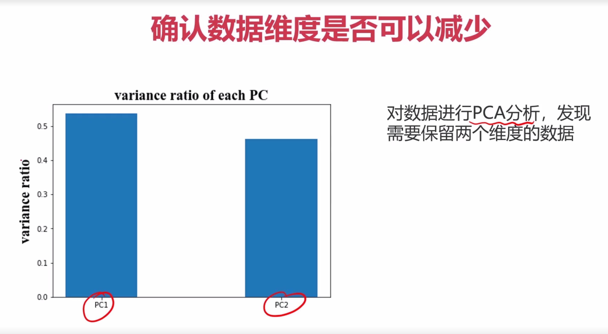

PCA 判断是否需要降维

> 尝试不同的模型 -> 选择一个模型 -> 模型优化


**相关搜索**

鲁棒性：在不同环境下的适应能力

标准化和归一化：https://www.zhihu.com/question/20467170 和 https://blog.csdn.net/bl128ve900/article/details/94509983

### 4.实战准备

#### 4.1生成多项式数据


这里的linspace是用来生成等差数列的，具体用法在下面的相关搜索中。因为线性回归的predict输入参数中的X必须是2维的，因此还需要把他reshape成2维的。

PolynomialFeatures用于生成多项式项的，degree=2他就会生成常数项、1次方项和2次方项。还有这里的fit_transform，fit是计算均值、标准差等值得一个适配过程，在进行了一次fit之后，后面测试集就不用再fit了，以此来保持后面的测试集和训练集的fit是同一套规则。

当时还迷惑线性模型会为什么还有高次方项，那为啥还叫线性模型，查了才知道线性原来说的是参数线性，不是变量线性。比如a x 2 + b x + c = 0 ax^2+bx+c=0ax2+bx+c=0是线性的，这说的线性是针对a、b、c这三个参数，而不是针对x是线性的。

#### 4.2**数据分离**


random_state = 4 主要是为了通过设计随机数种子来确保结果的可重复性，确保每次运行代码时生成的随机数序列是相同的。

test_size 训练集和测试集之间的比例

#### 4.3可视化决策区域


个人感觉对python不太熟的话，可能得想一会。我之前也没怎么学过python，所以写的时候也花了不少功夫理解。

#### 4.4根据混淆矩阵计算召回率、特异度、精确率、F1分数


**相关搜索**

fit 、 fit_transform 和 transform的区别： https://blog.csdn.net/weixin_38278334/article/details/82971752

PolynomialFeatures的用法： https://www.cnblogs.com/liweiwei1419/p/9715702.html

numpy.meshgird()的用法：https://blog.csdn.net/lllxxq141592654/article/details/81532855

numpy.meshgird()的原理：https://zhuanlan.zhihu.com/p/29663486

random_state随机数种子：https://blog.csdn.net/lwd512768098/article/details/88553770

numpy中的ravel()的用法：https://blog.csdn.net/tymatlab/article/details/79009618

> 简言之，ravel是用来将矩阵向量化的操作。

numpy中的c_的用法：https://www.cnblogs.com/shaosks/p/9890787.html 和 https://blog.csdn.net/weixin_41797117/article/details/80048688

> np.c_是按行连接两个矩阵，就是把两矩阵左右相加，要求行数相等。

### 5.实战

#### 5.1酶活性预测

> **酶活性预测实战task：**
> 1、基于T-R-train.csv数据，建立线性回归模型，计算其在 T-R-test.csv 数据上的 r2 分数，可视化模型预测结果
> 2、加入多项式特征（2次、5次），建立回归模型
> 3、计算多项式回归模型对测试数据进行预测的r2分数，判断哪个模型预测更准确
> 4、可视化多项式回归模型数据预测结果，判断哪个模型预测更准确

具体步骤如下：

**导入数据**

```python
#导入训练集和测试集
import pandas as pd
data_train = pd.read_csv('T-R-train.csv')
data_test = pd.read_csv('T-R-test.csv')
data_train.head()
data_test.head()
```


**定义X和y**

```python
#定义X和y
X_train = data_train.loc[:,'T']
y_train = data_train.loc[:,'rate']
X_test = data_test.loc[:,'T']
y_test = data_test.loc[:,'rate']
y_train.head()
```


**可视化原始数据点**

```python
#可视化原始数据
from matplotlib import pyplot as plt
fig1 = plt.figure(figsize=(8,5))
plt.title('raw data')
plt.xlabel('temperature')
plt.ylabel('rate')
plt.scatter(X_train,y_train)
plt.scatter(X_test,y_test)
plt.show()
```


```python
#查看X_train的类型及维数
#type(X_train)
print(X_train.shape)
```


**构建一阶线性模型、预测并计算训练集和测试集的r2分数**

```python
#构建一阶线性模型
from sklearn.linear_model import LinearRegression
import numpy as np
lr1 = LinearRegression()
#由于fit需要的参数X为2维，y为1维，故将X_train转化为2维
X_train = np.array(X_train).reshape(-1,1) # 若干行一列 --> 2维
X_test = np.array(X_test).reshape(-1,1)
lr1.fit(X_train,y_train)
#预测并计算训练集和测试集的r2分数
y_train_predict = lr1.predict(X_train)
y_test_predict = lr1.predict(X_test)
#r2分数越接近1越好，此时训练集和测试集的预测结果的r2分数与1偏差较大，说明一阶线性模型效果很差。
from sklearn.metrics import r2_score
print(r2_score(y_train,y_train_predict),r2_score(y_test,y_test_predict))
```


**可视化一阶线性模型**

```python
#生成一阶线性模型的坐标点 生成数据进行可视化
x1_range = np.linspace(40,90,300) # min max 多少个点
x1_range = np.array(x1_range).reshape(-1,1)
y1_range_predict = lr1.predict(x1_range)
#可视化一阶线性模型，欠拟合，效果可谓是非常地垃圾了。。。
fig2 = plt.figure(figsize=(8,5))
plt.title('First order linear model')
plt.xlabel('temperature')
plt.ylabel('rate')
plt.scatter(X_train,y_train)
plt.scatter(X_test,y_test)
plt.plot(x1_range,y1_range_predict)
plt.show()
```


**构建二阶线性模型**

```python
#构建2阶线性模型，包括常数项、一次方项、二次方项
from sklearn.preprocessing import PolynomialFeatures
poly2 = PolynomialFeatures(degree=2)
X_train_poly2 = poly2.fit_transform(X_train) # fit_transform 只需要在第一次调用的时候使用就可以
X_test_poly2 = poly2.transform(X_test) # 第二次直接使用 transform即可
print(X_train_poly2,X_test_poly2)
```


**使用二阶线性模型进行预测、计算二阶线性模型的r2分数**

```python
#拟合并预测
lr2 = LinearRegression()
lr2.fit(X_train_poly2,y_train)
y_poly2_train_predict = lr2.predict(X_train_poly2)
y_poly2_test_predict = lr2.predict(X_test_poly2)
#再次计算r2分数，发现训练集和测试集的分数都很高，说明2阶线性模型的效果非常不错
print(r2_score(y_train,y_poly2_train_predict),r2_score(y_test,y_poly2_test_predict))
```


**可视化二阶线性模型**

```python
#生成45~75之间的300个数用于画出预测线性模型曲线
x2_range = np.linspace(40,90,300).reshape(-1,1) #生成数据集
#这里记得把numpy类型的等差数列使用PolynumialFeatures对象处理一下
x2_range_poly2 = poly2.transform(x2_range)
x2_range_predict = lr2.predict(x2_range_poly2)
#可视化2阶线性模型，从可视化的2阶线性模型来看，它对训练集和测试集的预测效果都极其地好，说明2阶非常适合该案例。
fig3 = plt.figure(figsize=(8,5))
plt.title('Second order Linear Model')
plt.xlabel('temperature')
plt.ylabel('rate')
#画出原始训练集和测试集数据
plt.scatter(X_train,y_train)
plt.scatter(X_test,y_test)
#画出2阶线性模型
plt.plot(x2_range,x2_range_predict)
plt.show()
```


**构建五阶线性模型并重复上述操作看看效果**

```python
#构建5阶线性模型看看效果咋样
poly5 = PolynomialFeatures(degree=5)
X_train_poly5 = poly5.fit_transform(X_train)
X_test_poly5 = poly5.transform(X_test)
lr3 = LinearRegression()
lr3.fit(X_train_poly5,y_train)
#计算训练集和测试集的r2分数发现：训练集的分数非常高，但测试集的分数比较低，由此可以确定该模型过拟合了
y_train_poly5_predict = lr3.predict(X_train_poly5)
y_test_poly5_predict = lr3.predict(X_test_poly5)
print(r2_score(y_train,y_train_poly5_predict),r2_score(y_test,y_test_poly5_predict))
```


```python
#生成等差数列以便画出线性模型
x3_range = np.linspace(40,90,300).reshape(-1,1)
x3_range_poly5 = poly5.transform(x3_range)
x3_range_predict = lr3.predict(x3_range_poly5)
#可视化5阶线性模型，从图形可以看出：图形过度复杂，对训练集拟合效果几乎完美，但对测试集拟合效果很差，说明产生了过拟合
fig4 = plt.figure(figsize=(8,5))
plt.title('five order Linear Model')
plt.xlabel('temperature')
plt.ylabel('rate')
#画出原始训练集和测试集
plt.scatter(X_train,y_train)
plt.scatter(X_test,y_test)
#画出5阶线性模型
plt.plot(x3_range,x3_range_predict)
plt.show()
```


酶活性预测实战summary：
1、通过建立二阶多项式回归模型，对酶活性实现了一个较好的预测，无论针对训练或测试数据都得到一个高的r2分数；
2、通过建立线性回归、五阶多项式回归模型，发现存在过拟合或欠拟合情况。过拟合情况下，对于训练数据r2分数高（预测准确），但对于预测数据r2分数低（预测不准确）;
3、无论时通过r2分数，或是可视化模型结果，都可以发现二阶多项式回归模型效果最好
4、核心算法参考链接：https://scikit-learn.org/stable/modules/generated/sklearn.linear_model.LinearRegression.html#sklearn.linear_model.LinearRegression

#### 5.1质量好坏预测

> 好坏质检分类实战task：
> 1、基于data_class_raw.csv数据，根据高斯分布概率密度函数，寻找异常点并剔除
> 2、基于data_class_processed.csv数据，进行PCA处理，确定重要数据维度及成分
> 3、完成数据分离，数据分离参数：random_state=4,test_size=0.4
> 4、建立KNN模型完成分类，n_neighbors取10，计算分类准确率，可视化分类边界
> 5、计算测试数据集对应的混淆矩阵，计算准确率、召回率、特异度、精确率、F1分数
> 6、尝试不同的n_neighbors（1-20）,计算其在训练数据集、测试数据集上的准确率并作图

**读取数据**

```python
#读取数据
import pandas as pd
data = pd.read_csv('data_class_raw.csv')
data.head()
```


**定义X和y**

```python
#定义X和y
X = data.drop(['y'],axis=1) #axis=1：指定操作在列的方向上进行（axis=1 表示列，axis=0 表示行）。
y = data.loc[:,'y']
```

**画出原始数据**

```python
#画出原始数据
from matplotlib import pyplot as plt
fig1 = plt.figure(figsize=(8,5))
plt.title('raw data')
plt.xlabel('x1')
plt.ylabel('x2')
#为了更清楚地显示数据，对x1和x2的数据做出区分
bad = plt.scatter(X.loc[:,'x1'][y==0],X.loc[:,'x2'][y==0])
good = plt.scatter(X.loc[:,'x1'][y==1],X.loc[:,'x2'][y==1])
plt.legend([good,bad],['good','bad'])
plt.show()
```


**异常检测并可视化**

```python
#异常检测
from sklearn.covariance import EllipticEnvelope
#异常数据比例选0.02
anamoly = EllipticEnvelope(contamination=0.02)
#分别对两类数据进行异常检测
anamoly.fit(X[y==0])
y_predict_bad = anamoly.predict(X[y==0])
anamoly.fit(X[y==1]) # -1 表示是异常点
y_predict_good = anamoly.predict(X[y==1])
print(y_predict_bad,y_predict_good)
```


```python
#可视化通过异常检测检测出的异常点，用×表示
fig2 = plt.figure(figsize=(8,5))
plt.title('anamoly data')
plt.xlabel('x1')
plt.ylabel('x2')
#为了更清楚地显示数据，对x1和x2的数据做出区分
bad = plt.scatter(X.loc[:,'x1'][y==0],X.loc[:,'x2'][y==0])
good = plt.scatter(X.loc[:,'x1'][y==1],X.loc[:,'x2'][y==1])
plt.scatter(X.loc[:,'x1'][y==0][y_predict_bad==-1],X.loc[:,'x2'][y==0][y_predict_bad==-1],marker='x',s=150)
plt.scatter(X.loc[:,'x1'][y==1][y_predict_good==-1],X.loc[:,'x2'][y==1][y_predict_good==-1],marker='x',s=150)
plt.legend([good,bad],['good','bad'])
plt.show()
```


**去除异常点后重新读取数据**

```python
#读取数据
import pandas as pd
data = pd.read_csv('data_class_processed.csv')
data.head()
```


```python
#定义X和y
X = data.drop(['y'],axis=1)
y = data.loc[:,'y']
```

**使用PCA进行主成分分析**

```python
#PCA进行主成分分析
from sklearn.preprocessing import StandardScaler
from sklearn.decomposition import PCA
X_norm = StandardScaler().fit_transform(X)
pca = PCA(n_components=2)
X_reduced = pca.fit_transform(X_norm)
var_ratio = pca.explained_variance_ratio_
print(var_ratio)
```


**画出这两个维度的方差比例，观察是否要进行降维**

```python
#画出这两个维度的方差比例，发现没有必要降维
fig3 = plt.figure(figsize=(8,5))
plt.title('PCA')
plt.bar([1,2],var_ratio)
plt.show()
```


##### **进行训练集合测试集的分离** ！！ 

```python
#完成数据分离
from sklearn.model_selection import train_test_split
X_train,X_test,y_train,y_test = train_test_split(X,y,test_size=0.4,random_state=4)
print(X_train.shape,X_test.shape,X.shape)
```


**在n_neighbors=10的情况下建立KNN模型，计算分类的准确率，可视化决策边界**

```python
#建立KNN模型完成分类，n_neighbors取10，计算分类准确率，可视化分类边界
from sklearn.neighbors import KNeighborsClassifier
knn = KNeighborsClassifier(n_neighbors=10)
knn.fit(X_train,y_train)
knn_train_predict = knn.predict(X_train)
knn_test_predict = knn.predict(X_test)
print(knn_train_predict,knn_test_predict)
```


```python
#训练集准确率很高，测试集准确率很低，过拟合
from sklearn.metrics import accuracy_score
print(accuracy_score(y_train,knn_train_predict),accuracy_score(y_test,knn_test_predict))
```


**画出决策边界图**

```python
#可视化分类边界
xx,yy = np.meshgrid(np.arange(0,10,0.05),np.arange(0,10,0.05))
print(xx)
print(xx.shape)
print(yy)
print(yy.shape)
```

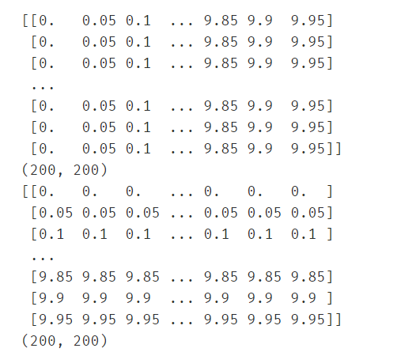

```python
#先使用ravel()将xx和yy降到一维，再进行c_操作（合并成[xx,yy]的形式）
X_range = np.c_[xx.ravel(),yy.ravel()]
print(X_range)
print(X_range.shape)
```


```python
X_range_predict = knn.predict(X_range)
#画出分类图
fig4 = plt.figure(figsize=(10,10))
plt.title('classification')
plt.xlabel('x1')
plt.ylabel('x2')
knn_bad = plt.scatter(X_range[:,0][X_range_predict==0],X_range[:,1][X_range_predict==0])
knn_good = plt.scatter(X_range[:,0][X_range_predict==1],X_range[:,1][X_range_predict==1])
#为了更清楚地显示数据，对x1和x2的数据做出区分
bad = plt.scatter(X.loc[:,'x1'][y==0],X.loc[:,'x2'][y==0])
good = plt.scatter(X.loc[:,'x1'][y==1],X.loc[:,'x2'][y==1])
plt.legend([good,bad,knn_bad,knn_good],['good','bad','knn_bad','knn_good'])
plt.show()
```


##### **使用混淆矩阵计算准确率、召回率、特异度、精确率、F1分数**

```python
from sklearn.metrics import confusion_matrix
cm = confusion_matrix(y_test,knn_test_predict)
print(cm)
```


```python
TN = cm[0][0]
FN = cm[1][0]
TP = cm[1][1]
FP = cm[0][1]
Accuracy = (TP+TN)/(TP+TN+FP+FN)
print(Accuracy)
```


```python
Recall = TP/(TP + FN)
print(Recall)
```


```python
Specificity = TN/(TN + FP)
print(Specificity)
```


```python
Precision = TP/(TP + FP)
print(Precision)
```


```python
F1_score = 2*Precision*Recall/(Precision + Recall)
print(F1_score)
```

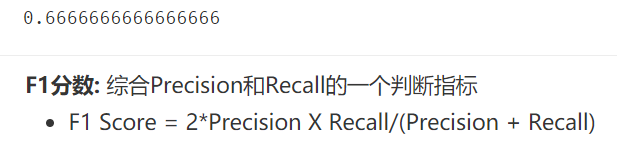

**尝试不同的n_neighbors对准确率的影响**

```python
#尝试不同的n_neighbors（1-20）,计算其在训练数据集、测试数据集上的准确率并作图
#列表推导式得到1~20
n = [x for x in range(1,21)]
accuracy_train = []
accuracy_test = []
for i in n:
    knn_i = KNeighborsClassifier(n_neighbors=i)
    knn_i.fit(X_train,y_train)
    knn_train_predict_i = knn_i.predict(X_train)
    knn_test_predict_i = knn_i.predict(X_test)
    accuracy_train.append(accuracy_score(y_train,knn_train_predict_i))
    accuracy_test.append(accuracy_score(y_test,knn_test_predict_i))
print(accuracy_train,accuracy_test)
```


**可视化n_neighbors对准确率的影响**

```python
#画出训练集和测试集维度与准确率的关系
fig5 = plt.figure(figsize=(18,5))
plt.subplot(121)
plt.title('training n_neighbors vs accuracy')
plt.xlabel('n')
plt.ylabel('accuracy')
plt.plot(n,accuracy_train,marker='o')
plt.subplot(122)
plt.title('testing n_neighbors vs accuracy')
plt.xlabel('n')
plt.ylabel('accuracy')
plt.plot(n,accuracy_test,marker='o')
plt.show()
```


好坏质检分类实战summary：
1、通过进行异常检测，帮助找到了潜在的异常数据点；
2、通过PCA分析，发现需要保留2维数据集；
3、实现了训练数据与测试数据的分离，并计算模型对于测试数据的预测准确率
4、计算得到混淆矩阵，实现模型更全面的评估
5、通过新的方法，可视化分类的决策边界
6、通过调整核心参数n_neighbors值，在计算对应的准确率，可以帮助我们更好的确定使用哪个模型
7、核心算法参考链接：https://scikit-learn.org/stable/modules/generated/sklearn.neighbors.KNeighborsClassifier.html#sklearn.neighbors.KNeighborsClassifier

至此，机器学习部分的笔记就已经全部完成，由于时间关系，有很多地方可能记得比较粗糙。但该笔记的目的也仅仅是提供一个快速复习和查阅的资料，如果想只通过该笔记学好机器学习是远远不够的，推荐多看一些课程和书籍。研一刚刚入学，新学期开始，联系了学校的一个技术工作室，认识了不少大牛，特此推荐一些学习路线：http://122.9.11.151/matrix/index#/studyRoute （天津科技大学Matrix Studio官方网站）


深度学习部分短期内可能不会更了，因为机器学习部分的笔记花了太长时间。深度学习可能会以单篇博客的方式再记录一些知识点把，不会像机器学习记那么详细了。如果你看到了最后，那你一定对ai非常感兴趣，并且愿意花大量精力去学习，那我们就是同道中人，虽然我还是刚学没多久的初学者，但还是欢迎和我交流~


