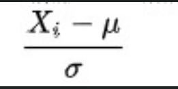

- 逻辑回归的主要场景是分类问题，称其为逻辑回归是否合适，为什么不叫逻辑分类？
- PCA求解与线性回归求解一样吗，如果不一样，差别在哪里
- PCA 为什么要舍去相关性高的数据

> 在数据分析和机器学习中，相关性指的是两个变量之间相互关系的度量，通常用相关系数表示，取值范围在 -1 到 1 之间。
>
> - **正相关** ：当一个变量增加，另一个变量也倾向于增加，相关系数接近 1。
> - **负相关** ：当一个变量增加，另一个变量倾向于减少，相关系数接近 -1。
> - **无相关** ：两个变量之间没有明显的关系，相关系数接近 0。
>
> ### 为什么要舍去相关性高的数据
>
> - **冗余信息** ：高相关性的数据往往包含重复的信息。例如，在一个数据集中，如果有两个变量高度正相关（如身高和体重），它们可能反映了相似的潜在特征。保留这些高度相关的变量可能不会为模型提供额外的有意义信息，反而会增加数据的复杂性。
> - **多共线性问题** ：在机器学习模型中，特别是线性模型（如线性回归、逻辑回归），高度相关的变量可能导致多共线性问题。这会使模型参数估计变得不稳定，增加模型的方差，降低模型的解释性和准确性。
> - **提升模型效率** ：舍去相关性高的数据可以减少特征数量，降低模型的复杂度，加快模型训练和预测速度，减少计算资源的消耗。

- 数据手机后建模时，尽可能把所有的属性都作为输入进行训练，这样能达到更好的效果。这是正确的还是错误的，为什么？

- 标准化和归一化

> 都是对数据做变换的方式，将原始的一列数据转换到某个范围，或者某种形态，具体的
>
> 1. 归一化：将一列数据变换到某个固定区间(范围)内，通常，这个区间是 [0,1] ，广义上，可以是各种区间 $\displaystyle \frac{X_i\ -\ X_{min}}{X_{max}\ -\ X_{min}}\ \ \ [-1,1]\ \ \displaystyle \frac{X_i\ -\ maxn(X)}{X_{max}\ -\ X_{min}}$
> 2. 标准化：将数据变换为均值为0，标准差为1的分布切记，并非一定是正态的 
> 3. 中心化：也叫做零均值处理，就是将每个原始数据减去这些数据的均值。
>
> 原因和作用
>
> 1. 统计建模中，如回归模型，自变量 X 的量纲不一致导致了回归系数无法直接解读或错误解读，需要将 X 都处理到统一量纲下，这样才可比
> 2. 机器学习任务和统计学任务中有很多地方要用到 ”距离“ 的计算，比如 PCA、KNN、kmeans等，假设使用**欧式距离**，不同维度量纲不同可能导致距离的计算依赖于量纲较大的那些特征而得到不合理的结果。
> 3. 参数估计时使用梯度下降，在使用梯度下降的方法求解最优化问题时，归一化/标准化后可以加快梯度下降的求解速度，即提升模型的收敛速度。
>
> 标准化是ML中更通用的手段，如果无从下手，可以直接使用标准化，如果数据不为稳定，存在极端的最大最小值，不要使用归一化。在分类，聚类算法中，需要使用距离来度量相似性的时候、或者使用PCA技术进行降维的时候，标准化表现更好；在不涉及距离度量，协方差计算时，，可以使用归一化方法。
>
> 当原始数据不同维度特质的尺度（量纲）不一致时，需要标准化步骤对数据进行标准化或归一化处理，反之不需要进行数据标准化。也不是所有的模型都需要做归一，比如模型中没有关于对距离的衡量，没有关于对变量间标准查的衡量。比如决策树，没有涉及任何和距离等有关的，所有通常不需要标准化，概率模型也不需要标准化，不关注变量的值，只是关注变量的分布和变量之间的条件概率。

- 逻辑回归不适用于图像分类任务的原因是什么？在什么情况下可以使用逻辑回归模型进行图像分类？请思考逻辑回归模型与神经网络模型之间的关系。

- 优化器

> 在机器学习中，优化器（Optimizer）用于调整模型的参数以最小化损失函数。不同的优化器有不同的可选参数，这些参数可以帮助你控制优化过程的行为。以下是一些常见优化器及其可选参数的概述：
>
> ### 1. 随机梯度下降（SGD）
>
> - **learning_rate（lr）**：控制每次更新的步长，默认值通常为0.01或0.001。
> - **momentum**：动量参数，用于加速梯度下降过程，取值范围在0到1之间，默认值通常为0.9。
> - **weight_decay**：权重衰减，用于正则化，默认值通常为0.0001或0.0005。
> - **nesterov**：布尔值，是否使用Nesterov动量，默认为False。
>
> ### 2. Adam（自适应矩估计）
>
> - **learning_rate（lr）**：初始学习率，默认值通常为0.001。
> - **beta_1**：一阶矩估计的指数衰减率，默认值为0.9。
> - **beta_2**：二阶矩估计的指数衰减率，默认值为0.999。
> - **epsilon**：数值稳定性的小值，默认值为1e-8。
> - **weight_decay**：权重衰减，默认值通常为0。
>
> ### 3. RMSprop（均方根传播）
>
> - **learning_rate（lr）**：初始学习率，默认值通常为0.001。
> - **alpha**：衰减率，用于移动平均计算，默认值为0.9。
> - **epsilon**：数值稳定性的小值，默认值为1e-8。
> - **weight_decay**：权重衰减，默认值通常为0。
>
> ### 4. Adagrad（自适应梯度算法）
>
> - **learning_rate（lr）**：初始学习率，默认值通常为0.01。
> - **epsilon**：数值稳定性的小值，默认值为1e-8。
>
> ### 5. Adadelta
>
> - **learning_rate（lr）**：初始学习率，默认值通常为1.0。
> - **rho**：衰减率，默认值为0.9。
> - **epsilon**：数值稳定性的小值，默认值为1e-8。
>
> ### 6. AdamW
>
> - **learning_rate（lr）**：初始学习率，默认值通常为0.001。
> - **beta_1**：一阶矩估计的指数衰减率，默认值为0.9。
> - **beta_2**：二阶矩估计的指数衰减率，默认值为0.999。
> - **epsilon**：数值稳定性的小值，默认值为1e-8。
> - **weight_decay**：权重衰减，默认值通常为0.01。
>
> ### 7. Nadam（NesterovAdam）
>
> - **learning_rate（lr）**：初始学习率，默认值通常为0.002。
> - **beta_1**：一阶矩估计的指数衰减率，默认值为0.9。
> - **beta_2**：二阶矩估计的指数衰减率，默认值为0.999。
> - **epsilon**：数值稳定性的小值，默认值为1e-8。
>
> ### 注意事项
>
> 1. **学习率（learning_rate）**：是所有优化器最重要的参数之一，决定了每次参数更新的步长。学习率过大可能导致训练发散，过小则可能导致收敛速度慢。
> 2. **动量（momentum）**：动量参数用于加速梯度下降过程，特别是在高维空间中。动量可以帮助模型更快地收敛到最小值。
> 3. **权重衰减（weight_decay）**：权重衰减是一种正则化技术，用于防止模型过拟合。它通过在损失函数中添加权重的L2范数来实现。
> 4. **数值稳定性（epsilon）**：在一些优化器（如Adam、Adadelta）中，epsilon用于防止除零错误，确保数值计算的稳定性。
>
> ### 选择优化器和参数的建议
>
> - 对于大多数深度学习任务，Adam优化器是一个不错的选择，因为它结合了动量和自适应学习率的优点。
> - 如果训练过程出现震荡或发散，可以尝试减小学习率。
> - 对于稀疏数据，Adagrad优化器可能效果较好，因为它会为每个参数维护一个学习率。
> - 在训练过程中，可以尝试不同的优化器和参数组合，找到最适合你模型和数据的配置。

- imshow

> `plt.imshow(img1)` 的作用，简而言之，就是把一个二维（或三维）数值“矩阵”当作一幅图像来**可视化**。具体来说：
>
> 1. **输入矩阵的形状**
>
> 	如果 `img1` 是一个形状为 `(M, N)` 的二维数组，Matplotlib 会把它当作灰度图或伪彩色图来渲染——数组中每个元素的数值，会根据当前的 **colormap**（默认是 `viridis`）映射为不同的颜色强度。
>
> 	如果 `img1` 是一个形状为 `(M, N, 3)`（RGB）或 `(M, N, 4)`（RGBA）的三维数组，则会把最后一个维度当作颜色通道，直接绘制彩色图像。
>
> 2. **坐标系与像素**
>
> 	在默认情况下，数组的第一维对应图像的 **纵轴**（y 方向），第二维对应 **横轴**（x 方向）。
>
> 	如果想让坐标对齐数学意义上的 x、y 轴范围，可以通过参数 `extent=[xmin, xmax, ymin, ymax]`、或 `origin='lower'`（将矩阵的第一个元素显示在左下角）来调整。
>
> 3. **常用参数**
>
> 	`cmap`：指定 colormap，例如 `plt.imshow(img1, cmap='gray')` 可以强制以灰度图显示。
>
> 	`interpolation`：指定插值方式，如 `'nearest'`（最近邻，不平滑）、`'bilinear'`（双线性平滑）等。
>
> 	`vmin`/`vmax`：手动设置色彩映射的数值上下限，有助于不同图像间保持一致的色彩刻度。

- batch_size

> `batch_size` 是机器学习（特别是深度学习）中的一个重要概念，指的是一次梯度更新（即一次反向传播）所使用的样本数量。具体来说，它是训练数据被分成的小批量的大小。模型在每个批次上计算损失函数，并根据该批次的梯度更新模型参数。
>
> ### 关键点
>
> 1. **批量训练 vs 单样本训练**
>    
>    如果 `batch_size` 等于整个训练集的大小，这称为**批量梯度下降**（Batch Gradient Descent），即每次更新都使用所有训练样本。
>    
>    如果 `batch_size` 等于1，这称为**随机梯度下降**（Stochastic Gradient Descent, SGD），即每次更新只使用一个样本。
>    
>    通常情况下，`batch_size` 是介于1和训练集大小之间的数，称为**小批量梯度下降**（Mini-batch Gradient Descent）。这是最常用的训练方式。
>    
> 2. **为什么使用小批量训练**
>    
>    **内存限制**：使用整个数据集进行训练可能超出计算机的内存容量。
>    
>    **计算效率**：小批量训练可以在每次更新时利用矩阵运算的优化（如GPU加速），提高计算效率。
>    
>    **泛化性能**：小批量训练引入了一定的噪声，有助于模型跳出局部最优解，提高泛化能力。
>    
> 3. **如何选择 `batch_size`**
>    
>    较小的 `batch_size`（如16、32）通常有助于模型更快地收敛，但可能会增加训练的不稳定性。
>    
>    较大的 `batch_size`（如256、512）通常会使训练更稳定，但可能需要更多的内存，并且可能陷入局部最优解。
>    
>    一般从32开始尝试，根据实际情况调整。
>
> ### 总结
>
> `batch_size` 是机器学习中用于控制每次更新模型参数时使用的样本数量的参数。选择合适的 `batch_size` 可以平衡训练效率和模型性能。希望这能帮助你更好地理解这个概念！

- 梯度更新

> 梯度更新是机器学习和深度学习中优化模型参数的关键步骤，它基于梯度下降（Gradient Descent）算法，用于最小化损失函数，从而提升模型性能。反向传播（Backpropagation）是计算梯度的具体方法，它利用链式法则计算损失函数对每个参数的偏导数。以下是详细解释：
>
> ### 梯度更新与反向传播的关系
>
> 1. **模型训练的总体流程**
>    - 在模型训练过程中，我们通过不断地调整模型的参数（权重和偏置），以使得模型的输出尽可能接近真实值。这个调整过程就是基于梯度下降算法实现的。
>    - 每一次完整的训练迭代（epoch）包括前向传播（Forward Propagation）、损失计算、反向传播（Backpropagation）以及梯度更新四个主要步骤。
>
> 2. **梯度更新的具体操作**
>    - 在前向传播阶段，输入数据通过模型进行计算，得到预测输出。
>    - 根据预测输出和真实值计算损失函数的值，损失函数衡量了模型预测结果与真实值之间的差异。
>    - 在反向传播阶段，从损失函数出发，利用链式法则逐层计算模型参数对损失函数的梯度。这些梯度指示了参数调整的方向和幅度，以使得损失函数能够最小化。
>    - 最后，在梯度更新阶段，根据计算得到的梯度以及预设的学习率，更新模型的参数。常用的更新公式为：
>      $
>      \theta_{\text{new}} = \theta_{\text{old}} - \eta \nabla L
>      $
>      其中，$\theta $ 表示模型参数，$(\eta)$ 是学习率，$\nabla L$ 是损失函数对参数的梯度。
>
> ### 为什么这样做能优化模型
>
> 梯度下降算法的核心思想是通过沿着梯度相反的方向更新参数，逐步找到损失函数的最小值。这是因为梯度的方向是损失函数增长最快的方向，所以沿着梯度相反的方向更新参数可以使得损失函数下降最快。通过不断地进行梯度更新，模型的参数逐渐调整到最优状态，从而使得模型的预测结果越来越接近真实值。
>
> ### 梯度更新的重要性
>
> 梯度更新是模型训练的核心环节，通过合理地调整学习率和优化算法，可以有效提升模型的性能。选择合适的学习率和优化算法对于模型的训练效果和收敛速度至关重要。如果学习率太大，可能导致模型训练过程不稳定，甚至无法收敛；如果学习率太小，则训练过程会变得非常缓慢。常见的优化算法包括随机梯度下降（SGD）、Adagrad、RMSprop 和 Adam 等，它们通过不同的策略来调整学习率和梯度更新的方式，以适应不同的训练需求。

- sigmoid vs relu

> **Sigmoid 函数和 ReLU 函数的区别及适用场景**如下：
>
> ### Sigmoid 函数
>
> 公式为：
>
> $
> \sigma(x) = \frac{1}{1 + e^{-x}}
> $
>
> 图像为 S 型曲线。
>
> **特点：**
>
>   * 将输入压缩到 (0, 1) 区间，可用于二分类问题中将输出映射为概率。
>   * 在输入值很大或很小的时候，输出接近饱和，梯度接近于 0，可能导致梯度消失问题，在深层网络中训练速度较慢。
>
> **适用场景：**
>
>   * 输出需要被限制在 (0, 1) 区间，尤其适用于二分类问题的最后一层。
>
> ### ReLU 函数
>
> 公式为：
>
> $
> f(x) = \max (0, x)
> $
>
> 当输入大于 0 时，输出为输入本身；当输入小于等于 0 时，输出为 0。
>
> **特点：**
>
>   * 计算简单，训练速度较快。
>   * 能够缓解梯度消失问题，在深度学习中应用广泛。
>   * 输出稀疏，部分神经元可能被永久激活为 0，导致 “神经元死亡” 问题。
>
> **适用场景：**
>
>   * 适用于隐藏层，特别是在深度神经网络中，如 CNN 和 RNN。
>
> ### 总结
>
> Sigmoid 函数主要用于二分类问题的输出层，将输出限制在 (0, 1) 区间以表示概率。而在隐藏层，ReLU 函数因计算效率高和缓解梯度消失问题而被广泛使用。实际应用中选择激活函数需要综合考虑任务需求和网络结构。

- predict.classes 

> ```py
>  
> ```
>
> np.argmax 它的作用是返回给定数组或张量中最大值的索引。在机器学习和深度学习中，`argmax` 常用于将模型的预测结果（通常是概率分布）转换为具体的类别标签。
>
> ```py
> import numpy as np
> A = np.array([1, 3, 2, 5, 4])
> print(np.argmax(A))  # 输出 3，因为索引从 0 开始，值 5 在索引 3 位置
> ```
>
> output_shape
>
> model.output_shape 是 Keras 模型的一个重要属性，描述了模型输出的张量形状，由多少维度组成，具体取决于模型的架构和输入配置。
>
> 输出形状的组成
>
> model.output_shape 是一个元组，包含以下组成部分：
>
> 1. 批次维度
>
> - 总是第一个维度，表示同时处理的样本数量，通常用 None 表示可变大小（即可接受任意批次的输入），(None,10)表示批量大小可变，每个样本输出长度为10的向量
>
> 2. 特征维度
>
> - 描述单个样本的输出形状，可以是多个维度，取决于模型类型：全连接网络：1D向量（features,）；图像分类：1D向量（classes,）；图像分割：3D张量（h，w，channels）；序列模型：2D张量（timesteps，features）
>
> ```py
> #二分类模型
> from tensorflow.keras.models import Sequential
> from tensorflow.keras.layers import Dense
> model = Sequential([
>     Dense(10, activation='relu', input_shape=(100,)),
>     Dense(1, activation='sigmoid')
> ])
> print(model.output_shape)  # 输出: (None, 1)
> 
> #多分类模型
> model = Sequential([
>     Dense(10, activation='relu', input_shape=(100,)),
>     Dense(5, activation='softmax')  # 5个类别
> ])
> print(model.output_shape)  # 输出: (None, 5)
> 
> #回归模型
> model = Sequential([
>     Dense(10, activation='relu', input_shape=(100,)),
>     Dense(3)  # 预测3个连续值
> ])
> print(model.output_shape)  # 输出: (None, 3)
> 
> #图像分类模型
> from tensorflow.keras.applications import ResNet50
> model = ResNet50(weights=None, input_shape=(224, 224, 3), classes=1000)
> print(model.output_shape)  # 输出: (None, 1000)
> 
> #图像分割模型
> from tensorflow.keras.layers import Conv2DTranspose
> model = Sequential([
>     # 编码器部分...
>     Conv2DTranspose(1, (3, 3), activation='sigmoid', padding='same')  # 输出分割图
> ])
> print(model.output_shape)  # 输出: (None, 256, 256, 1)
> 
> #序列模型
> from tensorflow.keras.layers import LSTM
> model = Sequential([
>     LSTM(64, return_sequences=True, input_shape=(10, 128)),
>     Dense(10, activation='softmax')
> ])
> print(model.output_shape)  # 输出: (None, 10, 10)
> ```


- input_idm vs input_shape

> input_idm 是整数，表示特征的数量，通常用于全连接层（Dense)，适用于表格数据或扁平化的向量
>
> inpur_shape 是元组，表示数据的完整形状，用于卷积层(Conv2D)、循环层(LSTM/GRU)、适用于图像、时间序列、文本等结构化数据
>
> ```py
> # 等价表示
> input_dim = 1000  # 1000个特征
> input_shape = (1000,)  # 1000个特征的一维向量
> 
> # 不等价情况（多维数据）
> input_shape = (28, 28, 1)  # 28x28像素的灰度图像
> # 不能使用 input_dim 表示
> ```
>
> 


- 全连接网络

> 全连接网络是神经网络的一种基本结构，指的是网络中的每个神经元都与前一层的所有神经元相连。它是神经网络中最常见的层类型之一，通常用于网络的最后几层，用于将前面层提取的特征映射到输出空间。
>
> 全连接网络可以定义为一种神经网络结构，其中每个神经元都与前一层的所有神经元相连。输入层的每个神经元都与隐藏层的每个神经元相连，而隐藏层的每个神经元又与输出层的每个神经元相连。每个连接都有一个权重参数，用于表示两个神经元之间的连接强度。
>
> 连接模式：
>
> - 在全连接网络中，每一层的神经元与下一层的所有神经元都有连接
> - 这种连接模式确保了每一层的输出都会被下一层的所有神经元所接收。
>
> 参数量大：
>
> - 假设第 l 层有 n 个神经元，第 l + 1 层有 m 个神经元，则第 l 层到第 l + 1 层的连接权重矩阵是一个 n * m 的矩阵
> - 此外，每个神经元还有一个偏置项，因此第 l + 1 层的总参数量 n * m + m，这使得全连接层的参数量通常较大。


- 以下 RNN 结构有什么特点，分别适用于哪些场景

> - BRNN
> - LSTM
> - 普通 RNN （单输入多输出、多输入单输出、多输入多输出）


基于单Reactor多线程模型构建，运行于Linux平台。主线程使用epoll实现I/O多路复用，负责监听文件描述符上的事件及连接的建立与断开，并将读写与逻辑处理任务分发至线程池进行并发处理。底层实现自动增长的缓冲区以提升数据处理效率；应用层引入基于定时器的心跳检测机制，自动清理不活跃连接，减少系统资源占用。在HTTP处理方面，进行POST和GET请求报文解析，使用集中写与内存映射方式进行响应数据发送。整体架构稳定，可支持大规模并发访问，适用于高并发场景下的网络服务部署。


•尊敬的xxx老师：

 您好，我叫任鑫，现就读于长春理工大学计算机科学技术学院（学科评估等级为B）。截止目前，CET4（522分）、CET6（503分），必修绩点排名(4%)，本科期间获得过王大珩创新实验班一等奖学金(本专业只有一个名额)、五次校奖学金、四次王大珩专项奖学金、校单项奖学金。

 我在本科期间参加了学校ACM程序设计竞赛协会并担任会长一职，在本科生阶段能够接触到“ACM—ICPC国际大学生程序设计竞赛”这一顶级计算机专业赛事，在这里练就了较强的算法能力和深厚的码力功底。

 自进入竞赛队的三年时光中，共获得国家级赛事奖项8项，共2枚金奖4枚铜奖，蓝桥杯国一，PAT顶级全国第五;省级赛事4项，2项一等奖2项二等奖。包括以下奖项:

 国家级:

 2022.11 第四十七届ACM—ICPC国际大学生程序设计竞赛(沈阳站) 铜奖

 2022.11 第七届CCPC中国大学生程序设计竞赛(绵阳站) 铜奖

 2022.10 第七届CCPC中国大学生程序设计竞赛(桂林站) 铜奖

 2022.05 第七届CCCC中国大学生程序设计天梯赛 一等奖

 2023.04 第八届CCCC中国大学生程序设计天梯赛 一等奖

 2022.06 第十三届蓝桥杯大赛(国赛C++组) 一等奖

 2022.09 新工科程序设计能力考试(PAT)(顶级) 全国第五

 2021.06 第二届全国大学生算法设计与编程挑战赛(春季赛） 铜奖

 省级:

 2022.05 第十三届蓝桥杯大赛(省赛C++组） 一等奖

 2023.04 第十六届CCPC吉林省程序设计竞赛 一等奖

 2022.05 第十六届CCPC东北大学生程序设计竞赛 二等奖

 2021.11 第十五届CCPC吉林省程序设计竞赛 二等奖

 

 项目方面，我搭建了一个数据管理中心，该项目基于Linux下C++实现原始数据采集、处理、管理在数据管理中心并提供统一对外接口。该项目中使用调度程序配合共享内存加心跳机制保证程序稳定运行在后台;通过非阻塞的I/O多路复用方式实现数据总线服务，搭配数据库池和线程池，比传统多线程或多进程方式更快;采用epoll模型实现正向代理和反向代理，便捷系统维护。

 我在近期阅读了您与其他老师合作发表的文章：Early prediction for mode anomaly in generative adversarial network training: An empirical study，拜读后了解到如下内容：

 背景：近年来，GAN（生成对抗网络）的算法研究越来越受到关注。 主要用于计算研究、智能分析或工业预测，GAN 以其强大的数据生成能力而闻名。 GAN生成的高质量数据依赖于多种因素，例如设计良好的模型结构、合适的目标数据集、合理的训练策略和合适的参数微调，这使得GAN训练容易失败。而模式异常（简称MA）则极大地阻碍了生成对抗网络（GANs）的应用。尽管已经提出了各种衡量MA的指标，并为解决MA做出了很多努力，但没有一个指标给出了MA检测的定量定义。此外，很少有研究专注于早期阶段的MA预测。

 主要贡献：首次在这一领域进行了系统的实证研究。为此，我们首先给出了一个细化的定义，将MA归类为三个典型的子模式。之后，对传统的MA指标进行了研究，对一些有代表性的主体组合（包括13个GANs和3个数据集）进行了广泛的实验，以探索它们在不同训练步骤中对MA的敏感性。我们发现，在大多数情况下，通过我们的敏感性研究，MA可以在很早的训练阶段被合理地预测。在此基础上，我们提出了一种使用 "异常标志 "概念的新型预测策略。 总结：对不同实验对象的评估结果证明了早期预测MA的可行性和高准确性。我们还讨论了预测效率，传统指标的灵敏度很差。 特别是对于BIGAN和WPGAN，所有传统指标都未能做出合理的反应。 相比之下，所提出的 IAM-MCF 对模式混淆具有相当的敏感性，其中具有混淆的 GAN 的计算度量值明显低于其他 GAN，从而为区分此类异常提供了明确的指标，除此之外其它很大部分传统指标表现也不及IAM-MCF。

 

 以上是我对老师论文的理解，如果有所不足请老师指出，非常期待能够跟随您攻读研究生学位！

 附件为我的简历

 再次感谢您在百忙之中翻阅我信件，我诚切希望自己能够成为您的学生，不知道老师能否给我您的联系方式做进一步交流，我的微信号为paidaxingaP11011，如果老师觉得我还有所欠缺，请您指正，我将不胜感激。

 冒昧致信，请您海涵，诚盼老师的回复。祝您及家人身体健康，阖家幸福，吉祥如意!

 此致

 敬礼！

 学生：任鑫

 2023年5月5日


尊敬的赖永炫教授：

您好，十分感谢您在百忙之中的回复，非常感谢您的认可，我非常愿意跟您学习，不知老师能否给我一个联系方式以便后续交流，在此附上我的联系方式：19139599508。

 再次感谢您在百忙之中翻阅我信件， 冒昧致信，请您海涵，诚盼老师的回复。祝老师工作顺利，万事如意！

 学生：赵耀财

 2025年6月11日


通过贵校官网我发现老师您的研究方向主要是多媒体技术处理、机器学习、嵌入式人工智能等，同时我注意到老师您在学术领域有很大成就，曾发表了很多学术论文，虽然我的本科课程与您的研究方向并未完全重合，但我相信我在计算机科学领域的基础知识积累，以及在编程和逻辑思考方面的能力，能够为我未来的学习和研究打下坚实的基础。研究生阶段我将努力学习相关知识，积极参与相关科研和课题项目，更多阅读相关文献，培养自己的科学研究和创新能力，非常期待能在您的指导下，深入探索这些前沿领域，并为科研项目贡献自己的力量。

吉林大学在学术领域的卓越声誉深深吸引了我。它作为一所国内顶尖的高等学府，特别是在 计算机 领域，吉林大学一直处于国内领先地位。同时，吉林大学的科研平台和实验室资源丰富，这为学生提供了非常优越的学习和科研条件，能够让我在学习过程中接触到前沿的科研设备和技术，拓宽我的学术视野。


如果有机会进入课题组，您建议学生应该从那些方面准备呢？

如果有机会加入课题组，您建议现在需要提前学习些什么呢？


你要是现在时候申请极大的那个开放日吗报名了没有呃等你们学校的章是吗嗯你现在的这个名词你感觉能不能拿到这个推免资格呀然后呢另外你们现在因为推免的学生嘛就联系的比较多每年也都是这个情况就是我们给了毕竟信也很多但是最后来极大的人其实并不多我不知道今年你们是是什么情况啊就你是意向中的当中的这个学校有几所嗯嗯我也实话跟你说就是我这边呢因为每个老师的名额是有限的我手里大概继续这边就计算机可能是五个名额嗯软件呢可能是四个名额但是联系我的同学呢就是其实也很多所以我希望我这边呢答应的名额就是比较有把握你得确定你来吉大我们组织后然后这样呢咱们再往下聊这样才有意义要不然我把这个名额给你了我会觉得其他同学了然后最后你再不来这样大家都浪费所以你要确定一下确定一下你自己有推免资格然后你也确定愿意来这样呢然后我才能答应你另外呢我刚才把我的这个方向呢也跟你说了一下嗯你自己可以可以考虑一下行吧嗯我再多问一句就是你如果想读研之后读研之后有什么打算


老师好，我仔细考虑了一下，我认为吉大对我来说是一个非常好的选择了，但是听说吉大最近两年卡排名卡的非常紧，开放日报名了但是不知道能不能拿到吉大开放日名额，老师您了解吉大今年的政策吗？


我们平常这个对于英语其实要求也挺高现在看论文啊写论文主要还是用英语尤其都写论文的这个这一步嗯然后我这边的这个方向你大概了解吗你是在我我们学院上找到我的吗嗯嗯我们这边呢还是以就是图像分析为主图像的这个类型呢

可能多一些比如说比如说是医学的嗯

比如说是可见光的还比如说是红外的图像

可能都有所涉及呃然后比如说医学图像这边呢

可能还有一些应用层面的比如说像分割呀

识别这一类的然后可见光的图像呢

可能就是普通类这类的图像

可能我们就是底层视角比如说是图像的增强和恢复这一类偏重一些嗯

所以可能对图像处理这一类的东西呢可能嗯后边会这样的任务多一点你有过类似的项目经验吗

或者呃对现在的c v领域的深度学习方法呀或者是处理传统的嗯c v领域就是图像处理这个这些方法你有没有过类似的从事过什么项目


