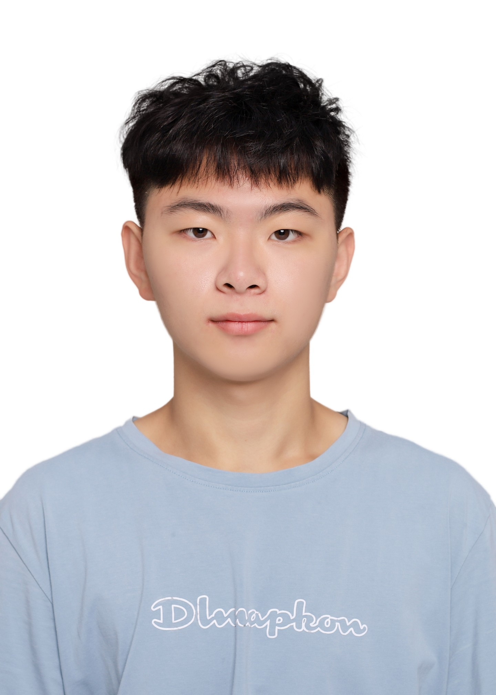

<table>
	<tr style="height: 50px;">
		<td style="font-size: 1.8em;"><strong>赵耀财👨‍💻</strong></td>
		<td style="font-size: 1.5em;"><strong>求职意向：后端开发</strong></td>
		<td rowspan="5">
			
		</td>
	</tr>
	<tr>
		<td>电话：19139599508</td>
		<td>邮箱：Zycz@163.com</td>
	</tr>
	<tr>
		<td>21岁</td>
		<td><a href="https://github.com/HaoHaovo">GitHub主页</a></td>
	</tr>
</table>

### ==🏫教育经历==

<h4 style="display: flex;justify-content: space-between;">
长春理工大学
</h4>

本科 | 计算机科学与技术 | 2022.09 - 2026.06

### ==📚专业技能==

- **C/C++**：精通 C/C++ 编程，深入理解指针、引用、内存分配与泄露机制，并具备调优能力；能熟练使用面向对象设计和 STL 容器解决复杂问题。
- **Python**：熟悉 Python 语言特性与生态系统，掌握异步 I/O、多线程、多进程编程，能够高效使用 NumPy、Pandas 等常用库，具备一定的数据处理与分析能力。
- **Go**：掌握 Go 语言，熟悉 Goroutine、Channel 等并发编程模型，了解 GC 机制与内存逃逸原理，具备底层性能调优能力。
- **分布式系统**：具备分布式系统与高性能 Web 服务架构设计经验，了解微服务架构、负载均衡、缓存策略以及服务注册与发现等核心技术。
- **Redis**：能使用常用的数据结构，了解持久化的方式。对缓存穿透、缓存击穿、缓存雪崩的原理以及解决方法有一定了解。
- **设计模式**：了解单例模式、生产者消费者模式、工厂模式等设计模式。
- **网络编程**：了解TCP/IP、UDP、HTTP等网络协议，了解IO复用。

### ==💻项目经历==

<h4 style="display: flex;justify-content: space-between;">
一、基于多源数据融合的智能图像拼接系统负责人2023.06 - 2024.04
</h4>

项目背景及描述：

- 基于嵌入式平台，结合 OpenCV 与 Qt 开发智能图像拼接系统；通过融合图像信息与 IMU 位姿数据，实现更精准的图像配准与拼接，提升图像拼接精度与鲁棒性。

我的工作内容：

- 负责项目从 0 到 1 的整体设计与开发，包括系统架构搭建、图像拼接算法实现、嵌入式平台部署与调试；
- 负责图像处理与拼接核心模块开发，基于 OpenCV 实现图像特征提取、匹配、配准与拼接流程；
- 利用 ORB/SIFT/SURF 等特征点算法进行图像关键点检测与匹配，提升拼接鲁棒性；
- 实现图像单应矩阵估计与透视变换，结合 IMU 位姿优化配准效果；
- 参与图像融合算法设计，如加权融合与羽化处理，提升拼接图像的过渡自然性；
- 配合嵌入式平台进行 OpenCV 模块的性能调优，确保拼接过程的实时响应。

<h4 style="display: flex;justify-content: space-between;">
二、面向机场跑道的航拍影像拼接与缺陷定位系统负责人2024.6 - 2025.04
</h4>

项目描述：

- 面向机场场景，基于航拍图像构建高精度影像拼接与自动缺陷检测系统。通过 OpenCV 完成图像特征提取、配准与融合，同时实现裂缝、脱落等缺陷的识别与定位，辅助机场日常巡检与维护。

我的工作内容：

- 主导图像拼接与缺陷检测模块的开发，基于 OpenCV 实现图像预处理、特征匹配与图像配准；
- 使用 SIFT/ORB 等算法提取航拍图像特征点，结合 RANSAC 算法计算单应矩阵，完成多幅图像的拼接；
- 针对机场跑道表面，设计图像增强与二值化处理流程，提升缺陷区域检测的准确率；
- 实现基于形态学和轮廓分析的裂缝与破损识别算法，自动标记缺陷区域并输出坐标；
- 对接飞控与图像采集系统，优化图像处理算法的运行效率，满足大范围、高分辨率数据处理需求

### ==🚀个人项目==

<h4 style="display: flex;justify-content: space-between;">
TinyWebserver个人开源项目2025.01 - 2025.03
</h4>

> 使用 C++ 编写的高性能 Web 服务器，基于 Reactor 模型与 IO 多路复用（epoll）实现并发连接处理，支持 GET 请求响应，具备良好的稳定性与可扩展性。**WebBench 测试 QPS 可达 10,000+，适用于高并发场景的服务端基础框架**。

- 基于 **Epoll + 线程池** 实现 IO 复用，采用 **多线程 Reactor 模型** 支持高并发连接处理；
- 通过 **有限状态机 + 正则表达式** 完成 HTTP 请求解析，支持静态资源访问；
- 使用 **封装的自动扩容缓冲区** 管理 `char` 数组，提高数据收发效率与内存安全；
- 设计并实现 **基于小根堆的定时器机制**，自动关闭非活动连接，提升系统资源利用率；
- 构建 **异步日志系统**，基于单例模式与阻塞队列，实现高性能下的运行日志记录；
- 利用 **RAII 技术** 封装数据库连接池，降低连接创建与释放开销，实现用户注册与登录功能；
- 编写 **模块化测试单元** 覆盖日志系统、线程池等核心模块，持续提升系统稳定性与可维护性。

### ==🏆获奖经历==

<table> <tr>     <td>第十五届蓝桥杯全国软件和信息技术专业人才大赛全国总决赛（C++）</td>     <td>全国二等奖</td><td>2024.11</td> </tr> <tr>     <td>第十届 CCPC 中国大学生程序设计竞赛-长春邀请赛（国赛）</td>  <td>银奖</td>   <td>2024.05</td> </tr> <td>第九届 CCCC 中国高校计算机大赛-团体程序设计天梯赛（国赛）</td> <td>全国三等奖</td>    <td>2024.04</td> </table>

- 省级奖项5项、校级奖项5项
- 校三好学生、校一等奖3次、二/三等奖各1次、软件著作权 1项

