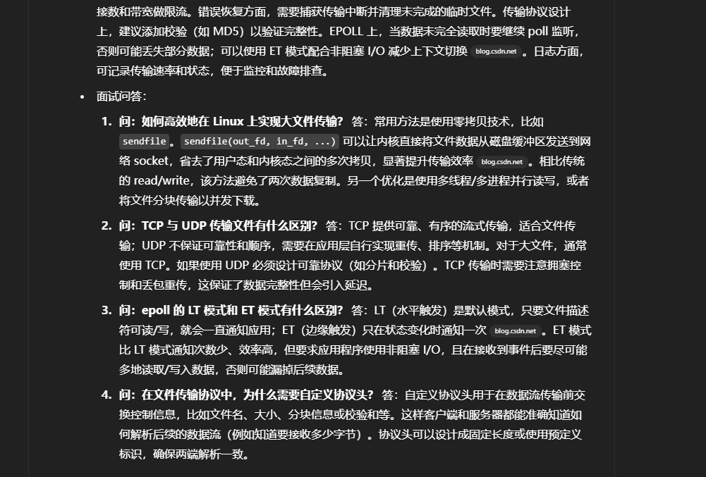

好的，我将基于你上传图片中的三部分内容（数据管理中心、后台调度系统、文件传输系统），分别复现项目实现流程，详细讲述设计与实现细节，并模拟面试官逐项提问并给出专业回答。

稍等片刻，我会为你生成完整内容，适用于技术面试和项目复述。

- 项目 1（数据管理中心）
	- 项目描述：数据管理中心是一个基于 C++/Linux 的后端守护进程，负责集中采集、存储和管理系统各类数据。它通常提供网络接口（如 HTTP 或自定义协议）供前端或其他系统调用，支持高并发访问和数据持久化。项目目标是在保证稳定性的同时，实现高吞吐量的数据写入/读取，并利用多进程（或多线程）架构充分利用多核 CPU。
	- 系统结构：系统架构上可划分为若干模块：网络监听模块（建立 TCP/HTTP 服务，使用 epoll 等 I/O 复用机制监听客户端请求）；请求调度模块（解析请求并分发给相应处理单元）；数据处理模块（执行业务逻辑和校验）；存储模块（将数据缓存于内存或落盘到数据库，例如 SQLite3）及日志/配置模块等。其中，主进程负责初始化配置和监听端口，然后通过 fork 创造多个工作进程，各子进程各自创建 epoll 实例并加入监听套接字，共享监听同一端口。子进程通过事件循环处理 accept、读写事件，完成数据解析和存储操作。模块之间的数据同步可通过进程间通信（如管道、消息队列、共享内存等）或统一的数据库来实现。
	- 核心技术实现：系统采用 Linux I/O 多路复用（epoll）实现高并发网络通信。在具体实现中，将监听套接字设置为非阻塞，并使用 ET（边沿触发）模式进行异步事件通知，以减少重复触发。HTTP 请求可以使用开源库或自定义解析器处理，必要时也可设计自定义二进制协议头（例如固定格式的头部字段包含数据长度、类型等）。守护进程部分，启动时进行双 fork、setsid、关闭标准文件描述符、重定向输出等步骤，使程序在后台长期运行。多进程模型中，需要设置 SO_REUSEADDR/SO_REUSEPORT 等选项，允许多个子进程同时绑定同一端口。数据持久化方面，可采用 SQLite 或文件存储：系统在内存中缓存最新数据，定期或在退出时将数据落盘，保证重启后数据不丢失。整个网络层与处理层采用异步非阻塞模式，通过事件驱动回调快速响应，同时尽量将耗时操作（如磁盘 I/O、数据库写入）放入独立线程或子进程中。
	- 遇到的问题与优化：实现过程中要解决多进程 epoll 的“惊群”问题：如果多个子进程共享一个 epoll 实例或监听 fd，则新连接到来时可能唤醒所有子进程，但只有一个能 accept 成功，浪费资源。解决方案是让每个子进程在 fork 之后都调用 epoll_create 并将 listen_fd 加入自己的 epoll（参见 Lighttpd 模型），这样每个进程独立处理 accept。同时，ET 模式下要一次性读写完所有数据，否则可能丢失事件；需要谨慎设置缓冲区和循环读取。对于数据持久化，SQLite 在多进程写入时要开启 WAL 模式避免锁等待；可将写入批量化以减少 I/O 频率。程序运行时还要注意文件描述符泄露、进程间同步锁（如互斥锁或信号量）避免死锁等问题。通过使用非阻塞 I/O、设置合理的网络超时时间、编写高效解析器等手段，可优化系统并发性能。
	- 面试问答：
		1. **问：什么是 epoll，与 select/poll 有何区别？** 答：epoll 是 Linux 提供的高效 I/O 多路复用机制，用于监视大量文件描述符的事件。与 select/poll 相比，epoll 支持水平（LT）和边缘（ET）触发模式，能同时处理成千上万个并发连接。ET 模式下只有状态发生变化时才通知用户，减少了重复唤醒次数。它通过内核事件表避免了遍历检查，具有更好的性能和可扩展性。
		2. **问：如何实现 Linux 守护进程（daemon）？** 答：常见做法是启动时 fork 两次、调用 setsid() 使进程脱离终端并成为新的会话首进程，然后将工作目录切换到根目录、重设文件权限掩码（umask(0)）、关闭或重定向标准输入输出流，并将 PID 写入文件。这样程序就可以在后台长期运行。
		3. **问：多进程模型下如何避免“惊群”现象？** 答：关键在于让每个子进程使用独立的 epoll 实例，即在 fork 之后再调用 epoll_create，每个子进程都将监听 socket 加入到自己的 epoll 中。这样只有收到事件的进程被唤醒，从而避免惊群。另一种方法是使用 SO_REUSEPORT，让内核负载均衡新连接到不同进程。
		4. **问：进程间可以用哪些方式同步数据？** 答：常用 IPC 方式包括匿名管道、命名管道（FIFO）、System V 或 POSIX 消息队列、共享内存加锁、信号量、Unix 域套接字等。对于需要交换数据的场景，共享内存速度最快但需自行同步；若仅需通知事件，可用信号或管道；若结构化消息可用消息队列。此外，也可以使用数据库或 Redis 等外部系统作为通信桥梁。
- 项目 2（后台调度系统）
	- 项目描述：后台调度系统是一个负责定时或定条件执行任务（Job）的服务，一般部署为守护进程形式。它的主要目标是在预定时间或触发事件发生时，自动运行配置好的任务（如脚本、程序）并监控其执行结果。该系统需支持任务的增删改查、自定义触发条件（时间表达式或外部事件）、并发执行、失败重试等功能，并保证在高并发任务执行时系统的稳定性和可扩展性。技术栈同样基于 C++/Linux，多采用多进程或线程池来并行处理任务。
	- 系统结构：调度系统通常分为管理模块（接受用户或其他系统的任务提交请求）、调度模块（解析任务时间/事件并触发执行）、执行模块（实际运行任务）、持久化模块（存储任务定义与状态）和日志监控模块等。管理模块可能提供 HTTP API 或命令行接口，供用户定义任务。调度模块维护一个优先队列或时间轮结构来管理即将执行的任务，可使用 timerfd 等内核定时机制在到达时间后发出事件。任务到点后由执行模块（可为子进程池或线程池）异步调用系统命令或执行回调函数。各模块之间通过线程安全队列或消息队列通信，任务元数据可存储在配置文件或轻量数据库中，确保任务列表持久化。
	- 核心技术实现：调度系统的核心是定时器和并发执行。一种实现方式是使用 Linux 的 timerfd 结合 epoll：程序调用 timerfd_create 创建定时器，并将其加入 epoll 循环中监控。一旦定时器到期，epoll 返回事件并执行对应回调。支持多种触发条件时，可创建多个 timerfd 或计算下一个触发时间设定 timerfd。在任务执行时，通过 fork/exec 或子线程来并行运行任务，父进程继续监听后续事件。为了避免阻塞，可设置非阻塞 I/O、超时时间以及任务的最大并发数限制。执行模块可以维护一个线程池或进程池，统一调度工作。例如，从数据库取任务时可启用事务防止并发修改。数据同步方面，当任务运行结果需要更新时，可通过队列通知调度器更新状态，并持久化到存储中。
	- 遇到的问题与优化：调度系统需处理时间精度和资源竞争问题。定时任务的精度受 timerfd 精度和系统负载影响，可通过加大优先级或使用高精度定时（clockid 参数）改进。并发执行任务时要防止僵尸进程，可在父进程捕获 SIGCHLD 信号并 waitpid。任务执行失败时要有重试机制或错误报警。系统设计时也要避免任务执行时间过长导致下一个任务延迟，可通过隔离进程或超时杀死等措施实现。对调度内部数据结构（如任务队列）要做线程/进程同步，例如加锁或使用线程安全容器。日志记录要注意同步写入或日志滚动策略以免丢失。对于大规模任务场景，可将任务分发到多台机器执行，使用消息中间件传递触发消息，以实现分布式扩展。
	- 面试问答：
		1. **问：如何在 Linux 程序中实现定时任务？** 答：常用方式包括使用系统的 crontab（外部调度器）或在程序内部使用定时器机制。在 C/C++ 程序内，可使用 alarm 信号、setitimer 或更现代的 timerfd_create 来创建计时器。配合 epoll 将 timerfd 加入事件循环，当到期时 epoll_wait 触发读事件，再执行回调。timerfd 允许设置周期性或一次性定时，可用它来替代轮询检查时间的低效方案。
		2. **问：调度系统如何保证任务并发执行且互不影响？** 答：通常为每个任务创建独立的进程或线程，在隔离的环境中运行。这样一个任务的异常不会影响其他任务。父进程只负责调度和监控，可使用 fork+exec 执行外部脚本，或使用线程池执行内部函数。使用进程时要捕获 SIGCHLD 并回收子进程，防止僵尸进程。同时可对并发数量做限制，比如进程池大小或并发任务数上限。必要时，为任务加锁或使用原子操作，避免对共享资源（如同一文件）并发冲突。
		3. **问：异步执行和同步执行有什么区别？** 答：同步执行时，函数调用会阻塞直到操作完成；异步执行则发起操作后立即返回，完成时通过回调、事件或轮询通知。调度系统中，一般将耗时任务异步执行（如子进程运行任务），父进程继续监听调度事件。这样避免主调度线程被阻塞，提高吞吐量。例如使用非阻塞 I/O 和 epoll、后台线程池等都属于异步模式。
		4. **问：如果调度系统意外挂掉，如何保证任务不丢失？** 答：需要将任务元数据持久化到存储（如数据库或文件）。每次启动时从存储加载未完成的任务。运行时状态（已完成、失败或等待重试）也要写回存储。还可以结合心跳或 watchdog 机制，当系统发现主调度进程不可用时，自动重启或切换到备用调度实例，从而提高可靠性。
- 项目 3（文件传输系统）
	- 项目描述：文件传输系统是一个支持多客户端并发上传/下载文件的服务端程序。项目目标是在不牺牲安全性的前提下，提供稳定高效的大文件传输功能。技术栈包括 C++、Linux 网络编程、epoll、多进程/线程等。系统可采用自定义 TCP 协议或基于 HTTP 的 REST 接口，在传输前通过协议头交换文件名、大小、校验信息等元数据，然后进行文件数据的传输。常见应用场景包括私有云存储、P2P 文件共享或视频分发等。
	- 系统结构：架构上分为控制通道和数据通道：控制通道负责客户端连接认证、协议解析和传输指令（如开始上传、下载文件等），可使用长连接和简易文本/二进制协议；数据通道用于实际的文件块传输。服务端监听一个 TCP 端口并使用 epoll 监视多个客户端连接。当有新连接时，根据协议类型将其分配给对应的处理逻辑（上传或下载）。文件读写和网络 I/O 是性能关键，通常使用线程池或进程池来处理文件 I/O，以避免阻塞主循环。文件存储模块维护磁盘上的文件结构目录，提供读写接口并做权限校验。整个传输协议设计可在每次传输前发送一个自定义的头部字段（如固定长度包含文件名长度和文件大小），客户端接收头部后分配缓冲区或创建文件，然后循环收发文件数据块。
	- 核心技术实现：使用 non-blocking socket + epoll 实现高并发网络传输。上传时，服务器在接收到文件元信息后，以非阻塞方式循环读取客户端发送的数据并写入目标文件；下载时，可使用 Linux 提供的零拷贝 sendfile 系统调用，将文件直接从文件描述符传输到 socket。sendfile 省去了用户态和内核态之间的数据拷贝，极大提高了大文件传输效率。在 epoll 循环中，对读写事件使用 LT 触发模式，读写前均检查缓冲区长度避免阻塞。如果使用 ET 模式，则需反复读写直到 EAGAIN。多线程/多进程可用于并行读写：比如主进程负责 accept 后，fork 子进程或交给线程池去处理文件数据的读写。异步通信方面，还可以利用管道或消息队列在主线程和工作线程之间传递文件传输状态。协议头中通常包含文件名长度、文件大小等信息，使用固定字节序列或 JSON 等格式封装，确保前后端一致解析。
	- 遇到的问题与优化：文件传输中主要问题是传输效率和稳定性。大文件传输可能造成网络或磁盘 I/O 瓶颈：可通过分块传输（比如分片下载）、调节 TCP 窗口大小、开启 Nagle 算法优化等手段缓解。同时注意 TCP 传输的可靠性，如实现超时重传和断点续传。使用 sendfile 时需保证文件描述符对齐和足够权限，否则会失败。服务器要限制并发传输数量，避免内存耗尽；可以对客户端连接数和带宽做限流。错误恢复方面，需要捕获传输中断并清理未完成的临时文件。传输协议设计上，建议添加校验（如 MD5）以验证完整性。EPOLL 上，当数据未完全读取时要继续 poll 监听，否则可能丢失部分数据；可以使用 ET 模式配合非阻塞 I/O 减少上下文切换。日志方面，可记录传输速率和状态，便于监控和故障排查。
	- 面试问答：
		1. **问：如何高效地在 Linux 上实现大文件传输？** 答：常用方法是使用零拷贝技术，比如 `sendfile`。`sendfile(out_fd, in_fd, ...)` 可以让内核直接将文件数据从磁盘缓冲区发送到网络 socket，省去了用户态和内核态之间的多次拷贝，显著提升传输效率。相比传统的 read/write，该方法避免了两次数据复制。另一个优化是使用多线程/多进程并行读写，或者将文件分块传输以并发下载。
		2. **问：TCP 与 UDP 传输文件有什么区别？** 答：TCP 提供可靠、有序的流式传输，适合文件传输；UDP 不保证可靠性和顺序，需要在应用层自行实现重传、排序等机制。对于大文件，通常使用 TCP。如果使用 UDP 必须设计可靠协议（如分片和校验）。TCP 传输时需要注意拥塞控制和丢包重传，这保证了数据完整性但会引入延迟。
		3. **问：epoll 的 LT 模式和 ET 模式有什么区别？** 答：LT（水平触发）是默认模式，只要文件描述符可读/写，就会一直通知应用；ET（边缘触发）只在状态变化时通知一次。ET 模式比 LT 模式通知次数少、效率高，但要求应用程序使用非阻塞 I/O，且在接收到事件后要尽可能多地读取/写入数据，否则可能漏掉后续数据。
		4. **问：在文件传输协议中，为什么需要自定义协议头？** 答：自定义协议头用于在数据流传输前交换控制信息，比如文件名、大小、分块信息或校验和等。这样客户端和服务器都能准确知道如何解析后续的数据流（例如知道要接收多少字节）。协议头可以设计成固定长度或使用预定义标识，确保两端解析一致。

好的，我将以课程项目背景，使用 C++ 与 Linux 开发为前提，为你详细解释该综合项目的结构与实现方式，包括三个子模块（数据管理中心、后台调度系统、文件传输系统），并整合为一个整体项目说明。同时我会给出适合初学者的简历项目描述，以及典型面试问答与推荐答法。

请稍等，我将为你整理完整内容。

# 项目整体结构

该项目由三个子模块协同工作：数据管理中心、后台调度系统和文件传输系统。**数据管理中心**负责从外部接收数据（支持 XML/JSON/CSV 格式），将数据转换处理后存入数据库，并提供 HTTP 接口供其他系统访问；**后台调度系统**以守护进程方式运行，定时触发各类任务（如压缩或清理），通过 fork/exec 调用外部脚本并记录日志；**文件传输系统**基于 TCP 协议，提供客户端上传/下载功能，使用自定义协议头描述文件信息。三个模块通过共享数据库和文件目录配合：数据管理中心产生并更新的数据可通过文件传输系统提供给客户端，后台调度系统定期压缩或清理这些数据，保证系统稳定可靠。三者均运行在 Linux 环境下，使用 C++ 编写，通过系统调用和网络编程接口进行协同。

## 数据管理中心模块

- **主要功能**：数据采集（HTTP 接口或文件接口获取 XML/JSON/CSV 数据）、格式转换（使用 JSON/XML 库将不同格式互转）、数据入库（调用数据库 API 将处理后数据存储到 MySQL 等）、数据同步和压缩（定期备份新数据并调用压缩工具减小空间）。
- **实现方式**：我们在 C++ 中编写了一个简单的 HTTP 服务器，使用 socket 创建监听端口，通过 `epoll` 机制同时处理多个连接。收到数据后，用快速解析库（如 RapidJSON、TinyXML）将 XML/JSON/CSV 格式转换成统一的数据结构，然后调用数据库接口（如 MySQL C++ Connector）将数据写入数据库。对于数据同步和压缩，后台调度模块会定时触发相应脚本（例如调用 `rsync` 或 `gzip`），实现数据备份与压缩。整个模块作为一个服务进程运行，提供 RESTful 风格的 HTTP 接口供其他模块或客户端访问。

## 后台调度系统模块

- **主要功能**：定时执行维护任务，包括数据压缩、日志清理、备份同步等。
- **守护进程**：模块以**守护进程**模式运行，使进程在后台执行。启动时，程序调用 `fork()`、`setsid()` 等函数脱离终端，父进程退出，子进程成为会话组长，从而成为后台守护进程。
- **多进程调度**：调度进程按照设定的时间间隔（如每小时或每天）循环检查执行任务。每当到达执行时间，会 `fork()` 一个子进程，并在子进程中通过 `execvp()` 或 `system()` 等方式启动对应的 Shell 脚本或外部程序。这样主进程不受阻塞，可继续等待下次调度。
- **日志记录**：调度系统将每次任务的启动时间、结束时间、状态信息写入日志文件，便于监控和排错。

## 文件传输系统模块

- **主要功能**：支持客户端上传和下载文件。
- **TCP 通信**：使用 BSD socket 接口在指定端口监听 TCP 连接。文件传输采用 TCP 协议，因此具有**面向连接、可靠传输**的特点。服务器端先创建监听 socket，接受客户端连接，然后通过 `send/recv` 实现文件数据传输。
- **并发连接**：为支持多个客户端同时传输，服务器利用 `epoll` 监听多个 socket 事件。主循环中调用 `epoll_wait`，一旦有新的上传/下载请求或数据可读，就分别处理。这样一个线程便可高效管理成百上千的并发连接。
- **自定义协议头**：在传输文件之前，客户端和服务器先交换一个固定格式的报文头，包含文件名和文件大小等信息。服务器收到文件后根据头信息创建文件并持续读取剩余字节；下载时也是先发送头部，客户端再根据头部信息读取相应长度的数据。
- **数据读写**：文件以字节流方式进行传输，服务器使用循环读写确保收到完整数据。由于 TCP 提供的重传机制，传输过程可靠无丢包。

## 项目简历描述

- **项目概述**：该项目使用 C++ 在 Linux 平台开发，实现了数据管理中心、后台调度守护程序和文件传输系统三个模块。项目涵盖网络编程、并发处理、进程管理等多个方面，是一个完整的数据采集与分发解决方案。
- **技术要点**：
	- 熟练运用 **epoll** 进行 I/O 多路复用，构建高并发网络服务。
	- 精通 Linux **守护进程**、进程控制（`fork`/`setsid`）与定时任务调度机制。
	- 掌握 C/C++ 调用外部程序的方法，使用 `system`/`execvp` 执行 Shell 脚本。
	- 熟悉 **TCP/IP** 套接字编程，实现稳定可靠的文件上传/下载服务。
	- 熟悉 JSON、XML、CSV 等数据格式的解析与数据库存储，具备数据处理能力。
- **模块协作**：各模块通过数据库或文件共享数据，数据管理模块提供存储和访问接口，文件传输模块用于数据收发，调度模块负责系统维护。项目突出展示了模块化设计和 C++ 系统编程能力。

## 面试可能问及的问题及参考答案

- **问：什么是 epoll？有什么优势？**
	 答：`epoll` 是 Linux 内核提供的可扩展 I/O 事件通知机制，用于同时监听和处理大量文件描述符上的 I/O 事件。与传统的 `select`/`poll` 相比，`epoll` 在大量并发连接时性能更高（平均时间复杂度更优），非常适合高并发网络服务。
- **问：如何创建一个守护进程？**
	 答：通常在创建守护进程时，程序先调用 `fork()` 让父进程退出，然后在子进程中调用 `setsid()` 脱离终端并成为新会话组长。随后关闭标准输入输出、重定向到 `/dev/null`，改变工作目录等，就可以在后台持续运行。这样子进程就成为了真正的守护进程。
- **问：C/C++ 程序中如何执行外部 Shell 脚本？**
	 答：可以使用 `system()` 函数直接运行 Shell 命令，也可以先 `fork()` 出子进程，再在子进程中使用 `execvp()`、`execlp()` 等 `exec` 系列函数加载并执行另一个程序。`exec` 函数成功后不会返回，子进程会被新程序替换；如果失败才会返回 -1。
- **问：为什么文件传输模块使用 TCP 协议？**
	 答：TCP 是一种**面向连接的可靠传输协议**。它在通信开始时通过三次握手建立连接，然后保证数据按序到达并自动重传丢失的数据。对于文件传输，需要确保数据完整性和顺序，TCP 的特性使其成为理想选择。

以上回答采用了通俗的语言介绍了项目结构、模块功能实现以及所用的 Linux 技术，在简历中强调了 C++ 网络编程和系统编程技能，同时给出了初学者能够理解的面试问答示例。引用内容已标注相关出处。

