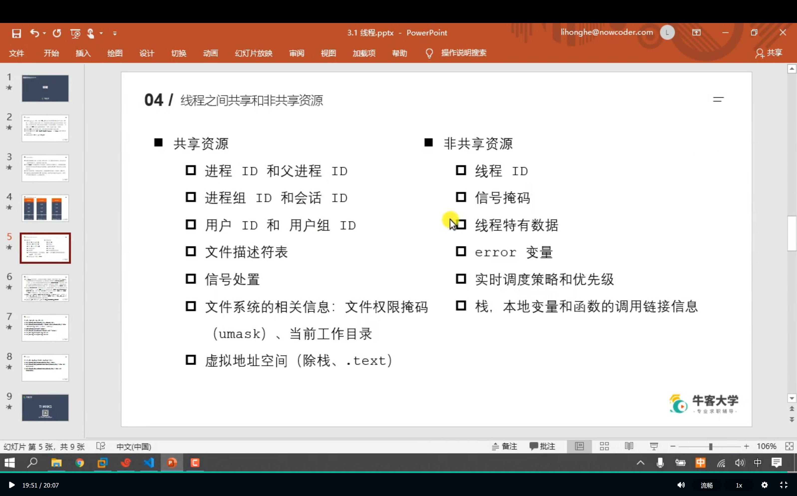
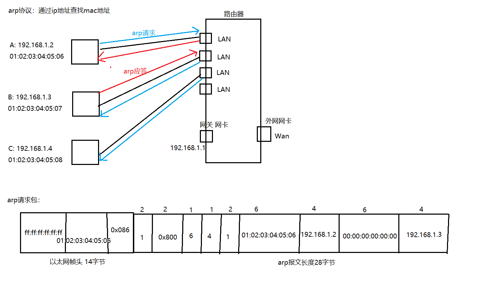

## 线程

<font size=3>[press](../项目学习/WebServer/3.1 线程.pdf)</font>

<pre><font size =3>  线程是允许应用程序并发执行多个任务的一种机制，一个进程可以包含多个线程，<b>同一个程序中的所有线程均会独立执行相同程序，并共享同一份全局共享内存</b>,栈空间和text会分为多部份，每个线程占一部分，共享库，堆空间和内核线程之间共享
  进程是 CPU 分配单元的最小单位，线程是 OS 调度执行的最小单位
  线程是轻量化的进程（LWP）,Linux 下线程的本质仍是进程   ps -Lf pid



### 创建线程

<pre><font size=3>  一般情况下，main函数所在的线程成为主线程(main线程)，其余创建的线程为子线程，程序中默认只有一个进程，程序默认只有一个线程
  gcc pthread_create.c -o create -pthread/-lpthread (链接库)
  int pthread_create(pthread_t *thread,const pthread_attr_t *attr,void *(*start_routine) (void *),void *arg);  --> pthread.h
  功能：创建一个子线程
  参数：
    thread：传输参数，线程创建成功后，子线程的线程 ID 会写入到该变量中
    attr：需要设置线程的属性，一般使用默认值，NULL
    start_routine：函数指针，这个函数是子线程需要处理的逻辑代码
    arg：给第三个参数使用，传参
  返回值：成功：0，失败：返回错误号，和之前的errno不太一样 -> 获取错误号信息：char * strerror(int errnum)
</pre>


```cpp
void *callback(void *arg){//void *是万能指针，表示可以将任何类型的指针传递进来 
  printf("child thread...\n");// 子线程的代码
  printf("arg value: %d\n",*(int*)arg);
  return NULL;
}
pthread_t tid;
int num = 10;
int ret = pthread_create(&tid,NULL,callback,NULL); // (...callback,(void *)&num);
if(ret != 0){
  char *errstr = strerror(ret);
  printf("error : %s\n",errstr);
}
for(int i=1;i<=5;i++){
  printf("%d\n",i); //主线程的代码
}
sleep(1);//防止子线程未执行 程序就被return
```

### 终止线程

<pre><font size=3>  void pthread_exit(void *retval); --> pthread.h，返回的是地址
  功能：终止一个线程,在哪个线程中调用，就表示终止哪个线程
  retval：需要传递一个指针，作为返回值，可以在pthread_join()中获取到<br>
  pthread_t pthread_self(void);
  功能：获取当前的线程的线程 ID<br>
  int pthread_equal(pthread_t t1,pthread_t t2);
  功能：比较两个线程 ID 是否相等,不同的OS pthread_t类型的实现不一样，有的是无符号长整型，有的是结构体
</pre>


```cpp
void *callbck(void *arg){ //返回的是地址
  printf("child pthread id : %ld\n",pthread_self());
  return NULL; //相当于 pthread_exit(NULL)
}
pthread_t tid;
int ret = pthread_create(&tid,NULL,callback,NULL);
if(ret != 0){
  char *errstr = strerror(ret);
  printf("error : %s\n",errstr); 
}
for(int i=1;i<=5;i++){
  printf("%d\n",i);
}
printf("tid : %ld,main thread id : %ld\n",tid,pthread_self());
pthread_exit(NULL);//主线程退出，进程不会直接结束，不会影响其他正常运行的线程
```

### 连接已终止的线程

<pre><font size=3>  int pthread_join(pthread_t thread,void **retval);
 功能：和一个已终止的线程进行连接 --> 回收子线程的资源  ， 阻塞函数 ， 调用一次只能回收一个，一般在主线程中使用
  thread：需要回收的子线程的 ID
  retval：接收子线程退出时的返回值，二级指针<br>
  在上述代码主线程退出前调用 join 回收子线程的资源
  ret = pthread_join(tid,NULL); // 阻塞函数
  printf("回收自线程资源\n");
</pre>


```cpp
 // 如果子线程中不是return而是exit终止：
int value = 10;//cb中的局部变量，exit后会被释放，再次访问该地址是随机值，可以使用全局变量
pthread_exit((void *)&value); // = return (void *)&value
//主线程中
int *thread_retval;
ret = pthread_join(tid,(void **)&thread_retval);//如果不是二级指针，会值传递，不会真的改变变量的值，类似于 * & 改为地址传递，真正修改局部变量的值
printf("exit data: %d\n",*thread_retval);
```

### 线程的分离

<pre><font size=3>  int pthread_detach(pthread_t thread);
  功能：分离线程，被分离的线程在终止的时候会自动释放资源返回给系统
  注意：1.不能多次分离，会产生不可预料的行为。  2.不能去连接一个已经分离的线程，会报错。


```cpp
//在主线程exit之前设置子线程分离,子线程结束时对应的资源就不需要主线程释放
pthread_detach(tid);//注意 不能再次对分离的子线程进行连接了，即是不能 x_join 了
```

### 线程取消

<pre><font size=3>  int pthread_cancel(pthread_t thread);
  功能：取消线程（让线程终止）  取消某个线程可以终止某个线程的运行，但是并不是马上终止，而是当子线程执行到一个取消点，线程才会取消
  取消点：OS 规定好的一些系统调用，可以粗略的理解为从用户区到内核的切换，这个位置称为取消点
</pre>


### 线程属性

<pre><font size=3>  int pthread_attr_init(pthread_attr_t *attr);
  功能：初始化线程属性变量
  int pthread_attr_destory(pthread_attr_t *attr);
  功能：释放线程属性的资源
  int pthread_attr_getdetachstate(const pthread_attr_t *attr,int *detachstate);
  功能：获取线程分离的状态属性
  int pthread_attr_setdetachstate(pthread_attr_t *attr,int detachstate);
  功能：设置线程分离的状态属性
</pre>


```cpp
void *callbck(void *arg){ //返回的是地址
  printf("child pthread id : %ld\n",pthread_self());
  return NULL; //相当于 pthread_exit(NULL)
}
//创建一个线程属性变量
pthread_attr_t attr;
pthread_attr_t_init(&attr);//初始化属性变量
pthread_attr_setdetachstate(&attr,PTHREAD_CREATE_DETACHED);//设置属性,此处指设置了线程分离
pthread_t tid;
int ret = pthread_create(&tid,&attr,callback,NULL);
if(ret != 0){
  char *errstr = strerror(ret);
  printf("error : %s\n",errstr); 
}
size_t size;
pthread_attr_getstacksize(&attr,&size);//获取线程属性中栈空间的大小
printf("thread stack size : %ld\n",size);
for(int i=1;i<=5;i++){
  printf("%d\n",i);
}
printf("tid : %ld,main thread id : %ld\n",tid,pthread_self());
pthread_attr_t_destory(&attr);//有初始化就要有释放
pthread_exit(NULL);//主线程退出，进程不会直接结束，不会影响其他正常运行的线程
```

### 线程同步

<font size=3>[press](../项目学习/WebServer/3.8 线程同步.pdf)</font>

```cpp
int tickets = 100;
void *sellticket(void *arg){
  while（tickets > 0){
    usleep(3000);
    printf("%ld 正在卖第 %d 张门票\n",pthread_self(),tickets)；
      tickets -- ;
  }
  return NULL;
}
//使用多线程实现卖票的案例，有多个窗口，一共100张票
pthread_t tid1,tid2,tid3; // 创建 3 个子线程
pthread_create(&tid1,NULL,sellticket,NULL);
pthread_create(&tid2,NULL,sellticket,NULL);
pthread_create(&tid3,NULL,sellticket,NULL);
pthread_join(tid1,NULL);//连接子线程，回收资源，阻塞的
pthread_join(tid2,NULL);
pthread_join(tid3,NULL);
//pthread_detach(tid1);//设置线程分离
//pthread_detach(tid2);
//pthread_detach(tid3);
pthread_exit(NULL);//退出主线程防止主进程结束，导致所有的线程结束
```

### 互斥锁  P V

<pre><font size=3>  互斥量的类型 pthread_mutex_t
  int pthread_mutex_init(pthread_mutex_t *restrict mutex,const pthread_mutexattr_t *restrict attr);
  功能：初始化互斥量
  mutex：需要初始化的互斥量变量
  attr：互斥量的相关属性，NULL
  restrict：C语言的修饰符，被修饰的指针，不能由另外的一个指针进行操作。<br>
  int pthread_mutex_destroy(pthread_mutex_t *mutex);
  功能：释放互斥量的资源
  int pthread_mutex_lock(pthread_mutex_t *mutex);
  功能：加锁，如果有一个线程加锁，其他线程只能阻塞等待
  int pthread_mutex_trylock(pthread_mutex_t *mutex);
  功能：尝试加锁，如果加锁失败不会阻塞，直接返回
  int pthread_mutex_unlock(pthread_mutex_t *mutex);
  功能：解锁
</pre>


```cpp
int tickets = 100;
pthread_mutex_t mutex;//创建一个互斥量
void *sellticket(void *arg){
  while(1){
    pthread_mutex_lock(&mutex);//加锁一定要在临界区之前，否则会出现多个线程进入临界区，出现阻塞等待现象，此时可能会导致超卖现象
    if(ticket > 0){
       usleep(3000);
    	 printf("%ld 正在卖第 %d 张门票\n",pthread_self(),tickets)；
    	 tickets -- ;
    }
    else {
      pthread_mutex_unlock(&mutex);//break前解锁
      break;
    }
    pthread_mutex_unlock(&mutex);//当前任务结束了在解锁
  }
  return NULL;
}
//main 函数中对互斥量初始化等
pthread_mutex_init(&mutex,NULL);
pthread_mutex_destory(&mutex);//如果是join回收资源，由于会阻塞主进程可以此时可以写道exit前，等所有的子线程结束便销毁，但是如果是detach是不会阻塞的，此时需要while防止直接销毁
```

#### 死锁

<pre><font size=3>  两个或两个以上的进程在执行过程中，因抢占资源而造成的一种互相等待的现象
  1.忘记释放锁   2.重复加锁   3.多线程多锁，抢占锁资源  
</pre> 


#### 读写锁

<pre><font size=3>  提供允许多个读出，但是只允许一个写入
    1.如果有其他线程读数据，则允许其他线程执行读操作，但不允许写操作；  2.如果有其他线程写数据，则其他线程都不允许读、写数据；  3.写是独占的，写的优先级高 <br>
    读写锁类型：pthread_rwlock_t
    int pthread_rwlock_init(xxx,xxx);//参数组成同 mutex，只是将mutex换为 rwlock
     rdlock()   wrlock()  分别表示写锁和读写，其余函数均与mutex类似 ,可以公用一个互斥量，函数调用实现不同的功能
</pre>


```cpp
//3个线程不定时写一个全局变量，其余5个不定时读
int num = 1;
pthread_rwlock_t rwlock;
void *writeNum(void *arg){
  while(1){
    pthread_rwlock()_wrlock(&rwlock);//加写锁
    num ++ ;
    printf("++write,tid ： %ld,num : %d\n",pthread_self(),num);
    pthread_rwlock_unlock(&rwlock);//解锁
    usleep(100);
  }
  return NULL;
}
void *readNum(void *arg){
	while(1){
    pthread_rwlock()_rdlock(&rwlock);//加读锁
    printf("==read,tid : %ld,num %d\n",pthread_self(),num);
    pthread_rwlock_unlock(&rwlock);
    usleep(100);
  } 
  return NULL;
}
//main
pthread_rwlock_init(&rwlock,NULL);//初始化互斥量
pthread_t wtids[3],rtids[5];
for(int i=0;i<3;i++){
  pthread_create(&wtids[i],NULL,writeNum,NULL);
}
for(int i=0;i<5;i++){
  pthread_create(&rtids[i],NULL,readNum,NULL);
}
//设置线程分离   ------> 省略，线程分离不需要传地址
//结束主线程 省略
pthread_rwlock_destroy(&rwlock);//销毁
```

### 条件变量

<pre><font size=3>  pthread_cond_t  ，某个条件满足后阻塞/解除线程
  init destroy 类似 更换关键词为 cond 即可
  int pthread_cond_wait(pthread_cond_t *restrict cond,pthread_mutex_t *restrict mutex); //等待 直至有信号
  功能：阻塞函数，线程会阻塞  <b>wait 会首先对互斥锁解释，当wait不阻塞时，又会对互斥锁加锁</b>
  int pthread_cond_timedwait(pthread_cond_t *restrict cond,pthread_mutex_t *restrict mutex,const struct timespec *restrict abstime);
  功能：等待多长时间，线程会阻塞，直至指定的时间结束
  int pthread_cond_signal(pthread_cond_t *cond);//唤醒等待的一个或多个
  int pthread_cond_broadcast(pthread_cond_t *cond);//唤醒所有等待的线程
</pre>

### 信号量

<pre><font size=3>  sem_t
  int sem_init(sem_t *sem,int pshared,unsigned int value);
    pshared：0 用在线程，非 0 用在进程
    value：信号量的值
  int sem_destroy(sem_y *sem);
  int sem_wait(sem_t *sem);// -1 信号量
  功能：对信号量加锁，信号量的值 -1，如果为 0 ，就阻塞
  int sem_trywait(sem_t *sem);
  int sem_timedwait(sem_t *sem,const struct timespec *abs_timeout);
  int sem_post(sem_T *sem);// +1 
  功能：对信号量解锁，信号量值 +1
  int sem_getvalue(sem_t *sem,int *sval);
</pre>

#### 生产者消费者

```cpp
pthread_mutex_t mutex;
//pthread_cond_t cond;//创建条件变量 直接使用信号量即可，条件变量只是一个过渡期
sem_t psem,csem;// 类似于模拟生产者消费者还有多少可以操作
struct node{
  int num;
  struct node *next;
}; 
struct node *head = NULL;
void *producer(void *arg){
  while(1){//创建新的节点
    sem_wait(&psem);
    pthread_mutex_lock(&mutex);
    struct node *newnode = (struct node *)malloc(sizeof(struct node));//不能写自动变量，写自动变量作用域结束后自动释放，本部分明显需要长期存在
    newnode->next = head;
    head = newnode;
    newnode->num = rand() % 1000;
    printf("add node, num : %d, tid : %ld\n",nownode->num,pthread_self());
    //只要生产一个就通知消费者消费
    //pthread_cond_signal(&cond);
    pthread_mutex_unlock(&mutex);
    sem_post(&csem);//对消费者 +1
    usleep(100);
  }
  return NULL;
}
void *customer(void *arg){
  while(1){
    sem_wait(&csem);
    pthread_mutex_lock(&mutex);
    struct node *tmp = head;
    if(head != NULL){
      head = head->next;
    	printf("del node ; num ： %d, tid : %d\n",tmp->num,pthread_self());
    	free(tmp);
    	pthread_mutex_unlock(&mutex);
    	usleep(100);
      sem_post(&psem);
    }
    //else {//没有数据、需要等待，并通知生产者生产 ---->  条件变量需要使用
    	//pthread_cond_wait(&cond,&mutex);//wait会首先对互斥锁解锁，wait不阻塞时会重新对其加锁
      //pthread_mutex_unlock(&mutex);
    //}
  }
  return NULL;
}
int main(){
  //使用链表实现，不考虑满，只考虑空
  pthread_mutex_init(&mutex,NULL);
  //pthread_cond_init(&cond,NULL);
  sem_init(&psem,0,8);//地址，线程，个数
  sem_init(&csem,0,0);
  pthread_t ptids[5],ctids[5];
  for(int i=0;i<5;i++){
    pthread_create(&ptids[i],NULL,producer,NULL);
    pthread_create(&ctids[i],NULL,customer,NULL);
  }
  //线程分离 pthread_detach(ptids[i]);...省略  detach 或 join 决定了 destroy 的写法，位置
  while(1){ //防止直接将mutex销毁
    sleep(10);
  }
  pthread_mutex_destroy(&mutex);//不能放exit后，exit后的代码不会执行，
  //注意上述destroy 如果使用的是join释放子线程则不用写while 因为join是阻塞的，子线程回收完才会继续
  //pthread_cond_destroy(&cond);
  pthread_exit(NULL);
  return 0;
}
```

```cpp
// while 版本
void *customer(void *arg) {
    while (1) {
        pthread_mutex_lock(&mutex);
        // 判断是否有数据
        while (head == NULL)
            // 当这个函数调用阻塞的时候，会对互斥锁进行解锁，当不阻塞的，继续向下执行，会重新加锁。
            pthread_cond_wait(&cond, &mutex);
        // 保存头结点的指针
        struct Node *tmp = head;
        assert(head != NULL);
        // 有数据
        head = head->next;
        printf("del node, num : %d, tid : %ld\n", tmp->num, pthread_self());
        free(tmp);
        pthread_mutex_unlock(&mutex);
        sleep(1);
    }
    return NULL;
}
```

## 网络结构模式

 <font size=3>[press](../项目学习/WebServer/4.1 网络基础.pdf)     <b>最重要的部分</b></font>

<pre><font size=3>  MAC 地址，48位，12个16进制数组成，网卡上唯一的标识
  ip 地址，为互联网上的每个主机或者网络分配一个逻辑地址，32位，点分十进制，网络ID，主机ID
  端口：2个字节，设备与外界通讯交流的出口，<b>虚拟端口</b>指计算机内部和交换机路由器内的端口，不可见，特指TCP/IP协议的端口，逻辑意义上的；<b>物理端口</b>又称接口，可见。端口是由端口号标记的，0-65535


### 网络通信


<pre><font size=3>  每层协议都将在上层数据的基础上加上自己的头部信息（有时还包括尾部信息），以实现该层的功能，这个过程称为 <b>封装</b>
  <b>分用</b> 当帧到达目的主机时，将沿着协议栈自底向上依次传递。各层协议依次处理帧中本层负责的头部数据，以获取所需的信息，并最终将处理后的帧交给目标应用程序。




<pre><font size=3>  <b>ARP 协议：</b> 通过 ip 地址来查找 mac 地址，网管一般是最大的或最小可用的，例如：192.168.1.1 / 192.168.1.254  上述具体字节数和意义详见相关资料内的说明，ARP 报文需要加上以太网帧才能正确使用。ff:ff:ff:ff:ff:ff 表示给网站中所有的机器都发送请求。


### socket 

<font size=3>[press](../项目学习/WebServer/4.8 socket通信基础.pdf)  此处不在赘述，详细看pdf文件</font>

<pre><font size=3>  socket ：是对网络中不同主机上的应用进程之间进行双向通信的端点的抽象。上联应用进程，下联网络协议栈，是应用程序通过网络协议进行通信的<b>接口</b>，是应用程序与网络协议根进行交互的<b>接口</b>。socket 可以看作两个网络应用进行通信时，各自通信连接中的端点，逻辑上的概念，由 ip 地址和端口结合的，提供向应用层进程传送数据包的机制。<b>本质为</b>内核借助缓冲区形成的伪文件，用于网络进程间数据的通信。
  套接字通信分两部分：服务器：被动接受连接，一般不主动发连接 和 客户端：主动向服务器发起连接


####   字节序

<pre><font size=3>  字节的顺序，就是大于一个字节类型的数据在内存中的存放顺序，大端字节序是指一个整数的最高位字节(23-31bit)存储在内存的低地址处，低位字节存储在内存的高位地址，小段字节序反之。


```cpp
//通过代码检测当前主机的字节序
union {
  short value; // 2 字节
  char bytes[sizeof(short)];
} test；//联合体变量，联合体共享内存，size为成员最大的一个
test.value = 0x0102;
if(test.bytes[0] == 1 && test.bytes[1] == 2) {
  cout << "大端字节序" << endl;
}else if(test.bytes[0] == 2 && test.bytes[1] == 1) {
  cout << "小端字节序" << endl;
}
else cout << "未知" << endl;
```

##### 字节序转换函数

<pre><font size=3>  发送端总是把发送的数据转化为大端字节序数据后再发送，接收方自行判断是否转换。
  <b>网络字节序</b> ：TCP/IP规定的一种数据表示格式，与CPU、OS无关，采用大端排序方式。
  头文件：arpa/inet.h  uint16_t unsigned short   32 -> unsigned int  (long)
  uint16_t htons(uint16_t hostshort); // 主机转换为网络字节序
  uint16_t ntohs(uint16_t netshort);  // 网络转换为主机字节序 short 转换端口
  uint32_t htonl(uint32_t hostlong); // 主机转化为网络字节序 
  uint32_t ntohl(uint32_t netlong); // 网络转换为主机字节序  long 转化 ip


#####  socket 地址

<pre><font size=3>  结构体，封装端口号和 IP等信息，后面的 socket 相关的 api 中需要使用这个地址


###   ip 地址转换

<pre><font size=3>  字符串 ip - 整数，主机、网络字节序的转换
  arpa/inet.h     , in_addr_t  --> unsigned int
  in_addr_t inet_addr(const char *cp);
  int inet_aton(const char *cp,struct in_addr *inp); 返回值 1 成功
  char *inet_ntoa(struct in_addr in);  // 以上 只适用于 ipv4 <br>
  int inet_pton(int af,const *src,void *dst);
  p：表示点分十进制的ip字符串，n：表示network，网络字节序的整数
  af：地址族：AF_INET- ipv4  AF_INET6
  src：需要转换的点分十进制的 ip 字符串
  dst：转换后的结果保存在这个里面
  const char *inet_ntop(int af,void *src,char *dst,socklen_t size);
  size：第三个参数的大小（数组的大小）
  返回值：返回转换后的数据的地址（字符串），和 dst 一致


```cpp
// 创建一个ip字符串,点分十进制的IP地址字符串
char buf[] = "192.168.1.4";
unsigned int num = 0;// 将点分十进制的IP字符串转换成网络字节序(大端字节序)的整数
inet_pton(AF_INET, buf, &num);
unsigned char * p = (unsigned char *)&num;
printf("%d %d %d %d\n", *p, *(p+1), *(p+2), *(p+3));// 192 168 1 4
char ip[16] = "";// 将网络字节序的IP整数转换成点分十进制的IP字符串
const char * str =  inet_ntop(AF_INET, &num, ip, 16);
printf("str : %s\n", str);// 192.168.1.4
printf("ip : %s\n", str);
printf("%d\n", ip == str);
```

### TCP 通信流程

<font size=3>[press](../项目学习/WebServer/4.8 socket通信基础.pdf)  此处不在赘述，详细看pdf文件</font>

<pre><font size=3>  UDP：用户数据报协议，面向无连接的，可以单播，多播，广播，面向数据报，不可靠。首部8字节
  TCP：传输控制协议，面向连接的，可靠的，基于字节流的传输协议，仅支持单播传输。首部最少20字节
  UDP 用在实时应用(会议、直播)   TCP：可靠性高得应用(文件传输)<br>
  服务器端
    1.创建一个用于监听的套接字。(监听：监听有客户端的连接；套接字：其实是一个文件描述符)
    2.将这个监听文件描述符和本地的 ip 和 端口 绑定(ip 和 端口 就是服务器的地址信息),客户端连接服务器的时候使用的就是这个 ip 和 端口
    3.设置监听，监听的 fd 开始工作
    4.解除阻塞，当有客户端发起连接，解除阻塞，接受客户端的连接，会得到一个和客户端通信的套接字(fd)
    5.通信：接收数据，发送数据
    6.通信结束，断开连接。


#### 服务器端

```cpp
#include<arpa/inet.h> 
#include<unistd.h>
//1. 创建用于监听的套接字
int lfd = socket(AF_INET,SOCK_STREAM,0);//协议族，ipv4；流式协议(TCP)；0 默认TCP协议
struct sockaddr_in saddr; //2. 绑定
saddr.sin_family = AF_INET;
inet_pton(AF_INET,"192.168.94.1",asddr.sin_addr.s_addr);//ip 地址，十进制转化为网络字节序
//asddr.sin_addr.s_addr = 0；//表示本机的任意 ip INADDR_ANY ，只有服务端可以这样
saddr.sin_port = htons(9999); // 主机字节序转换为 network
int ret = bind(lfd,(struct sockaddr *)&saddr,sizeof(saddr));
ret = listen(lfd,8); // 3.监听
struct sockaddr_in clientaddr; //4. 接受客户端连接
int len = sizeof(clientaddr);
int cfd = accept(lfd,(struct sockaddr *)&clientaddr,&len); // 客户端的文件描述符
char clientIP[16]; // 输出客户端的信息
inet_ntop(AF_INET,&clientaddr.sin_addr.s_addr,clientIP,sizeof(clientIP));
unsigned short clientPort = ntohs(clientaddr.sin_poet);
printf("client ip is %s,port is %d\n",clientIP,clientPort);
char recvBuf[1024] = {0};// 5.获取客户端的数码
int len1 = read(cfd,recvBuf,sizeof(recvBuf));
if(len1 > 0)
  printf(“recv client data : %s\n",recvBuf);
else if(len1 == 0) {
  printf("client closed...\n");
}
char *data = "hello xxxxx";//给客户端发送
write(cfd,data,strlen(data));
close(cfd);clode(lfd);
```

#### 客户端

```cpp
int fd = socket(AF_INET,SOCK_STREAM,0); //1. socket
struct sockaddr_in serveraddr;// 2. 连接 服务器端
serveraddr.sin_family - AF_INET; 
inet_pton(AF_INET,"192.168.x.x",&serveraddr.sin_addr.s_addr);
serveraddr.sin_port = htons(9999);//对应住
connet(fd,(struct sockaddr *)&serveraddr,sizeof(serveraddr));
char *data = "hello i am client";
write(fd,data,strlen(data)); // 写数据
char recvBuf[1024] = {0};// 5.获取客户端的数码
int len = read(fd,recvBuf,sizeof(recvBuf)); // 读服务端数据
if(len > 0)
  printf(“recv server data : %s\n",recvBuf);
else if(len == 0) {
  printf("server closed...\n");
}
```

### TCP 三次握手

<font size=3>[press](../项目学习/WebServer/4.8 socket通信基础.pdf)     [图解](../../nodeT/项目学习/WebServer/4.17 TCP三次握手四次挥手.pdf)</font>

<pre><font size=3>  三次握手的<b>目的</b>是保证双方建立了连接。发生在客户端连接的时候。调用connet()时，底层会通过 TCP 协议进行三次握手
  只有收到的是 SYN 或者 FIN 时，确认序号 sack 才会加一，其余情况加上具体的数据
  第一次握手：
    1.客户端将 SYN 标志位置为 1
    2.生成一个随机的 32 位的序号 seq = j，这个序号后边是可以携带数据(数据的大小)
  第二次握手：
    1.服务器端接收客户端的连接：ACK = 1
    2.服务器会回发一个确认序号：ack = 客户端的序号 + 数据长度 + SYN/FIN(按一个字节算)
    3.服务器会向客户端发起连接请求：SYN = 1
    4.服务器会生成一个随机序号：seq = k
  第三次握手：
    1.客户端应答服务器的连接请求，ACK = 1
    2.客户端回复收到了服务器端的数据：ack = 服务端的序号 + 数据长度 + SYN/FIN(按一个字节算)


### 滑动窗口

<pre><font size=3>  滑动窗口：流量控制技术，允许发送方在接收任何应答之前传送附加的包。接收方告诉发送方在某一时刻能发送多少包(称窗口尺寸)。
  TCP 中采用滑动窗口来进行传输控制，滑动窗口的大小意味着接收方还有多大的缓冲区可以用于接收数据。发送方可以通过滑动窗口的大小来确定应该发送多少字节的数据。当滑动窗口为 0时，发送方一般不能再发送数据报。
  滑动窗口理解为缓冲区的大小
  滑动窗口的大小会随着发送数据和接收数据而发生变化，通信的双方都有发送缓冲区和接收缓冲区
### 多进程实现并发服务器


```cpp
void recyleChild(int arg){
  while(1){
    int ret = waitpid(-1,NULL,WHNOHANG);//回收所有的子进程 并且设置为非阻塞
    if(ret == -1) {
      break;//所有的子进程都回收完了
    }
    else if(ret == 0){
      break;//还有子进程或者
    }else if(ret > 0){
      printf("子进程 %d 被回收了\n",ret);
    }
  }
}
int main() {
  //注册信号捕捉，实现非阻塞的情况下回收子进程资源
  struct sigaction act;
  act.sa_flag = 0;
  sigemptyset(&act.sa_mask);
  act.sa_handler = recyleChild;
  sigaction(SIGCHLD,&act,NULL);
  int lfd = socket(PF_INET,SOCK_STREAM,0); // 创建 socket
  if(lfd == -1) {...}
  struct sockaddr_in saddr; // 绑定
  saddr.sin_family = AF_INET;
  saddr.sin_port = htons(9999);
  saddr.sin_addr.s_addr = INADDR_ANY; // 0
  int ret = bind(lfd,(struct sockaddr *)&saddr,sizeof(saddr));
  if(ret == -1){}
  ret = listen(lfd,128) ;//监听
  if(ret == -1){}
  while(1) { //循环等待客服端连接
    struct sockaddr_in  cliaddr;
    int len = sizeof(cliaddr);
    int cfd = accept(lfd,(struct sockaddr*)&cliaddr,&len);//接受客户端连接
    if(cfd == -1){ //回收子进程资源后，如果信号在有效的连接之前一个信号被捕捉会报错
      if(errno == EINTR){
        continue;
      }
      exit(-1);
    } 
    pid_t pid = fork();
    if(pid == 0){ // 子进程
      char cliIP[16]; // 获取客户端信息
      inet_ntop(AF_INET,&cliaddr.sin_addr.s_addr,cliIP,sizeof(cliIP));//获取 ip
      unsigned short cliPort = ntohs(cliaddr.sin_port);
      printf("client ip is : %s ,port is %d\n",cliIP,cliPort);
      char recvBuf[1024] = {0};//接受客户端发来的数据
      while(1){
        int len = read(cfd,&recvBuf,sizeof(recvBuf));
        if(len == -1){}
        else if(len > 0) {
          printf("recv client data : %s\n",recvBuf);
        }
        else if(len == 0) {
          printf("client closed...\n");
        }
        write(cfd,recvBuf,strlen(recvBuf));
      }
      close（cfd);
      exit(0);//退出当前子进程
    }
  }
  close(lfd);
}
//client
int main() {
    // 1.创建套接字
    int fd = socket(AF_INET, SOCK_STREAM, 0);
    if(fd == -1) {
        perror("socket");
        exit(-1);
    }
    // 2.连接服务器端
    struct sockaddr_in serveraddr;
    serveraddr.sin_family = AF_INET;
    inet_pton(AF_INET, "192.168.193.128", &serveraddr.sin_addr.s_addr);
    serveraddr.sin_port = htons(9999);
    int ret = connect(fd, (struct sockaddr *)&serveraddr, sizeof(serveraddr));
    if(ret == -1) {
        perror("connect");
        exit(-1);
    }
    // 3. 通信
    char recvBuf[1024] = {0};
    int i = 0;
    while(1) {   
        sprintf(recvBuf, "data : %d\n", i++);        
        // 给服务器端发送数据
        write(fd, recvBuf, strlen(recvBuf)+1);
        int len = read(fd, recvBuf, sizeof(recvBuf));
        if(len == -1) {
            perror("read");
            exit(-1);
        } else if(len > 0) {
            printf("recv server : %s\n", recvBuf);
        } else if(len == 0) {
            // 表示服务器端断开连接
            printf("server closed...");
            break;
        }
        sleep(1);
    }
    close(fd);
    return 0;
}
```

### 多线程实现并发服务器

```cpp
struct sockInfo {
  int fd;//通信的文件描述符
  pthread_t tid;
  struct sockaddr_in addr;
};
struct sockInfo sockinfos[128];//表示最多支持128个客户端同时连接进来
void *working(void *arg){//子线程和客户端通信  cfd，客户端的信息 tid
  struct sockInfo *pinfo = (struct sockInfo *) arg;
  char cliIP[16]; // 获取客户端信息
  inet_ntop(AF_INET,&pinfo->addr.sin_addr.s_addr,cliIP,sizeof(cliIP));//获取 ip
  unsigned short cliPort = ntohs(pinfo->addr.sin_port);
  printf("client ip is : %s ,port is %d\n",cliIP,cliPort);
  char recvBuf[1024] = {0};//接受客户端发来的数据
  while(1){
    int len = read(pinfo->fd,&recvBuf,sizeof(recvBuf));
    if(len == -1){}
    else if(len > 0) {
      printf("recv client data : %s\n",recvBuf);
    }
    else if(len == 0) {
      printf("client closed...\n");
    }
    write(pinfo->fd,recvBuf,strlen(recvBuf));
  }
  close（pinfo->fd);
  exit(0);//退出当前子进程
}
int main() {
  int lfd = socket(PF_INET,SOCK_STREAM,0); // 创建 socket
  if(lfd == -1) {...}
  struct sockaddr_in saddr; // 绑定
  saddr.sin_family = AF_INET;
  saddr.sin_port = htons(9999);
  saddr.sin_addr.s_addr = INADDR_ANY; // 0
  int ret = bind(lfd,(struct sockaddr *)&saddr,sizeof(saddr));
  if(ret == -1){}
  ret = listen(lfd,128) ;//监听
  if(ret == -1){}
  //初始化数据 sockinfos
  int max = sizeof(sockinfos) / sizeof(sockinfos[0]);
  for(int i=0;i<max;i++){
    bzero(&sockinfos[i],sizeof(sockinfos[i]))；//初始化为 0
    sockinfos[i].fd = -1;// -1 是无效的文件描述符，表示此时还可用
    sockinfos[i].pid = -1;
  }
  while(1){//循环等待，创建子线程
    struct sockaddr_in cliaddr;
    int len = sizeof(cliaddr);
    int cfd = accept(lfd,(struct sockaddr*)&cliaddr,&len);
    //pthread_t tid;//tid 只有在线程创建之后才有具体的值
    struct sockInfo *pinfo; // 防止局部变量结束后被直接释放,防止循环后子线程仍在继续
    for(int i=0;i<max;i++){ // 找到一个可用的 sockInfo
      if(sockinfos[i].fd == -1){
        pinfo = &sockinfos[i];
        break;
      }
    }
    pinfo->fd = cfd;
    memcpy(&pinfo->addr,&cliaddr,len);
    pthread_create(&pinfo->tid,NULL,working,pinfo);//第4个参数是 working 需要的参数
    pthread_detach(pinfo->tid);//设置线程分离，结束时自己释放资源
  }
  close(lfd);
}
//client 代码不变
```

<pre><span style="font-size: 16px">  关于进程和线程中局部变量的不同：由于子进程读时共享，写时拷贝，拷贝后，子进程有自己的虚拟资源地址，会将 cfd 复制到自己的地址中，故此时即便循环结束局部变量被释放，子进程并没有结束的情况下，子进程由于有自己的地址保存数据并不会出现问题。
  对于线程，由于父子线程共享用户数据区，栈区间是隔离的，每个线程分一部分，堆区间是共享的，由于局部变量存在栈区间中，如果使用普通变量那么循环结束时，相关的数据会直接被释放，如果此时子线程并未结束就会出现问题，所以使用全局变量来接受循环中的数据，存在堆区间中，在子线程使用的过程中都不会被释放，直至子线程回收资源

### 端口复用

<pre><span style = "font-size:16px">  1.防止服务器重启时之前绑定的端口还未释放
  2.程序突然退出而系统未释放端口

```cpp
int main(int argc, char *argv[]) {
    // 创建socket
    int lfd = socket(PF_INET, SOCK_STREAM, 0);
    if(lfd == -1) {}
    struct sockaddr_in saddr;
    saddr.sin_family = AF_INET;
    saddr.sin_addr.s_addr = INADDR_ANY;
    saddr.sin_port = htons(9999);
    int optval = 1;
    setsockopt(lfd, SOL_SOCKET, SO_REUSEPORT, &optval, sizeof(optval));
    // 绑定
    int ret = bind(lfd, (struct sockaddr *)&saddr, sizeof(saddr));
    if(ret == -1) {}
    ret = listen(lfd, 8);
    if(ret == -1) {}
    // 接收客户端连接
    struct sockaddr_in cliaddr;
    socklen_t len = sizeof(cliaddr);
    int cfd = accept(lfd, (struct sockaddr *)&cliaddr, &len);
    if(cfd == -1) {}
    // 获取客户端信息
    char cliIp[16];
    inet_ntop(AF_INET, &cliaddr.sin_addr.s_addr, cliIp, sizeof(cliIp));
    unsigned short cliPort = ntohs(cliaddr.sin_port);
    printf("client's ip is %s, and port is %d\n", cliIp, cliPort );
    char recvBuf[1024] = {0};
    while(1) {
        int len = recv(cfd, recvBuf, sizeof(recvBuf), 0);
        if(len == -1) {
        } else if(len == 0) {
            printf("客户端已经断开连接...\n");
            break;
        } else if(len > 0) 
            printf("read buf = %s\n", recvBuf);
        for(int i = 0; i < len; ++i) 
            recvBuf[i] = toupper(recvBuf[i]);
        printf("after buf = %s\n", recvBuf);
        // 大写字符串发给客户端
        ret = send(cfd, recvBuf, strlen(recvBuf) + 1, 0);
        if(ret == -1) {}
    }
    close(cfd);
    close(lfd);
}
//client
int main() {
    int fd = socket(PF_INET, SOCK_STREAM, 0);
    if(fd == -1) {
        perror("socket");
        return -1;
    }
    struct sockaddr_in seraddr;
    inet_pton(AF_INET, "127.0.0.1", &seraddr.sin_addr.s_addr);
    seraddr.sin_family = AF_INET;
    seraddr.sin_port = htons(9999);
    // 连接服务器
    int ret = connect(fd, (struct sockaddr *)&seraddr, sizeof(seraddr));
    if(ret == -1){}
    while(1) {
        char sendBuf[1024] = {0};
        fgets(sendBuf, sizeof(sendBuf), stdin);//阻塞的
        write(fd, sendBuf, strlen(sendBuf) + 1);
        int len = read(fd, sendBuf, sizeof(sendBuf));//接受
        if(len == -1) {
        }else if(len > 0) {
            printf("read buf = %s\n", sendBuf);
        } else {
            printf("服务器已经断开连接...\n");
            break;
        }
    }
    close(fd);
}
```

### I/O 多路复用

<span style= "font-size:16px"> [press](../../nodeT/项目学习/WebServer/4.25 IO多路复用.pdf)                       [图解](../../nodeT/项目学习/WebServer/4.25 IO多路复用图解.pdf) </span>

<pre><span style="font-size:16px">  I/O 多路复用使得程序能同时及监听多个文件描述符，<b>能提高程序的性能</b>

#### select 实现多客户端的连接

```cpp
int main() {
  int lfd = socket(PF_INET,SOCK_STREAM,0);//创建 socket
  struct sockaddr_in saddr;
  saddr.sin_port = htons(9999);
  saddr.sin_family = AF_INET;
  saddr.sin_addr.s_addr = INADDR_ANY;//所有网卡的 ip
  bind(lfd,(struct sockaddr*)&saddr,sizeof(saddr));
  listen(lfd,8);
  fd_set rdset,tmp;//创建一个fd_set集合，存放的是需要检测的文件描述符，最多1024个
  FD_ZERO(&rdset);
  FD_SET(lfd,&rdset);// 将监听的文件描述符加入 rdset
  int maxfd = lfd;
  while(1) {
    tmp = rdset;
    int ret = select(maxfd + 1,&tmp,NULL,NULL,NULL);//调用函数，内核检测哪些文件描述符有数据
    if(ret == -1){}
    else if(ret == 0){
      continue;//实际不存在，因为是阻塞的，在有数据前一直都在阻塞中
    }else if(ret > 0){
      //说明检测到了有文件描述符对应的缓冲区的数据发生了改变
      if(FD_ISSET(lfd,&tmp)){//表示有新的客户端连接进来了，lfd表示监听的文件描述符
        struct sockaddr_in cliaddr;
        int len = sizeof(cliaddr);
        int cfd = accept(lfd,(struct sockaddr*)&cliaddr,&len);
        FD_SET(cfd,&rdset);//将新的文件描述符加入到集合中
        maxfd = maxfd > cfd ? maxfd : cfd;
      }
      for(int i=lfd+1;i<=maxfd;i++){
        if(FD_ISSET(i,&tmp)){//说明文件对应客户端发来了数据
          char buf[1024] = {0};
          int len = read(i,buf,sizeof(buf));
          if(len == -1){}
          else if(len == 0){//对方断开
            printf("client closed...\n");
            close(i);
            FD_CLR(i,&rdset);
          }else if(len > 0){
            printf("read buf = %s\n",buf);
            write(i,buf,strlen(buf) + 1);
          }
        }
      }
    }
  }
  close(lfd);
}
```

<pre><span style="font-size:16px">1. select 函数和监听套接字
  编程中，select 函数用于等待一个或多个文件描述符（在这里是套接字）的状态变化。对于服务器端的监听套接字（lfd），当有客户端尝试连接时，这个监听套接字的状态就会发生变化。
  监听套接字的作用是等待客户端的连接请求。当客户端通过 connect 函数向服务器发起连接时，服务器的监听套接字就会收到这个连接请求，并且会进入连接队列（也称为未完成连接队列）。
2. FD_ISSET 检测监听套接字可读的原因
  在服务器调用 select 函数之前，监听套接字会被设置为监听状态。当 select 函数检测到监听套接字可读时，其实并不是因为有数据到达（像普通通信套接字那样有数据可读），而是因为连接队列中有新的连接请求等待处理。此时，监听套接字的状态变化是由于有新的客户端连接请求的到来。
3. 与 accept 的关系
  只有通过 accept 函数，服务器才会从连接队列中取出一个连接请求，完成三次握手（在 TCP 协议下），建立一个新的通信套接字，用于和客户端进行实际的数据通信。这个新建立的通信套接字才会用于后续的数据收发操作。
#### poll

<span style= "font-size:16px"> [press](../../nodeT/项目学习/WebServer/4.25 IO多路复用.pdf)                                  [图解](../../nodeT/项目学习/WebServer/4.25 IO多路复用图解.pdf) </span>

```cpp
listen(lfd,8);
struct pollfd fds[1024];//初始化检测的文件描述符数组
for(int i=0;i<1024;i++){
  fds[i].fd = -1;
  fds[i].events = POLLIN;//检测读事件 
}
fds[0].fd = lfd; // 0 表示监听的文件描述符
int nfds = 0;
while(1)
{
  int ret = pll(fds,nfds + 1,-1);//-1 表示阻塞，只有有状态变化才会解除阻塞
  if(ret == -1){}
  else if(ret == 0) continue;
  else 
  {
    if(fds[0].revents & POLLIN == POLLIN)
    {
      struct sockaddr_in cliaddr;
      int len = sizeof(cliaddr);
      int cfd = accept(lfd,(struct sockaddr*)&cliaddr,&len);
      for(int i=1;i<1024;i++)
      {
        if(fds[i].fd == -1)
        {
          fds[i].fd = cfd;
          fds[i].events = POLLIN;
          break;
        }
      }
      nfds = nfds > cfd ? nfds : cfd;
    }
    for(int i=1,i<=nfds;i++)
    {
      if(fds[i].revents & POLLIN)
      {
        char buf[1024] = {0};
        int len = read(fds[i].fd,buf,sizeof(buf));
        if(len == -1){}
        else if(len == 0){
         	printf("client closed ...\n");
          close(fds[i].fd);
          fds[i].fd = -1;
        }
        else if(len > 0)
        {
          printf("read buf = %s\n",buf);
          write(fds[i].fd,buf,strlen(buf) + 1);
        }
      }
    }
  }
}
```

#### epoll

<span style= "font-size:16px"> [press](../../nodeT/项目学习/WebServer/4.25 IO多路复用.pdf)                          [图解](../../nodeT/项目学习/WebServer/4.25 IO多路复用图解.pdf) </span>

```cpp
listen(lfd,8);
int epfd = epoll_create(100);//调用 epoll_create创建一个 epoll 实例
struct epoll_event epev;
epev.events = EPOLLIN;
epev.data.fd = lfd;
epoll_ctl(cpfd,EPOLL_CTL_ADD,lfd,&epev);
struct epoll_event epevs[1024];
while(1) {
  int ret = epoll_wait(epfd,epevs,1024,-1);
  if(ret == -1){}
  printf("res = %d\n",ret); //返回的是多少个
  for(int i=0;i<ret;i++) {
    if(epevs[i].data.fd == lfd) { //监听的文件描述符,有客户端连接
      struct sockaddr_in cliaddr;
      int len = sizeof(cliaddr);
      int cfd = accept(lfd,(struct sockaddr*)&cliaddr,&len);
      epev.events = EPOLLIN;
      epev.data.fd = cfd;
      epoll_ctl(epfd,EPOLL_CTL_ADD,cfd,&epev);
    }
    else { //有数据到达 需要通信
      if(epevs[i].events & EPOLLOUT) continue;//目前忽略out
      char buf[1024] = {0};
      int len = read(epevs[i].data.fd,buf,sizeof(buf));
      if(len == -1){}
      else if(len == 0){
        printf("client closed ...\n");
        epoll_ctl(epfd,EPOLL_CTL_DEL,epevs[i].data.fd,NULL);
        close(epevs[i].data.fd);
      }
      else if(len > 0)
      {
        printf("read buf = %s\n",buf);
        write(epevs[i].data.fd,buf,strlen(buf) + 1);
      }
    }
  }
  close(lfd);close(epfd);
}
```

##### epoll 工作模式

```cpp
//server_lt    client使用fget输入字符串
//只需要读数据的时候更换 char 数组的大小即可 ，会一直读，直至缓冲区数据完全完毕
char buf[5];//会一直通知，直至缓冲区无数据 

//server_et  边沿触发不是默认的，需要手动设置  EPOLLET  
int cfd = accept(lfd,(struct sockaddr*)&cliaddr,&len);
int flag = fcntl(cfd,F_GETFL);
flag |= O_NONBLOCK;//read是否阻塞和传入的 fd 的文件描述符一致
fcntl(cfd,F_SETFL,flag);//将文件描述符设置为非阻塞，防止read阻塞 
epev.events = EPOLLIN | EPOLLET; //事件加上 EPOLLET  只会通知一次 
....
else {
  if(epevs[i].events & EPOLLOUT) continue;//目前忽略out
  char buf[5] = {0};
  int len = 0;
  while((len = read(epevs[i].data.fd,buf,sizeof(buf))) > 0) { 
  	printf("recv data : %s\n",buf);
    //write(STDOUT_FILENO,buf,len);//直接写道终端 
    write(epevs[i].data.fd,buf,len);
  }
  if(len == 0) {
    printf("client closed ...\n");
  }else if(len == -1){
    if(errno == EAGAIN){//读到缓冲区尾部
      printf("data over...\n");
    }else {exit(-1);}
  }//read在信号前被打断时，会报错 EINIR；数据读完也会返回-1(EAGAIN)
}

```

### UDP 通信

<span style="font-size:16px">[press](../../nodeT/项目学习/WebServer/4.32 UDP通信、本地套接字.pdf)   UDP 不需要多线程或者多进程就可以实现多个 client 和 server 通信</span>

```cpp
//server
int main() {
  int fd = socket(PF_INET,SOCK_DGRAM,0);//UDP使用数据报协议
  if(fd == -1){}
  struct sockaddr_in addr;
  addr.sin_family = AF_INET;
  addr.sin_port = htons(9999);
  addr.sin_addr.s_addr = INADDR_ANY;
  int ret = bind(fd,(struct sockaddr*)&addr,sizeof(addr));
  if(ret == -1){}
  while(1) {
    char recvbuf[128] = {0};
    char ipbuf[16] = {0};
    struct sockaddr_in cliaddr;
    int len = sizeof(cliaddr);
    int num = recvfrom(fd,buf,sizeof(buf),0,(struct sockaddr*)&cliaddr,&len);//接收数据
    if(num == -1){}
    printf("client IP : %s ,Port : %d\n",inet_ntop(AF_INET,&cliadddr.sin_addr.s_addr,ipbuf,sizeof(ipbuf)),ntohs(cliaddr.sin_port));
    printf("client say : %s\n",recvbuf);
    sendto(fd,recvbuf,strlen(recvbuf) + 1,0,(struct sockaddr*)&cliaddr,sizeof(cliaddr));//发送数据
  }
  close(fd);
}
//client
int main() {
  int fd = socket(PF_INET,SOCK_DGRAM,0);//UDP使用数据报协议
  if(fd == -1){}
  struct sockaddr_in saddr;//服务器的地址信息
  saddr.sin_family = AF_INET;
  saddr.sin_port = htons(9999);
  inet_pton(AF_INET,"127.0.0.1",&saddr.sin_addr.s_addr);
  if(ret == -1){}
  int num = 0;
  while(1) { 
  	char sendbuf[128] = {0};
    sprintf(sendbuf,"hello,i am client %d\n",num ++ );
    sendto(fd,sendbuf,strlen(sendbuf) + 1,0,(struct sockaddr*)&saddr,len);
    int num = recvfrom(fd,sendbuf,sizeof(sendbuf),0,NULL,NULL);//不用传服务器的地址
    printf("server say : %s\n",snedbuf);
  }
}
```

### 广播

<span style="font-size:16px">[press](../../nodeT/项目学习/WebServer/4.32 UDP通信、本地套接字.pdf)    广播只能在局域网中使用，主机位全 1 代表广播</span>

```cpp
//server   广播时 服务端作为发送数据方
int main() {
  int fd = socket(PF_INET,SOCK_DGRAM,0);//UDP使用数据报协议
  if(fd == -1){}
  //2.设置广播属性
  int op = 1;//允许广播
  setsockopt(fd,SOL_SOCKET,SO_BROADCAST,&op,sizeof(op));
  struct sockaddr_in cliaddr;//3.创建一个广播地址
  cliaddr.sin_family = AF_INET;
  cliaddr.sin_port = htons(9999);
  inet_pton(AF_INET,"102.168.xxx.255",&cliaddr.sin_addr.s_addr);
  int num = 0;
  while(1) {//4.通信
    char sendbuf[128] = {0};
    sprintf(sendbuf,"hello，client... %d\n",num ++ );
    sendto(fd,sendbuf,strlen(sendbuf) + 1,0,(struct sockaddr*)&cliaddr,sizeof(cliaddr));//发送数据
    printf("广播的数据 :%s\n",sendbuf); 
  }
  close(fd);
}
//client
int main() {
  int fd = socket(PF_INET,SOCK_DGRAM,0);//UDP使用数据报协议
  if(fd == -1){}
  struct sockaddr_in addr;//客户端绑定本地ip和端口
  addr.sin_family = AF_INET;
  addr.sin_port = htons(9999);
  addr.sin_addr.s_addr = INADDR_ANY;//绑定本机 ip
  bind(fd,(struct sockaddr*)&addr,sizeof(addr));
  if(ret == -1){}
  while(1) { 
  	char buf[128] = {0};
    int num = recvfrom(fd,buf,sizeof(buf),0,NULL,NULL);//不用传服务器的地址
    printf("server say : %s\n",buf);
  }
}
```

<pre><span style="font-size:16px">  Xshell 会在后台为每个会话分配不同的源端口，即使目标端口可能相同。而 UDP 的实现中，源端口和目标端口是直接绑定的，无法通过这种方式区分不同的会话。
  TCP 使用四元组（源 IP、源端口、目标 IP、目标端口）来区分不同的连接，因此即使两个会话使用相同的源端口和目标端口，只要源 IP 不同或者目标 IP 不同，它们就可以同时存在。而 UDP 是无连接的，它依赖于端口来区分不同的会话。如果一个端口已经被某个会话绑定，其他会话无法再绑定到同一个端口上，因此会提示端口被占用。在UDP通信中，同一端口只能被一个应用程序用于发送或接收数据，除非使用特殊的选项（如SO_REUSEADDR）来允许端口复用。</span>

### 组播

```cpp
//server   广播时 服务端作为发送数据方
int main() {
  int fd = socket(PF_INET,SOCK_DGRAM,0);//UDP使用数据报协议
  if(fd == -1){}
  //2.设置多播属性
  struct in_addr imr_multiaddr;
  inet_pton(AF_INET,"239.0.0.10",&imr_multiaddr.s_addr);//初始化多播地址
  setsockopt(fd,IPPROTO_IP,IP_MULTICAST_IF,&&imr_multiaddr.s_addr,sizeof(&imr_multiaddr.s_addr));
  struct sockaddr_in cliaddr;//3.初始化客户端的地址信息
  cliaddr.sin_family = AF_INET;
  cliaddr.sin_port = htons(9999);
  inet_pton(AF_INET,"239.0.0.10",&cliaddr.sin_addr.s_addr);
  int num = 0;
  while(1) {//4.通信
    char sendbuf[128] = {0};
    sprintf(sendbuf,"hello，client... %d\n",num ++ );
    sendto(fd,sendbuf,strlen(sendbuf) + 1,0,(struct sockaddr*)&cliaddr,sizeof(cliaddr));//发送数据
    printf("多播的数据 :%s\n",sendbuf); 
  }
  close(fd);
}
//client
int main() {
  int fd = socket(PF_INET,SOCK_DGRAM,0);//UDP使用数据报协议
  if(fd == -1){}
  struct sockaddr_in addr;//客户端绑定本地ip和端口
  addr.sin_family = AF_INET;
  addr.sin_port = htons(9999);
  addr.sin_addr.s_addr = INADDR_ANY;//绑定本机 ip
  bind(fd,(struct sockaddr*)&addr,sizeof(addr));
  if(ret == -1){}
  //通信前要加入多播组
  struct ip_mreq op;
  inet_pton(AF_INET,"239.0.0.10",&op.imr_multiaddr.s_addr);
  op.imr_interface.s_addr = INADDR_ANY;
  setsockopt(fd,IPPROTO_IP,IP_ADD_MEMBERSHIP,&op,sizeof(op));
  while(1) { 
  	char buf[128] = {0};
    int num = recvfrom(fd,buf,sizeof(buf),0,NULL,NULL);//不用传服务器的地址
    printf("server say : %s\n",buf);
  }
}
```

### 本地套接字

```cpp
unlink("server.sock");//加上后不必在终端内手动 rm 删除sock文件，client中同理
//1.创建监听的套接字
int lfd = socket(AF_LOCAL,SOCK_STREAM,0);
//2.绑定本地套接字文件
struct sockaddr_un addr;
addr.sin_family = AF_LOCAL;
strcpy(addr.sun_path,"server.sock");//文件只能绑定一次，存在文件后除非产出sock文件否则无法再次运行可执行文件
int ret = bind(lfd,(struct sockaddr*)&addr,sizeof(addr));
//3.监听
ret = listen(lfd,100);
//4.等待客户端连接
struct sockaddr_un cliaddr;
int len = sizeof(cliaddr);
int cfd = accept(lfd,&cliaddr,&len);
printf("client socket filename: %s\n"，cliaddr.sun_path);
//5.通信
while(1) {
  char buf[128] = {0};
  int len = recv(cfd,buf,sizeof(buf),0);
  if(len == -1) {}
  else if(len == 0) {
    printf("client closed ...\n");
    break;
  }
  else if(len > 0) {
    printf("client say %s\n",buf);
    send(cfd,buf,len,0);
  }
  close(cfd);close(lfd);
}
//client
//1.创建套接字
int cfd = socket(AF_LOCAL,SOCK_STREAM,0);
//2.绑定本地套接字文件
struct sockaddr_un addr;
addr.sin_family = AF_LOCAL;
strcpy(addr.sun_path,"client.sock");
int ret = bind(cfd,(struct sockaddr*)&addr,sizeof(addr));
//3.主动连接服务器
struct sockaddr_un seraddr;
seraddr.sun_family = AF_LOACL;
strcpy(seraddr.sun_path,"server.sock");//指定socket文件描述符
connect(cfd,(struct sockaddr*)&seraddr,sizeof(seraddr));
int num = 0;
while(1) {
  char buf[128] = {0};
  sprintf(buf,"hello,i am client %d\n",num ++ );
  send(cfd,buf,strlen(buf) + 1,0);
  printf("client say : %s\n",buf);
  int len = recv(cfd,buf,sizeof(buf),0);
  if(len == -1) {}
  else if(len == 0){
    printf("server closed...\n");
    break;
  }
  else if(len > 0) { 
  	printf("server say : %s\n",buf);
  }
}
```


