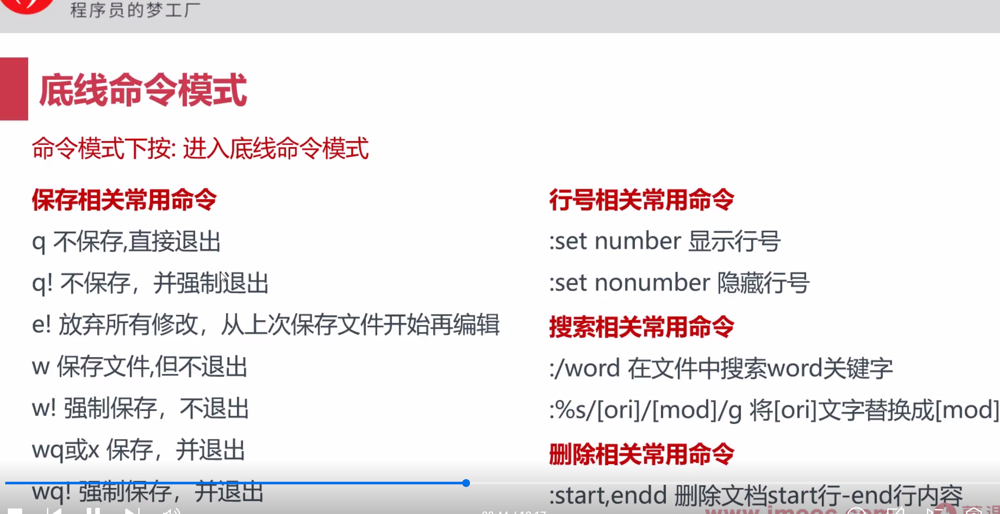

## 包管理工具

```cpp
dpkg 适用于Ubuntu 和 Debian
	dpkg -i package.deb  //安装deb包
	dpkg -r package  //安装软件
apt 适用于Ubuntu 和 Debian
	apt-get install package
	apt-get remove package
rpm 适用于 RHEL、CentOS
  rpm -ivh ....rpm
  rpm -e  ...
yum 适用于 CentOS6-8
  yum install ...
  yum remove ...
dnf RHEL8 、CentOS8
  dnf install ...
  dnf remove ...
```




 


