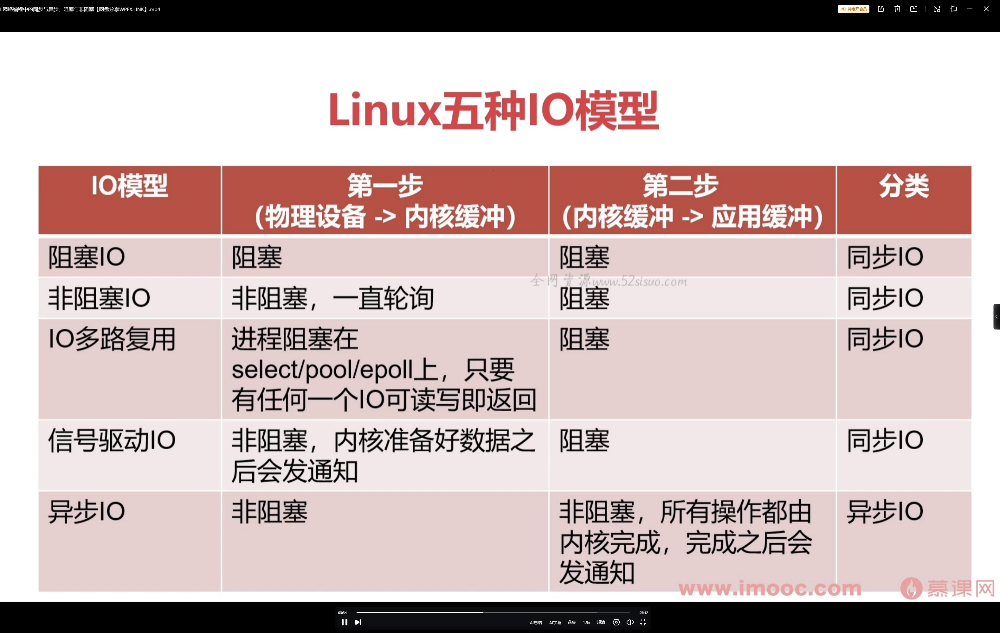

- 事件驱动的运行机制
- 如何设计高效的后台服务工作模型
- 非阻塞 socket 的网络数据读写

解压缩

```cpp
*.tar 用 tar –xvf 解压
*.gz 用 gzip -d或者gunzip 解压
*.tar.gz和*.tgz 用 tar –xzf 解压
*.bz2 用 bzip2 -d或者用bunzip2 解压
*.tar.bz2用tar –xjf 解压
*.Z 用 uncompress 解压
*.tar.Z 用tar –xZf 解压
*.rar 用 unrar e解压
*.zip 用 unzip 解压
```


## **事件驱动编程范式**

一种异步编程范式，执行流程取决于事件的发生，在后台服务设计中，通常运用事件循环 + IO多路复用技术，最大限度的利用 CPU 资源，实现高并发。 `nginx   redis`

适合 IO 密集型



> 同步、异步；阻塞、非阻塞 ！ ！ ！ 

### **核心要素 ** 

1. 事件源
2. 事件循环(事件收集，分发者)
3. 事件处理(事件消费者)

**优点 ：**

1. 高效处理时间 (事件驱动 + IO 多路复用)
2. 占用系统资源少 (固定线程数 + 绑带 CPU 亲和性(将 CPU 和线程绑定))
3. 逻辑处理可单线程闭环，没有多线程同步问题

**缺点：**

1. 流程不直观，不易理解 (所有的操作基本都在回调函数中)
2. 对开发人员要求高 (单线程不应该做成同步阻塞操作)

### Nginx 分析

进程模型


### Redis 事件

文件事件  +  时间事件   -> 线程模型


## WebRTC

```cpp
name -a  // 查看当前 linux 版本信息
cat /proc/cpuinfo   // 查看 cpu
```

### 配置go

```cpp
wget https://go.dev/dl/go1.xx.2.linux-amd64.tar.gz
tar -xzf go1.xx.2.linux-amd64.tar.gz
sudo mv go /usr/local
sudo vi /etc/profile
o     //加入下列信息
export GOROOT=/usr/local/go  // go 的工作目录
export PATH="$PATH:$GOROOT/bin"  
export GOPATH=$HOME/go/lib:$HOME/go/work  //源文件保存位置
source /etc/profile
```


<pre><span style="font-size:16px">  实体 peerA 和 PeerB 两实体间进行实时通信 
  信令服务起到 PeerA 和 PeerB 之间交换会话描述信息的作用

### P2P 通信概述
P2P 通信是一种网络通信模式，其中参与通信的双方（即对等方，Peer）在通信过程中地位平等，既是服务的提供者，也是服务的使用者。与传统的客户端 - 服务器（C/S）模式不同，P2P 模式下数据直接在对等方之间传输，无需通过中心服务器进行中转。

### WebRTC P2P 通信流程
图片中的时序图展示了 WebRTC P2P 通信的一个典型流程，以下是该流程的详细讲解：

  * **创建 Peer 对象** ：PeerA 和 PeerB 分别创建自己的 WebRTC Peer 对象，这是进行 WebRTC 通信的基础，负责处理通信过程中的各种事务。
  * **PeerA 创建 offer** ：PeerA 调用 createOffer 方法生成一个 SDP（会话描述协议）offer，其中包含了 PeerA 的媒体信息（如音视频轨道、编解码器等）、网络信息（如 IP 地址、端口号等）以及采用的加密方式等。
  * **PeerA 设置本地描述** ：PeerA 调用 setLocalDescription 方法将刚才创建的 offer 设置为本地的会话描述，这一步会触发 ICE（交互式连接建立）候选的收集，ICE 是一种用于在两个对等体之间建立直接连接的协议，ICE 候选包含用于建立连接的网络地址和端口等信息。
  * **PeerA 发送 offer** ：PeerA 将 offer 通过信令服务发送给 PeerB，信令服务在这里起到了传递双方通信信息的作用，因为 WebRTC 本身不提供信令传输机制，需要开发者自己实现或借助第三方服务。
  * **PeerB 设置远端描述** ：PeerB 收到 offer 后，调用 setRemoteDescription 方法将其设置为远端的会话描述，此时 PeerB 会根据 offer 中的信息解析出 PeerA 的媒体和网络等信息，并且也会开始收集自己的 ICE 候选。
  * **PeerB 创建 answer** ：PeerB 调用 createAnswer 方法生成一个 SDP answer，其中包含了 PeerB 自身的媒体、网络以及加密等信息。
  * **PeerB 设置本地描述** ：PeerB 调用 setLocalDescription 方法将 answer 设置为本地的会话描述，同样会继续收集 ICE 候选。
  * **PeerB 发送 answer** ：PeerB 将 answer 通过信令服务发送回 PeerA。
  * **PeerA 设置远端描述** ：PeerA 收到 answer 后，调用 setRemoteDescription 方法将其设置为远端的会话描述，至此双方的 SDP 信息交换完成。
  * **ICE 候选交换与连接建立** ：在双方设置本地和远端描述的过程中，会不断收集 ICE 候选，并通过信令服务将 ICE 候选发送给对方。当双方都收到足够的 ICE 候选后，WebRTC 会利用这些候选进行网络连接的尝试，寻找最佳的连接路径，建立 ICE 通道。一旦 ICE 通道建立成功，双方就可以通过这个通道进行 DTLS（数据报传输层安全）握手，协商加密密钥等信息，以确保通信的安全性。
  * **DTLS 握手与数据传输** ：DTLS 握手成功后，WebRTC 会进一步建立 SRTP（安全实时传输协议）会话，用于传输实际的媒体数据（如音视频流）。此时，PeerA 和 PeerB 之间就可以通过建立的 P2P 连接进行高效、安全的数据传输了。

### P2P 通信的优势
  * **高效** ：数据直接在对等方之间传输，减少了中间环节，能够充分利用双方的带宽和计算资源，提高数据传输效率，降低延迟，在实时性要求较高的场景（如视频通话、在线游戏等）中具有明显优势。
  * **可扩展性强** ：新节点的加入不会像 C/S 模式那样给中心服务器带来巨大压力，整个网络的性能和容量可以根据参与的节点数量动态扩展，适合大规模分布式应用。
  * **健壮性高** ：没有单点故障问题，即使部分节点离线，其他节点之间的通信仍然可以正常进行，整个网络具有较强的容错能力和生存能力。

### P2P 通信的挑战
  * **NAT（网络地址转换）穿透问题** ：由于大多数设备都处于 NAT 网络环境中，需要解决如何在 NAT 后的设备之间建立直接连接的难题，ICE 协议及其相关的 STUN（简单Traversal of UDP through NATs）和 TURN（Traversal Using Relays around NAT）技术就是为解决这个问题而设计的。
  * **防火墙限制** ：防火墙可能会阻止 P2P 通信中的一些数据包，需要通过特定的配置和策略来确保通信的顺利进行。
  * **安全性和隐私保护** ：由于节点之间直接通信，在安全性和隐私保护方面面临更大的挑战，需要采用加密等技术来保障数据的安全性和用户的隐私。

在 WebRTC 中，通过 ICE、DTLS 等技术来应对这些挑战，从而实现稳定、安全的 P2P 通信。


